# 自动舵控制算法开发文档

> **文档编号**：AR-DEV-2026-003
> **版本**：V1.0
> **编制日期**：2026-07-30
> **密级**：内部公开
> **上游文档**：《自动舵定位与控制设计文档》（AR-DOC-2026-002）
> **配套文档**：《自动舵控制算法 C++ 代码说明文档》（AR-CODE-2026-001）
> **代码目录**：`control/include/`

---

## 目录

1. [概述与开发总纲](#1-概述与开发总纲)
2. [开发流程总体规划](#2-开发流程总体规划)
3. [PD 航向控制器开发](#3-pd-航向控制器开发)
4. [增益调度开发](#4-增益调度开发)
5. [Nomoto 模型辨识开发](#5-nomoto-模型辨识开发)
6. [控制参数自动优化（AutoTuner）开发](#6-控制参数自动优化autotuner开发)
7. [机动序列（ManeuverSequencer）开发](#7-机动序列maneuversequencer开发)
8. [参数存储与标定流程开发](#8-参数存储与标定流程开发)
9. [核心集成与主循环开发](#9-核心集成与主循环开发)
10. [测试与验证计划](#10-测试与验证计划)
11. [可视化调参工具开发](#11-可视化调参工具开发)
- [附录 A：术语与符号](#附录-a术语与符号)

---

## 1. 概述与开发总纲

### 1.1 编制目的

本文档面向 **开发工程师**，将《自动舵定位与控制设计文档》中 §3（PD 航向控制、标定、自动优化）、§4（仅航向机动）、§5（联合工作流）的设计要求，拆解为可执行的开发任务：明确每个算法模块的实现细节、边界条件、易错点、开发顺序与测试验收标准。

三份文档的分工关系：

| 文档 | 视角 | 回答的问题 |
|------|------|-----------|
| 设计文档（AR-DOC-2026-002） | 系统设计 | 做什么、为什么这样做 |
| **本开发文档（AR-DEV-2026-003）** | **开发实现** | **怎么拆、怎么写、怎么验** |
| 代码说明文档（AR-CODE-2026-001） | API 使用 | 接口怎么调、参数是什么 |

### 1.2 开发范围

覆盖 `control/include/` 下 8 个纯算法模块的开发全过程，以及配套的 **可视化调参工具**（`control/ui/debug_ui.html`，作为开发/试验支撑项目，见 §11）。**不包含**：GNSS 定位解算（设计文档 §2，由定位组独立开发）、硬件 IO / BSP 驱动、实船驾驶台人机界面。

### 1.3 模块分层与依赖

模块间依赖自底向上分为四层，开发顺序遵循依赖方向（先底层后上层）：

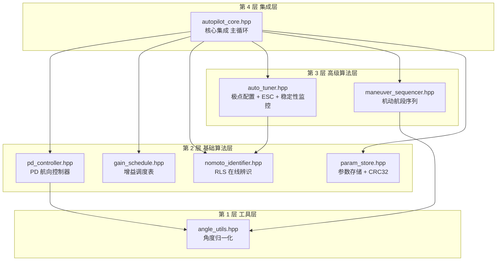

### 1.4 开发原则

1. **纯算法层**：所有模块不含任何硬件 IO（GPIO/CAN/UART/EEPROM），传感器输入与舵机输出一律通过函数参数传递；EEPROM 读写通过 `std::function` 注入。这是单元测试与 HIL 仿真可行的前提。
2. **header-only + C++17 + 零第三方依赖**：便于直接嵌入 ECU 工程，避免交叉编译链接问题。
3. **确定性执行**：主循环内禁止动态内存分配（`ManeuverSequencer::setLegs` 等配置类接口除外）、禁止异常、禁止阻塞调用，保证 50 Hz（20 ms）周期的最坏执行时间可控。
4. **单位与约定统一**：角度一律用 **度（deg）**，转向率 deg/s，船速 kn，时间 s；航向误差恒定义为 `ref − act` 并归一化到 (−180°, 180°]；舵角右舵为正。
5. **可追溯**：每个函数/常量注释标注对应设计文档章节号（如 `§3.3`），设计变更时可反向检索受影响代码。

### 1.5 设计输入汇总（关键指标）

开发与验收所依据的设计指标（摘自设计文档 §1.3、§3.8、§3.9.6）：

| 指标 | 要求 | 验证阶段 |
|------|------|----------|
| 控制周期 | 20 ms（50 Hz 解算） | 单元测试 / HIL |
| 航向控制精度 | ≤ ±1.0°（静水）/ ±2.0°（2 级海况），1σ | 海试 |
| 阶跃超调 | ≤ 10% | 闭环仿真 / 海试 |
| 5% 调节时间 | ≤ 30 s | 闭环仿真 / 海试 |
| 稳态航向误差 | ≤ 1° | 闭环仿真 / 海试 |
| 操舵频次 | ≤ 6 次/分钟 | 闭环仿真 / 海试 |
| 闭环阻尼比 | ζ ≥ 0.7（监控下限 0.6） | 仿真 / 在线监控 |
| 闭环自然频率 | ωn ≤ 0.5 rad/s | 仿真 / 在线监控 |
| 舵角/舵速限幅 | ±35°、10°/s | 单元测试 |
| 辨识拟合残差 | RMS < 5% · r_max | 仿真 / 海试 |

### 1.6 追溯矩阵（设计 → 开发 → 代码 → 里程碑）

| 设计文档章节 | 本文档章节 | 代码文件 | 里程碑 |
|--------------|-----------|----------|--------|
| §3.2 控制律 / 角度归一化 | §3.3~§3.4（DP-1/DP-2） | `pd_controller.hpp` / `angle_utils.hpp` | M1 |
| §3.3 输出限幅 | §3.4（DP-4/DP-5） | `pd_controller.hpp` | M1 |
| §3.7 抗噪与死区 | §3.4（DP-2/DP-3/DP-6） | `pd_controller.hpp` | M1 |
| §3.5~§3.6 参数整定 / 增益调度 | §4 | `gain_schedule.hpp` | M1 |
| §3.4 Nomoto 模型 | §5.2 | `nomoto_identifier.hpp` | M2 |
| §3.9.4 Z 形试验辨识 | §5.3（路线 A） | 离线辨识工具 | M2 |
| §3.9.3 / §3.9.8 执行器标定与存储 | §8 | `param_store.hpp` | M2 |
| §3.9.5 PD 增益初算 | §6.3 | `auto_tuner.hpp` (`polePlacement`) | M3 |
| §3.10.3 RLS 在线辨识 | §5.4~§5.5 | `nomoto_identifier.hpp` | M2 |
| §3.10.4 极点配置重算 | §6.3 | `auto_tuner.hpp` | M3 |
| §3.10.5 ESC 性能寻优 | §6.4 | `auto_tuner.hpp` (`escStep`) | M3 |
| §3.10.6~§3.10.7 触发 / 稳定性监控 | §6.4.3、§6.5 | `auto_tuner.hpp` / `autopilot_core.hpp` | M3/M5 |
| §4.2 机动调度框架 | §7.2~§7.3 | `maneuver_sequencer.hpp` | M4 |
| §4.3~§4.8 六种机动 | §7.4 | `maneuver_sequencer.hpp` | M4 |
| §5 联合工作流 | §9 | `autopilot_core.hpp` | M5 |
| §3.9.6 性能指标 / §7.11 海试日程 | §10.2、§10.4 | 仿真环境 / 试验大纲 | M1~M5 |

---

## 2. 开发流程总体规划

### 2.1 V 模型开发流程

整体采用 V 模型：左侧自顶向下细化设计与编码，右侧自底向上逐级验证，每个开发阶段与一个验证阶段一一对应。

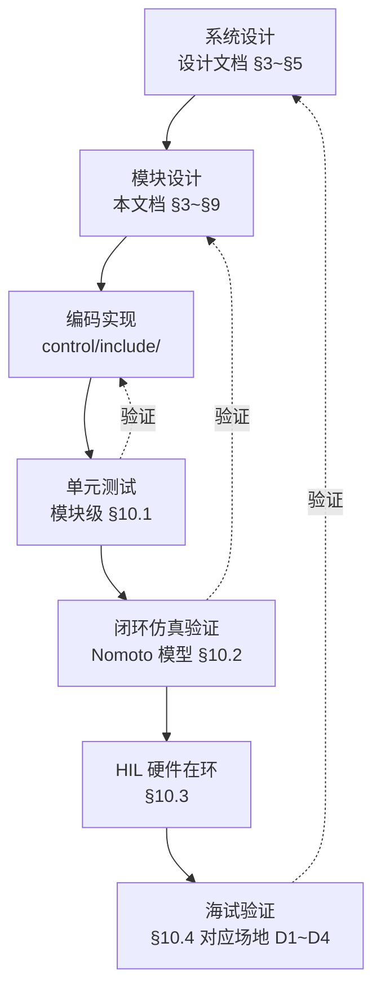

### 2.2 里程碑划分

按模块依赖关系与风险从低到高，划分 5 个里程碑：

| 里程碑 | 内容 | 交付物 | 准出标准 |
|--------|------|--------|----------|
| M1 基础控制律 | `angle_utils` + `pd_controller` + `gain_schedule` | 三模块 + 单测 | 单测全过；PD 阶跃仿真超调 ≤ 10% |
| M2 辨识与标定 | `nomoto_identifier` + `param_store` + Z 形试验离线工具 | 两模块 + 单测 + 辨识脚本 | 已知 K/T 仿真数据收敛误差 < 5%；CRC 读写回环通过 |
| M3 自动优化 | `auto_tuner`（极点配置 + ESC + 稳定性监控） | 模块 + 单测 | 极点配置反推增益仿真达标；ESC 在仿真中 J 单调收敛；异常参数触发回退 |
| M4 机动功能 | `maneuver_sequencer` + 6 种预置机动 | 模块 + 单测 | 6 种机动在仿真中航段推进正确、轨迹形态符合 §4 |
| M5 集成联调 | `autopilot_core` + 模式切换 + HIL | 集成 + HIL 报告 | HIL 全模式切换无异常；50 Hz 周期最坏执行时间 < 2 ms |
| MV 可视化调参工具（贯穿） | `debug_ui.html` 增强：指标面板、一键试验、参数扫描、回放、会话日志、在线联锁（详见 §11.4 U1~U7） | UI V1.1 + 使用手册更新 | U1/U2 随 M1 交付、U3/U5 随 M3、U4/U6 随 M4、U7 随 M5；验收判据见 §11.6 |

### 2.3 开发进度计划

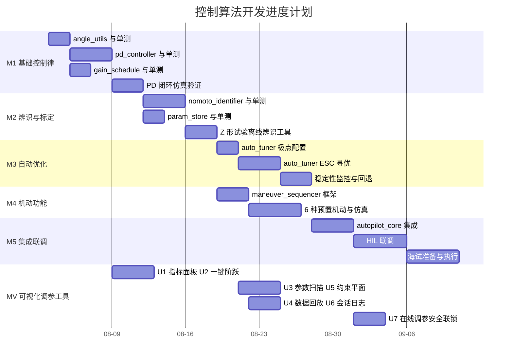

MV 各任务与对应算法里程碑并行：U1/U2 在 PD 编码完成后立即启动（M1 的 PD 仿真验证即用它出报告），U7 必须在 HIL 联调前就绪（HIL/海试的在线调参依赖联锁保护）。

### 2.4 开发环境与工具链

| 项 | 选型 | 说明 |
|----|------|------|
| 语言标准 | C++17 | 与 ECU 交叉编译器能力对齐 |
| 宿主编译器 | GCC ≥ 9 / Clang ≥ 10 | 单测与仿真在 PC 上运行 |
| 编译选项 | `-Wall -Wextra -Werror -O2`；单测加 `-fsanitize=address,undefined` | 尽早暴露未定义行为 |
| 单测框架 | GoogleTest 或 Catch2（header-only，与工程风格一致） | 每模块一个测试文件 |
| 仿真被控对象 | Nomoto 一阶模型 + 可选舵机一阶惯性 + 量测噪声 | 见 §10.2 |
| 可视化调参工具 | `control/ui/debug_ui.html`（增强计划见 §11.4） | 参数编辑、实时曲线、指标评估、在线调参 |
| 版本管理 | Git；算法参数变更须在提交信息中注明对应文档章节 | 可追溯 |

### 2.5 模块开发统一模板

第 3~9 章每个模块按统一结构展开，开发时按此顺序推进：


---

## 3. PD 航向控制器开发

### 3.1 设计依据

设计文档 §3.2（控制律与角度归一化）、§3.3（输出限幅）、§3.7（抗噪与死区）。实现文件：`control/include/pd_controller.hpp`，前置依赖 `angle_utils.hpp`。

### 3.2 开发任务拆解

PD 控制器虽然公式简单，但工程实现要点集中在"公式之外"的 6 个开发点，缺一不可：

| 开发点 | 设计依据 | 一句话要求 |
|--------|----------|-----------|
| DP-1 角度归一化误差 | §3.2 | 误差必须经 atan2 等价归一化到 (−180°, 180°] |
| DP-2 微分低通滤波 | §3.2/§3.7 | 差分微分必须带一阶低通，τ = 0.2 s |
| DP-3 误差死区 | §3.3/§3.7 | \|e\| < 0.3° 时输出 0，减少操舵频次 |
| DP-4 舵角限幅 | §3.3 | 输出饱和 ±35° |
| DP-5 舵速限幅 | §3.3 | 相邻周期输出变化 ≤ 10°/s × dt |
| DP-6 输出量化 | §3.7 | 目标舵角量化到 0.1°（12-bit 舵角分辨率） |

### 3.3 处理链与执行顺序

**执行顺序是本模块最重要的实现约束**：死区判断最先（直接短路返回），量化最后；舵速限幅必须在舵角限幅之后，否则限幅截断会破坏速率约束。

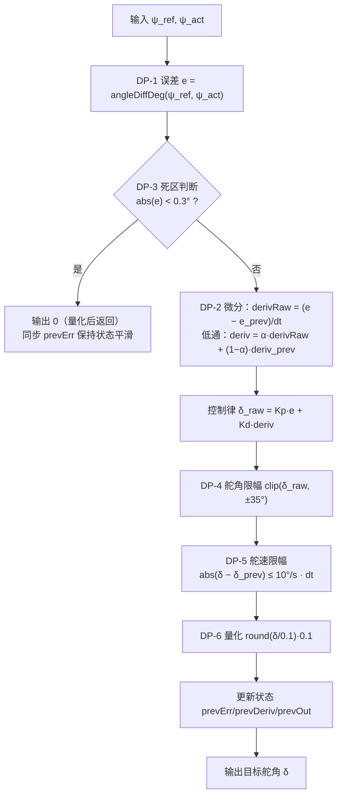

对应实现即 `PdController::update()` 的处理链：

```39:82:control/include/pd_controller.hpp
    double update(double headingRef, double headingAct) {
        // §3.2 角度归一化的航向误差
        const double e = angleDiffDeg(headingRef, headingAct);

        // §3.7 误差死区
        if (std::abs(e) < p_.deadzone) {
            // ... 死区短路返回 ...
        }
        // ... 微分低通 → PD → 舵角限幅 → 舵速限幅 → 量化 ...
    }
```

### 3.4 各开发点实现细节

#### DP-1 角度归一化误差

$$
e = \text{atan2}(\sin(\psi_{\text{ref}}-\psi),\ \cos(\psi_{\text{ref}}-\psi))
$$

工程实现不必调用三角函数，用 while 折叠等价实现（`angle_utils.hpp` 的 `normalizeAngleDeg`）：结果落在 **(−180°, 180°]**，注意区间是左开右闭——`normalizeAngleDeg(180)` 必须返回 +180 而不是 −180，边界条件用 `a <= -180` 判断实现。

典型错误示例：ψ_ref = 1°、ψ_act = 359°，直接相减得 −358°，归一化后应为 **+2°**（右转 2° 而不是左转 358°）。

#### DP-2 微分低通滤波

$$
\dot e_k = \alpha\cdot\frac{e_k - e_{k-1}}{\Delta t} + (1-\alpha)\cdot\dot e_{k-1},\qquad
\alpha = \frac{1}{1+\tau/\Delta t}
$$

- 取 τ = 0.2 s、dt = 0.02 s 时 α ≈ 0.0909，即新样本权重约 9%，等效截止频率约 0.8 Hz，可压制 AHRS/GNSS 高频噪声。
- **首拍处理**：第一拍没有 e_{k−1}，若直接差分会产生一次 e/dt 量级的微分冲击（e = 30° 时冲击达 1500°/s）。实现上用 `first_` 标志令首拍 `derivRaw = 0`。
- **微分对象的选择**：本实现对误差 e 微分。若 ψ_ref 会被上层频繁阶跃修改（如机动序列切段），对 e 微分会引入"设定值踢"（derivative kick）；缓解手段是切换目标航向时调用 `reset()`，或后续版本改为对测量值 −ψ 微分。

#### DP-3 误差死区

- 死区内输出 0 而不是"保持上一输出"，语义为"回中"；死区内仍要更新 `prevErr_`，否则退出死区的第一拍会把死区期间积累的误差变化一次性算进微分。
- **死区边界抖动**：e 在 0.3° 附近来回穿越时输出在 0 与非 0 间跳变。当前实现依靠舵速限幅（DP-5）天然抑制跳变幅度；若海试发现操舵频次超标（> 6 次/分钟），加迟滞（如 0.3° 进入 / 0.5° 退出）。

#### DP-4 / DP-5 双重限幅

$$
\delta = \mathrm{clip}(\delta_{\text{raw}},\ \pm\delta_{\max}),\qquad
|\delta_k - \delta_{k-1}| \le \dot\delta_{\max}\cdot\Delta t
$$

- 顺序固定为 **先幅值后速率**。dt = 0.02 s 时单周期最大变化量 10 × 0.02 = 0.2°，即从 0 打到 35° 满舵至少需要 3.5 s，与舵机物理能力一致。
- 舵速限幅基于 `prevOut_` 递推，因此 `reset()` 后第一拍从 0 开始爬升；若上电时舵不在中位，应以实际舵角反馈初始化 `prevOut_`（当前实现未做，列入 §10.5 待完善项）。

#### DP-6 输出量化

`round(v / 0.1) * 0.1`。量化必须放在处理链最后，否则量化误差会被后级放大。量化本身也兼具消除极小抖动输出的作用。

### 3.5 参数与状态

| 类别 | 成员 | 说明 |
|------|------|------|
| 参数（`Params`） | Kp, Kd, dMax, ddMax, deadzone, tau, quant, dt | 全部带默认值，可整组替换 |
| 内部状态 | prevErr_, prevDeriv_, prevOut_, first_ | `reset()` 统一清零 |

**注意**：`setParams()` 内部调用 `reset()`，这意味着**每次改参数都会清空微分历史与舵速限幅基准**。增益调度按周期改参数时必须避开该行为（详见 §9.4 与 §10.5-P1）。

### 3.6 测试要点

前置依赖 `angle_utils` 的用例（对应 §10.1 汇总表 angle_utils 行）：

| 用例 | 输入 | 预期 |
|------|------|------|
| 正边界（左开右闭） | normalizeAngleDeg(180) | +180（不是 −180） |
| 负边界 | normalizeAngleDeg(−180) | +180 |
| 正向折叠 | normalizeAngleDeg(540) | +180 |
| 负向折叠 | normalizeAngleDeg(−541) | +179 |
| 跨零差值 | angleDiffDeg(1, 359) | +2 |
| 反向跨零差值 | angleDiffDeg(359, 1) | −2 |

PD 控制器用例：

| 用例 | 输入 | 预期 |
|------|------|------|
| 跨零误差 | ref=1, act=359 | e = +2，输出为正（右舵） |
| 死区 | ref=100, act=99.8 | 输出 0 |
| 舵角饱和 | Kp=10, e=170° | 输出被限幅（受舵速限幅逐拍爬升，稳态 = ±35°） |
| 舵速限幅 | 阶跃 e：0 → 30° | 相邻输出差 ≤ 0.2°（dt=0.02） |
| 首拍无冲击 | 首次 update，e=30° | 输出 ≈ Kp·e 限幅限速后的值，无微分尖峰 |
| 量化 | 任意 | 输出为 0.1° 整数倍 |
| 低通有效性 | e 叠加 5 Hz 噪声 | 输出微分分量显著衰减（> 80%） |

---

## 4. 增益调度开发

### 4.1 设计依据

设计文档 §3.5（PD 参数整定示例表）、§3.6（增益调度）、§3.10.4（按船速分段的 ζ*/ωn* 表）。实现文件：`control/include/gain_schedule.hpp`。

### 4.2 算法拆解

增益调度是一张 **船速 × 海况 → (Kp, Kd)** 的二维查表。物理动因：船速越高、海况越差，等效模型增益 K 越大且噪声越强，需要越保守的控制增益。

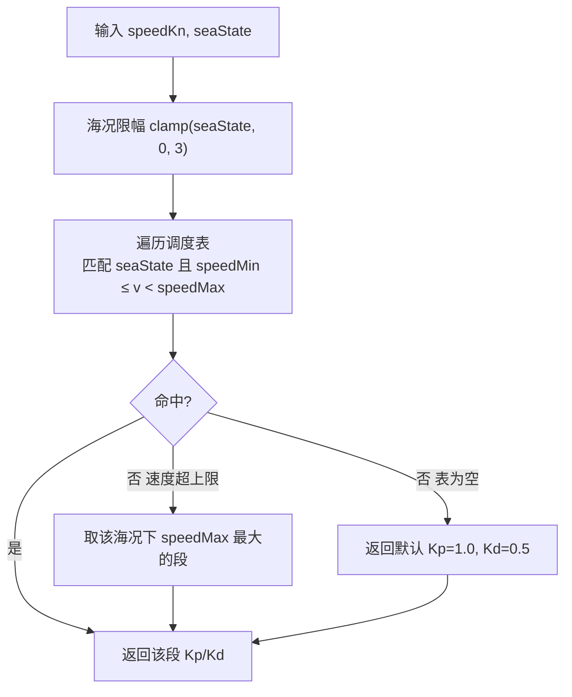

### 4.3 调度表数据结构与默认内容

```cpp
struct GainPoint {
    double speedMin, speedMax;  // [speedMin, speedMax) kn
    int    seaState;            // 0..3
    double Kp, Kd;
};
```

默认表共 14 条记录（4 个速度段 × 海况分组），与设计文档 §3.5 示例表和 §3.10.4 分段一致：

| 船速区间 (kn) | 海况 0~1 | 海况 2~3 |
|---------------|----------|----------|
| [0, 4) | Kp=2.0, Kd=0.8 | —（同 0~1，低速不区分） |
| [4, 10) | Kp=1.5, Kd=0.6 | Kp=1.0, Kd=0.4 |
| [10, 18) | Kp=1.2, Kd=0.5 | Kp=0.9, Kd=0.4 |
| [18, 25) | Kp=1.0, Kd=0.4 | Kp=0.7, Kd=0.3 |

### 4.4 实现细节与易错点

1. **区间为左闭右开**：`speedMin ≤ v < speedMax`，段间不重叠、不留缝。10.0 kn 恰好落入 [10, 18) 段，单测须覆盖边界值。
2. **速度超上限**（> 25 kn）：取该海况下 `speedMax` 最大的段，等价于"高速段外推为常值"，保证 25 kn 以上仍返回最保守增益而不是失败。
3. **海况输入防御**：外部海况估计可能给出越界值，入口 `clamp(0, 3)`。
4. **当前实现为阶跃查表**（注释写了插值但代码未做）：船速穿越段边界时 Kp 从 1.5 跳到 1.2，经 PD 输出会产生一次小的舵角阶跃。两个改进方向（列入 §10.5-P5）：
   - 按速度对相邻段做线性插值（消除跳变源头）；
   - 或对查表结果加一阶低通 / 斜坡限速（限制增益变化率 ≤ 5%/s）。
5. **自定义表替换**：整表可由标定结果替换（配合 `param_store` 的区块 D），替换时必须校验"每个海况分组的速度段完整覆盖 [0, 25) 且无重叠"，建议提供 `validate()` 工具函数。

### 4.5 增益切换与 PD 的衔接

查表结果每周期写入 PD 参数。由于 `PdController::setParams()` 会 `reset()` 内部状态（§3.5 注意事项），衔接方式必须是下列之一：

- **方案 A（推荐）**：给 `PdController` 增加 `setGains(Kp, Kd)` 轻量接口，只改增益不清状态；
- 方案 B：仅当增益变化超过阈值（如 1%）时才调用 `setParams`，并接受一次状态清零。

当前 `autopilot_core.hpp` 每周期无条件 `setParams`，属于必须整改的缺陷，见 §10.5-P1。

### 4.6 测试要点

| 用例 | 输入 | 预期 |
|------|------|------|
| 正常查表 | v=6, sea=0 | Kp=1.5, Kd=0.6 |
| 段边界 | v=10.0, sea=0 | 落入 [10,18) 段，Kp=1.2 |
| 高海况 | v=6, sea=3 | Kp=1.0, Kd=0.4 |
| 海况越界 | v=6, sea=9 | 按 sea=3 处理 |
| 速度超上限 | v=30, sea=0 | 取 [18,25) 段值 |
| 速度为负 | v=−1, sea=0 | 不命中任何段时按外推规则返回，不得崩溃 |

---

## 5. Nomoto 模型辨识开发

### 5.1 设计依据

设计文档 §3.4（Nomoto 一阶模型）、§3.9.4（Z 形试验离线辨识）、§3.10.3（RLS 在线辨识）。实现文件：`control/include/nomoto_identifier.hpp`。

### 5.2 模型离散化推导

连续模型 $T\dot r + r = K\delta$，用后向差分 $\dot r \approx (r_k - r_{k-1})/\Delta t$ 离散化：

$$
r_k = K\delta_k - \frac{T}{\Delta t}(r_k - r_{k-1})
$$

整理为线性回归 $y_k = \phi_k^T\theta$：

$$
\phi_k = \left[\delta_k,\ -\frac{r_k - r_{k-1}}{\Delta t}\right]^T,\quad
y_k = r_k,\quad
\theta = [K,\ T]^T
$$

该形式的价值在于：**K、T 同时以线性参数出现**，离线最小二乘与在线 RLS 共用同一套回归量构造代码。

### 5.3 两条辨识路线

| 项 | 路线 A：离线批量 LS（§3.9.4） | 路线 B：在线 RLS（§3.10.3） |
|----|------------------------------|----------------------------|
| 使用场景 | 装船标定、海试 Z 形试验 | 运行中持续跟踪 K/T 慢变 |
| 激励来源 | 人工 Z 形试验（±10°/10°，3~5 循环） | 正常操舵自然激励 |
| 算法 | $\hat\theta = (\Phi^T\Phi)^{-1}\Phi^T y$ | 带遗忘因子 λ=0.98 的递推 LS |
| 载体 | PC 离线脚本（M2 交付的辨识工具） | ECU 内 `NomotoIdentifier` |
| 验收 | 拟合残差 RMS < 5% · r_max | 仿真数据上收敛误差 < 5% |

两条路线共享回归量构造，离线工具建议直接复用 `NomotoIdentifier`（λ 置 1.0、P0 足够大即可等效批量 LS 的递推形式）。

### 5.4 RLS 递推实现

$$
K_k = \frac{P_{k-1}\phi_k}{\lambda + \phi_k^T P_{k-1}\phi_k},\qquad
\hat\theta_k = \hat\theta_{k-1} + K_k\,(y_k - \phi_k^T\hat\theta_{k-1}),\qquad
P_k = \frac{1}{\lambda}\left(P_{k-1} - K_k\phi_k^T P_{k-1}\right)
$$

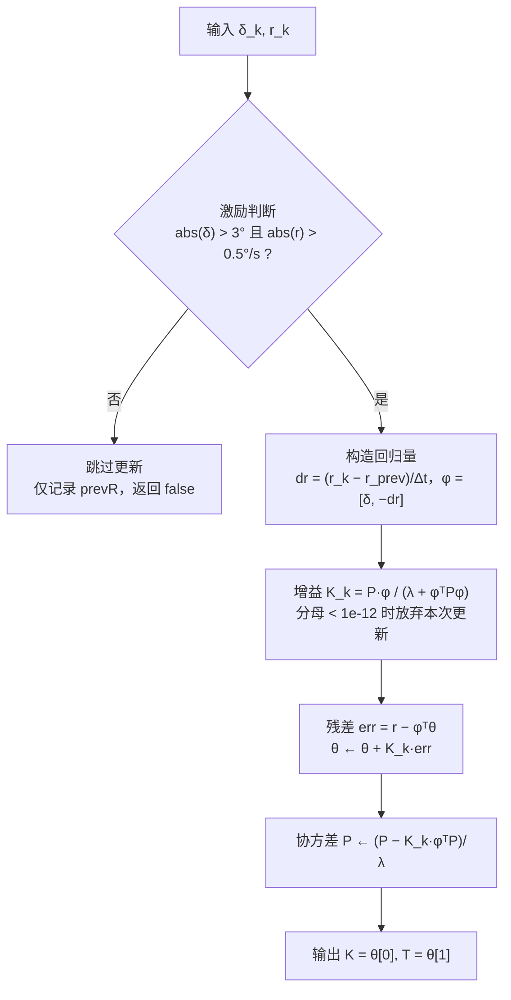

### 5.5 实现细节与易错点

1. **激励门限是数值稳定的生命线**（|δ| > 3° 且 |r| > 0.5°/s）。直航时 δ、r 均近零，φ ≈ 0，若仍更新则 P 阵按 1/λ 每步放大 2%（"协方差爆炸"），一旦重新出现激励，θ 会剧烈跳变。无激励时**必须完全跳过 P 与 θ 的更新**。
2. **首拍差分**：第一拍无 r_{k−1}，令 dr = 0。注意长时间未激励后重新进入激励段时，prevR_ 是上一周期的值（每次调用都更新），差分仍连续，无需额外处理。
3. **分母保护**：`λ + φᵀPφ` 理论上恒正，但浮点异常输入（NaN/Inf 传感器值）可能破坏该性质，实现中做了 `< 1e-12` 防御；工程上还应在入口对 δ、r 做范围检查（|δ| ≤ 35°、|r| ≤ 30°/s，超限丢弃）。
4. **物理合理性检查**（当前未实装，列入 §10.5-P6）：辨识结果应满足 K ∈ (0, 2]（1/s 量级）、T ∈ [1, 60] s；越界说明数据质量差，应拒绝将该结果送入层 2 极点配置。
5. **调用周期**：设计文档 §3.10.3 规定辨识每 **1 s** 更新一次（降低 ECU 负担并保证差分信噪比），Params 中 `dt` 应与实际调用周期一致——若外层按 1 s 调用，`dt` 必须设为 1.0 而不是默认的 0.02（当前 `autopilot_core` 按 50 Hz 调用且 dt 不匹配，见 §10.5-P3）。
6. **单位一致性**：全链路用度（deg、deg/s），则辨识出的 K 单位为 (deg/s)/deg = 1/s，与弧度制数值相同，可直接用于极点配置公式。

### 5.6 收敛性单测方案

用已知参数的 Nomoto 模型生成仿真数据回灌，是 M2 准出的核心用例：


| 用例 | 场景 | 预期 |
|------|------|------|
| 无噪收敛 | 干净 Z 形数据 | 30 个有效样本内误差 < 1% |
| 带噪收敛 | σ=0.1°/s 噪声 | 100 s 内误差 < 5% |
| 无激励保护 | 全程 δ=0 | θ 保持初值，P 不增长，`update` 恒返回 false |
| 参数慢变跟踪 | K 在 200 s 内线性 +50% | λ=0.98 下 K_hat 跟踪滞后 < 30 s |
| 坏数据防御 | 混入 NaN/超限样本 | 不污染 θ，无 NaN 扩散 |

---

## 6. 控制参数自动优化（AutoTuner）开发

### 6.1 设计依据

设计文档 §3.10 全节。实现文件：`control/include/auto_tuner.hpp`，依赖 `nomoto_identifier.hpp`（层 1）。

### 6.2 三层架构与开发次序

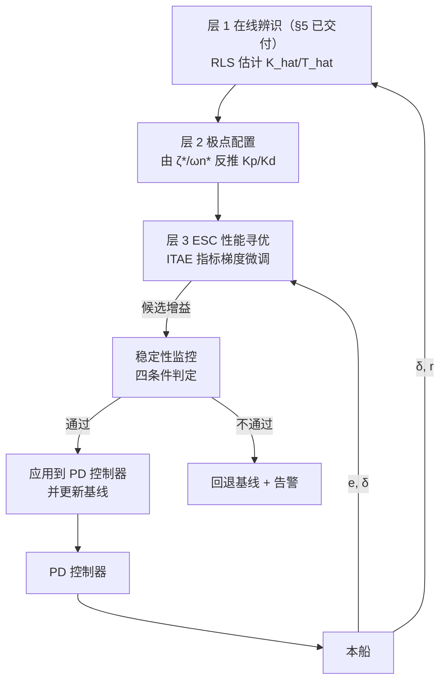

开发次序即 L2 → L3 → 监控（层 1 在 M2 已完成）：极点配置是纯函数最简单；ESC 依赖性能指标窗口；监控最后接线，因为它要拦截前两者的全部输出。

### 6.3 层 2：极点配置

由期望闭环 ζ*、ωn* 与辨识值反推（设计文档 §3.10.4）：

$$
K_p = \frac{(\omega_n^\ast)^2\, \hat T}{\hat K},\qquad
K_d = \frac{2\zeta^\ast\omega_n^\ast\, \hat T - 1}{\hat K}
$$

实现为静态纯函数 `AutoTuner::polePlacement(K, T, zeta, wn, Kp, Kd)`，便于独立单测。

**实现细节**：

1. **除零保护**：|K| < 1e-6 时返回 Kp = Kd = 0（当前实现），更好的做法是返回 false 并保持原增益——Kp=0 意味着开环，直接送给 PD 是危险的（列入 §10.5-P6 一并整改）。
2. **Kd 正性约束**：公式在 $2\zeta^\ast\omega_n^\ast \hat T < 1$ 时给出负 Kd（例如 ζ*=0.85、ωn*=0.2 时要求 T > 2.94 s）。小 T 快响应船本就不需要微分补偿，但负 Kd 会反向放大振荡，**必须 clamp 到 Kd ≥ 0** 并记录告警。
3. **ζ*/ωn* 按船速分段**（设计文档 §3.10.4 表）：< 4 kn 取 (0.9, 0.15)、4~10 kn 取 (0.85, 0.20)、10~18 kn 取 (0.85, 0.25)、18~25 kn 取 (0.90, 0.20)。当前 Params 只有单组 zeta/wn，分段逻辑由上层在船速变化 > 2 kn 时改写 Params 实现。
4. **验证公式**（与 §3.8 一致，用于监控反算）：

$$
\omega_n = \sqrt{\frac{K_p \hat K}{\hat T}},\qquad
\zeta = \frac{1+K_d \hat K}{2\sqrt{\hat T\,K_p \hat K}}
$$

将 polePlacement 的输出代回，应精确还原 ζ*、ωn*（单测断言，容差 1e-9）。

### 6.4 层 3：ESC 极值搜索

#### 6.4.1 性能指标（ITAE + 控制能耗）

$$
J = \int_0^{T_w} \left(t\,|e(t)| + w_u|\delta(t)| + w_{\dot u}|\dot\delta(t)|\right) dt
$$

- 评估窗口 T_w = 60 s，w_u = 0.01、w_du = 0.005（Params 默认值）。
- 实现为滑动窗口三队列（`windowErr_/windowDelta_/windowDDelta_`），`accumulate(e, δ)` 每控制周期（20 ms）推入，队列长度上限 T_w/dt = 3000 样本。
- **注意**：ITAE 的时间权重 t 以窗口起点为零点，窗口滑动时早期样本权重小。该实现语义是"窗口内 ITAE"，评估两组增益优劣时窗口必须对齐（每个 ESC 步长评估完整的 60 s 窗口）。

#### 6.4.2 ESC 更新流程

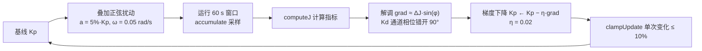

**实现细节与易错点**：

1. **时间尺度分离**是 ESC 收敛的前提：扰动周期 2π/0.05 ≈ 126 s ≫ 闭环调节时间（≤ 30 s）≫ 控制周期 20 ms。`escStep()` 只能按窗口周期（60 s）调用一次，绝不能放进 50 Hz 主循环——否则相位推进与指标窗口完全失配（当前 `autopilot_core` 已把该职责外置为 `runEscTuning()`，由外部定时器触发，正确）。
2. **相位错开 90°**：Kp 用 sin(φ)、Kd 用 sin(φ+π/2)，两通道扰动正交，解调时互不耦合。
3. **简化解调的局限**：当前实现用 `dJ × sin(φ)` 近似梯度（未显式将扰动注入增益，靠 dJ 与相位相关性估计）。这是可接受的工程简化，但收敛速度与理论 ESC 有差距；HIL 阶段若收敛慢，升级为标准"扰动注入 + 高通滤波 + 低通解调"结构（§10.5-P2）。
4. **禁用状态短路**：`enabled_ == false` 时 `escStep` 直接返回，增益冻结。

#### 6.4.3 触发与去激活

设计文档 §3.10.6 的触发矩阵由上层（`autopilot_core` + 外部调度）实现，AutoTuner 只提供 `enable(speedKn)/disable()` 原语：

| 触发条件 | 动作 | 实现位置 |
|----------|------|----------|
| 船速变化 > 2 kn | 重算层 2 | 上层检测，调 polePlacement |
| 稳态误差 > 2° 持续 30 s | 启动层 2 + 层 3 | 上层检测 |
| 振荡检测（超调 > 15%） | 触发层 2 重算 | 上层检测（当前缺失，§10.5-P4） |
| 船速 > 15 kn | 默认去激活 | `enable()` 内判断 `highSpeedDeactivateKn` |
| 操作员手动指令 / 传感器异常 | 立即去激活 | 上层调 `disable()` |

### 6.5 稳定性监控与回退

四条件全满足才接受新增益（设计文档 §3.10.7）：

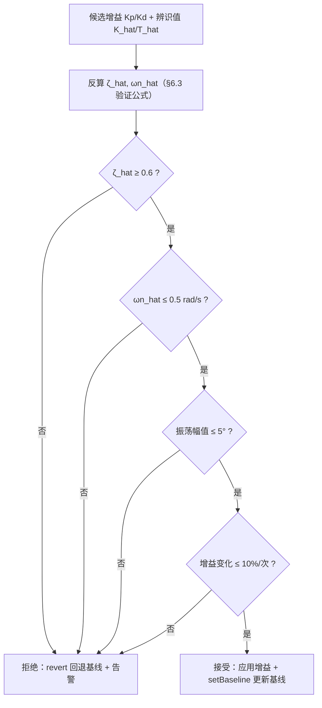

**实现细节**：

1. 条件 C4 由 `clampUpdate()` 在更新路径上强制满足（截断而非拒绝），`stabilityCheck()` 实际判定 C1~C3。
2. **振荡幅值检测需要独立开发**：对航向误差 e 做滑动窗口峰峰值统计（如 30 s 窗口内 max(e) − min(e) 的一半），当前集成代码恒传 0，等于 C3 永真（§10.5-P4）。
3. **回退缓存**：设计要求保留最近 3 组验证通过的参数（§3.10.7），当前只有单组 `baselineKp_/baselineKd_`，需扩展为深度 3 的环形缓存，`revert()` 逐级回退。
4. `stabilityCheck` 对 K、T 有 1e-6 防御，K 或 T 无效时直接返回 false（保守拒绝），方向正确。

### 6.6 测试要点

| 用例 | 场景 | 预期 |
|------|------|------|
| 极点配置往返 | K=0.2, T=8, ζ*=0.85, ωn*=0.2 | 反算 ζ/ωn 还原设定值（1e-9） |
| 负 Kd 场景 | T=2, ζ*=0.85, ωn*=0.2 | Kd 被 clamp 到 ≥ 0 并告警 |
| K 退化 | K=0 | 不产生可用增益、不崩溃 |
| clampUpdate | 请求 +30% 更新 | 实际变化恰为 +10% |
| ESC 收敛 | 仿真闭环，初始 Kp 偏离最优 −40% | 20 个窗口内 J 下降趋势单调（允许扰动纹波） |
| 稳定性拒绝 | 构造 ζ_hat=0.4 的增益 | stabilityCheck 返回 false |
| 回退 | 拒绝后调 revert | 增益等于最近一次 setBaseline 值 |
| 高速去激活 | speedKn=16 | enabled()==false，escStep 无效果 |

---

## 7. 机动序列（ManeuverSequencer）开发

### 7.1 设计依据

设计文档 §4（仅航向条件下的机动功能方案），尤其 §4.2 通用机动调度框架。实现文件：`control/include/maneuver_sequencer.hpp`，依赖 `angle_utils.hpp`。

### 7.2 通用框架：Leg 状态机

所有机动统一抽象为 **航段（Leg）序列**，序列器是一个由触发条件驱动的状态机：

```cpp
struct Leg {
    Mode    mode;       // HEADING（PD 跟踪目标航向）/ RUDDER（固定舵角）
    double  target;     // 目标航向(deg) 或 目标舵角(deg)
    Trigger trigger;    // HEADING_REACHED / TIME / RATE / NONE
    double  threshold;  // 触发阈值：累计航向变化(deg) / 时长(s) / 转向率(deg/s)
    int     next;       // 下一段索引，-1 表示序列结束
};
```

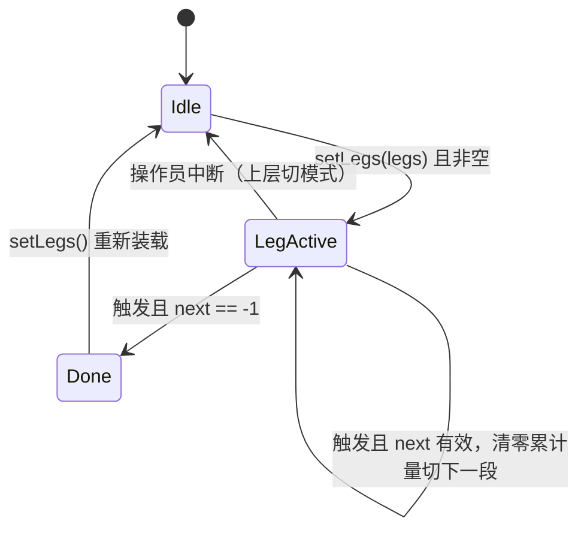

每周期 `update(headingAct, rateAct, dt)` 做三件事：**累计状态量 → 判定触发 → 输出当前段指令（并在触发时切段）**。

### 7.3 触发条件的实现细节（本模块核心难点）

#### 7.3.1 累计航向变化量 cumHeading

`HEADING_REACHED` 触发依赖"**带符号的累计航向变化**"而非当前航向与目标的差值：

$$
\text{cumHeading} \leftarrow \text{cumHeading} + \text{angleDiffDeg}(\psi_k,\ \psi_{k-1})
$$

- 每拍取相邻两拍航向的**最小带符号差**再累加，因此可正确表达"累计转过 270°、540°"这类超过一圈的语义——这是 Circles（360°）、Williamson（180°）能实现的关键。
- 逐拍差分要求 **相邻两拍航向变化 < 180°**。50 Hz 采样下即使 30°/s 的极限转向率每拍也只有 0.6°，裕量充足；但若上层以低频（如 1 Hz）调用且转向率高，会发生折叠错误——调用周期必须 ≥ 10 Hz 写入接口约束。
- **首拍基准**：`first_` 标志用当前航向初始化 `lastHeading_`，避免第一拍把 `ψ_act − 0` 误计入累计量。
- **切段清零**：`legElapsed_` 与 `cumHeading_` 在切段时同时清零，每段的阈值都是"本段内"的增量语义。
- 当前实现用 `abs(cumHeading) ≥ abs(threshold)` 判定，即**不校验转向方向**；对 Williamson 这类先右后左的机动，反向操舵段（Leg2）中累计量先回零再反向增长，阈值语义需按"累计净变化量"理解（见 §7.4.2 的参数推导）。

#### 7.3.2 三类触发对比

| Trigger | 判定式 | 适用 | 注意 |
|---------|--------|------|------|
| HEADING_REACHED | abs(cumHeading) ≥ abs(threshold) | 转向段 | 增量语义，切段清零 |
| TIME | legElapsed ≥ threshold | 直航定时段（Cloverleaf/Search） | 精度受 dt 粒度限制 |
| RATE | abs(rateAct) ≤ threshold | "转向率衰减到位"类收尾段 | 阈值过小会因噪声永不触发，建议 ≥ 0.5°/s |
| NONE | 永不触发 | 末段长期保持（如 Williamson Leg3） | 由操作员或上层退出 |

### 7.4 六种预置机动开发

#### 7.4.1 总览

| 机动 | 工厂函数 | 段数 | 模式组合 | 可行性（§4.1） |
|------|----------|------|----------|----------------|
| Circles | `circles(dCmd, totalDeg)` | 1 | RUDDER | 完全可行 |
| Williamson | `williamson(psi0, dMax)` | 3 | RUDDER×2 + HEADING | 完全可行 |
| U-Turn | `uTurn(psi0, right)` | 1 | HEADING | 完全可行 |
| Zigzag | `zigzag(psi0, dz, phiz, N)` | 2N | RUDDER | 完全可行 |
| Cloverleaf | `cloverleaf(psi0, tLeg)` | 8 | HEADING | 开环可行（漂移不闭合） |
| Search | `search(psi0, t0, dt, cycles)` | 2×cycles | HEADING | 开环可行 |

#### 7.4.2 Williamson Turn（重点机动）

人落水紧急返点机动，三段式（设计文档 §4.4）：

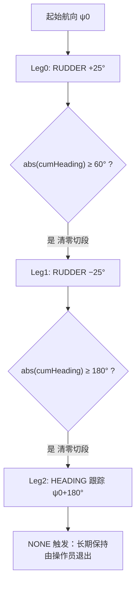

**参数推导细节**：Leg1 的阈值 180° 是"本段内累计净变化 180°"。Leg1 起点航向 ≈ ψ0+60°（右转后），反向左转过程中 cumHeading 从 0 向负方向增长，累计 −180° 时航向 ≈ ψ0−120°；此时切入 Leg2 的 PD 跟踪 ψ0+180°（= ψ0−180°），剩余约 60° 由 PD 闭环收尾。段间衔接的超调由海试标定 dMax（缺省 +25° 而非满舵 35°，留出修正裕量）。

#### 7.4.3 Zigzag（Z 形，兼作辨识激励）

2N 段全 RUDDER 序列，±δ_z 交替、每段以 abs(cumHeading) ≥ φ_z 触发。工程上它同时是 §5 Z 形试验的**激励发生器**：执行 `zigzag(psi0, 10, 10, 5)` 并同步记录 δ(t)、r(t)，即得到 §3.9.4 要求的辨识数据集。

#### 7.4.4 Circles / U-Turn

- Circles：单段 RUDDER（缺省 +15°），阈值 totalDeg=360°。设计文档 §4.3 的"转向率闭环"方案在当前版本以**恒舵角等效**实现（简化合理：Nomoto 稳态下恒舵角即恒转向率）；若海试发现风流下圆度不佳，升级为转向率外环。
- U-Turn：单段 HEADING 跟踪 ψ0±180°，转向方向由 `right` 参数指定。**注意**：PD 沿最短路径转向，target 恰好 ±180° 时方向取决于误差符号的数值噪声；如需强制转向方向，应把目标设为 ψ0±179°（引导方向）再切 ψ0+180°，或在 PD 前加方向引导逻辑（§10.5-P7）。完成判据（设计 §4.5：|e|<1° 持续 2 s）当前依赖 NONE 触发 + 上层判断，需上层实现该判据。

#### 7.4.5 Cloverleaf / Search（开环机动）

两者均为 HEADING 段 + TIME 段交替，属开环机动（无位置闭合，漂移不可消除，设计 §4.7/§4.8 已声明风险）。

**已知实现缺陷（§10.5-P7）**：转向段使用 `Mode::HEADING` + `HEADING_REACHED` 阈值 270°（Cloverleaf）/ 90°（Search），但 PD 跟踪目标航向时走**最短路径**：+270° 的目标等价于 −90°，实际只会累计约 90°，`abs(cumHeading) ≥ 270°` 永不满足，序列卡死。整改方案二选一：

- 方案 A：转向段改为 RUDDER 恒舵角（同 Williamson），达到累计角度后切 HEADING 直航段收尾；
- 方案 B：将 270° 转向拆为 3 个 90° HEADING 子段，每段最短路径方向与期望一致。

#### 7.4.6 与 PD 控制器的指令衔接

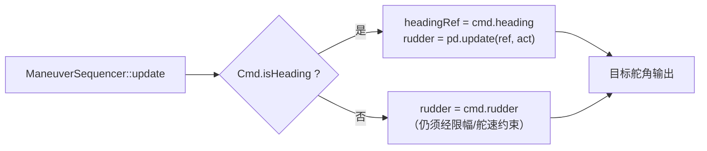

**注意**：RUDDER 段旁路了 PD，但**不得旁路安全限幅**——恒舵角指令仍须经舵角/舵速限幅（设计 §4.10）。当前 `autopilot_core` 中 RUDDER 段直接输出 `cmd.rudder`，缺一层限幅包裹（§10.5-P7）。

### 7.5 测试要点

| 用例 | 场景 | 预期 |
|------|------|------|
| 空序列 | setLegs({}) | done()==true，update 输出安全值 |
| 单段 TIME | threshold=1.0, dt=0.02 | 恰好 50 拍后切段 |
| cumHeading 跨零 | 航向 359→1→3 | 累计 +4°，无 358° 跳变 |
| Williamson 全程 | Nomoto 仿真闭环 | 三段依次推进，末段航向 → ψ0+180°±2° |
| Zigzag 计数 | N=5 | 恰好 10 段后 done |
| Circles 一圈 | 恒舵角仿真 | 累计 360° 触发完成 |
| Cloverleaf 卡死复现 | 当前实现 + 仿真 | 复现 §7.4.5 缺陷（回归用例，整改后转为通过） |
| 低频调用防御 | 1 Hz 调用 + 20°/s 转向率 | 文档化折叠风险（接口约束用例） |

---

## 8. 参数存储与标定流程开发

### 8.1 设计依据

设计文档 §3.9（控制算法标定）、§3.9.8（标定参数存储）、§3.10.9（自动优化参数存储与日志）。实现文件：`control/include/param_store.hpp`。

### 8.2 标定总流程与算法开发的关系

标定是"用试验数据喂算法"的过程，七步流程中有四步直接消费本工程交付的算法/工具：

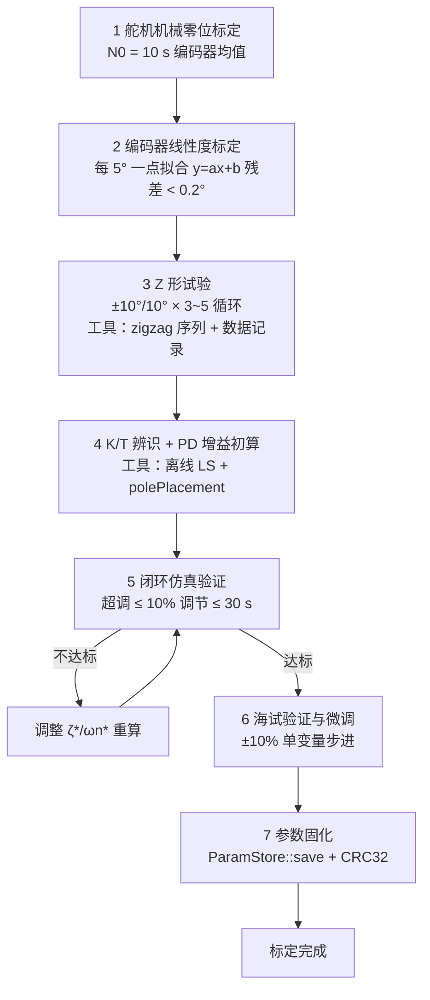

| 标定步骤 | 消费的模块/工具 | 交付里程碑 |
|----------|-----------------|-----------|
| 步骤 3 | `ManeuverSequencer::zigzag` + 日志记录 | M4 |
| 步骤 4 | 离线辨识工具（§5.3 路线 A）+ `AutoTuner::polePlacement` | M2/M3 |
| 步骤 5 | 闭环仿真环境（§10.2） | M1 |
| 步骤 7 | `ParamStore` | M2 |

### 8.3 参数集与 EEPROM 区块映射

```cpp
struct ControlParams {
    // 区块 A：执行器标定
    double rudderZero, rudderLeft, rudderRight;  // N0 / NL / NR
    double ddotMax;                               // 舵速限幅 (deg/s)
    // 区块 B：模型参数
    double K, T;
    // 区块 C：PD 增益
    double Kp, Kd;
    // 元信息
    uint32_t version, timestamp, crc;
};
```

| 设计区块 | 内容 | 当前实现 | 差距 |
|----------|------|----------|------|
| 区块 A | N0/NL/NR、舵速限幅 | 已含 | — |
| 区块 B | K、T | 已含 | — |
| 区块 C | Kp、Kd | 已含 | — |
| 区块 D | 增益调度表 | **未含** | 需扩展（§10.5-P8） |
| 元信息 | 版本 + 时间戳 + CRC | 已含 | 时间戳未自动填写 |

### 8.4 CRC 与版本机制

- CRC32 采用 IEEE 802.3 多项式 `0xEDB88320`，逐 bit 实现（无查找表，牺牲速度换 ROM 空间，仅在保存/加载时调用，可接受）。
- `save()`：版本号 +1 → 计算 CRC → 序列化写入；`load()`：读取 → CRC 校验，失败返回 false 由上层加载默认安全参数并告警（设计 §3.9.8）。
- **人工标定优先级高于自动优化**（设计 §3.10.8）：人工标定写入后，AutoTuner 的基线（`setBaseline`）必须重置为标定值。

上电加载流程：

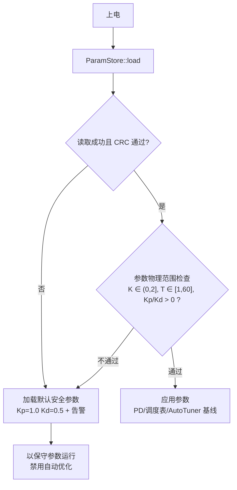

（范围检查为增补要求，当前 `load()` 仅做 CRC 校验，见 §10.5-P8。）

### 8.5 序列化实现的风险与整改

当前 `serialize()` 用 `memcpy(this)` 截取 `sizeof(ControlParams) − 4` 字节，存在三个必须整改的问题（§10.5-P8）：

1. **CRC 字段自包含**：`ControlParams` 按 8 字节对齐后 crc 位于截取范围内，`updateCrc()` 计算摘要时包含旧 crc 值、写入新值后 `verifyCrc()` 重算的摘要即与存储值不符——**save 后立即 load 会校验失败**。整改：序列化范围显式排除 crc 字段（逐字段序列化）。
2. **依赖结构体内存布局**：填充字节内容未定义，同一份参数两次序列化可能产生不同 CRC；跨编译器/ABI 不可移植。整改：逐字段小端序列化。
3. **load 读取长度**与 save 写入长度不一致（`sizeof` vs `sizeof−4+4` 的布局差异），依赖填充巧合。整改后统一为显式格式：`[8×double][version u32][timestamp u32][crc u32]` 共 76 字节。

### 8.6 标定操作规程要点（供试验大纲引用）

| 步骤 | 前置条件 | 通过判据 | 数据留存 |
|------|----------|----------|----------|
| 零位/满舵 | 舵机离合脱开，静水系泊 | 10 s 采样标准差 < 2 LSB | N0/NL/NR 原始码 |
| 线性度 | 每 5° 一点 | 拟合残差 < 0.2° | 全部点位码值 |
| 舵速 | ±20° 阶跃 | 舵速上限 = 40°/t_r，与铭牌值一致（±20%） | 阶跃响应曲线 |
| Z 形试验 | 海况 ≤ 1 级、场地 Z1 区、船速按 D1 计划 | 3~5 完整循环，r 信噪比 > 10 dB | δ(t)/r(t)/ψ(t) 50 Hz 原始记录 |
| 辨识 | Z 形数据 | 残差 RMS < 5%·r_max | K/T + 残差报告 |
| 仿真 | 辨识 K/T | §1.5 四项指标全达标 | 仿真曲线 + 指标表 |
| 海试微调 | 场地 D1~D2 | 航向误差 1σ ≤ 1°（静水） | 每次调整的增益与结果 |
| 固化 | 以上全部通过 | save 后回读 CRC 通过 | EEPROM 镜像备份 |

### 8.7 测试要点

| 用例 | 场景 | 预期 |
|------|------|------|
| 读写回环 | save → load（内存模拟 IO） | 参数逐字段一致，CRC 通过（当前实现该用例失败，作为 P8 整改回归用例） |
| CRC 篡改 | 写入后翻转任意 1 bit | load 返回 false |
| 版本递增 | 连续 save 3 次 | version 严格 +1 递增 |
| IO 失败 | ReadFn/WriteFn 返回 false | load/save 返回 false，不崩溃 |
| 默认参数回退 | load 失败路径 | 上层拿到保守默认参数 |

---

## 9. 核心集成与主循环开发

### 9.1 设计依据

设计文档 §5（定位与控制联合工作流）：§5.1 主循环、§5.2 模式切换、§5.3 定位失效降级、§5.4 数据流时序。实现文件：`control/include/autopilot_core.hpp`。

### 9.2 集成接口

`AutopilotCore::step(SensorInput, dt) → 目标舵角` 是算法层与 BSP 层唯一的运行时边界：

```cpp
struct SensorInput {
    double headingDeg;   // AHRS 艏向（已融合 GNSS 校正后的值）
    double rateDegS;     // AHRS 转向率
    double rudderDeg;    // 舵角反馈
    double speedKn;      // 船速（GNSS/计程仪）
    int    seaState;     // 海况 0..3（人工设定或估计）
};
```

**边界约定**：航向融合（"AHRS 高频 + GNSS 校正"，设计 §5.1）与传感器有效性判断在 BSP/融合层完成，`headingDeg` 进入算法层时已是可信值；定位失效降级（设计 §5.3）表现为上层切换模式，算法层不感知 GNSS 状态。

### 9.3 模式状态机

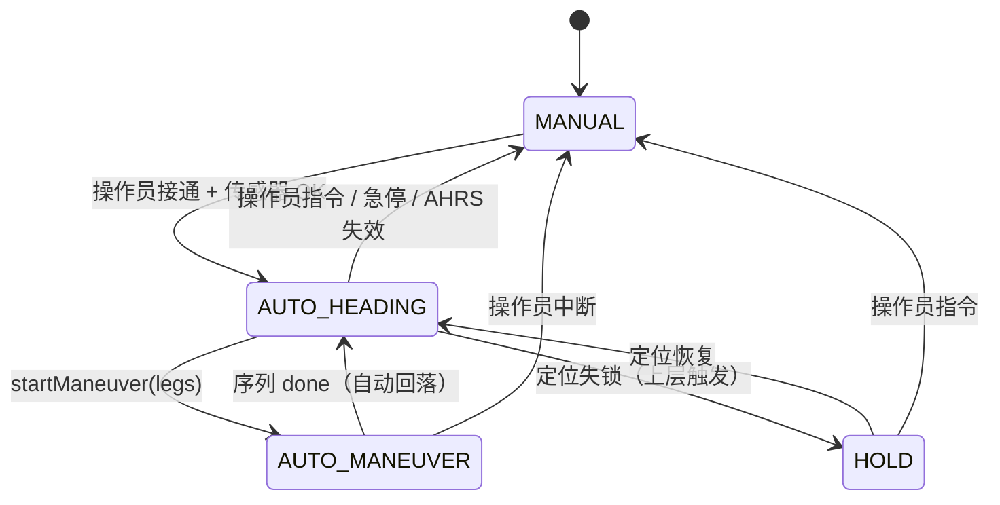

各模式输出语义：

| 模式 | 输出 | 说明 |
|------|------|------|
| MANUAL | 透传 `rudderDeg` 反馈 | 算法层不干预 |
| AUTO_HEADING | PD(headingRef, headingAct) | 含增益调度 + 自动优化 |
| AUTO_MANEUVER | 序列指令（HEADING 段走 PD / RUDDER 段直出） | done 后自动回 AUTO_HEADING |
| HOLD | 0（回中） | 设计语义为"保持"，回中是保守实现；是否应保持当前舵角待评审（§10.5-P9） |

**模式切换的状态清理**：切入 AUTO_HEADING/AUTO_MANEUVER 时必须 `pd_.reset()`（清微分历史）并以当前实际舵角初始化舵速限幅基准，否则切换瞬间会产生舵角跳变。当前 `setMode()` 仅赋值不清理，列入 §10.5-P9。

### 9.4 AUTO_HEADING 周期内流程

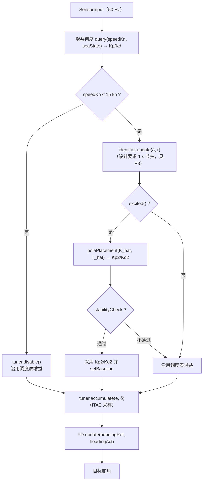

ESC 微调（层 3）**不在**该 50 Hz 路径内：外部调度器每 60 s 窗口调用一次 `runEscTuning()`（§6.4.2 时间尺度分离）。

### 9.5 各模块调用节拍

| 模块 | 节拍 | 调用者 | 备注 |
|------|------|--------|------|
| `AutopilotCore::step` | 20 ms（50 Hz） | BSP 主循环 | 唯一运行时入口 |
| `PdController::update` | 20 ms | step 内 | — |
| `GainSchedule::query` | 20 ms | step 内 | 查表开销 O(表长) |
| `NomotoIdentifier::update` | **1 s**（设计） | step 内降频计数器 | 当前 50 Hz 直调，待整改 P3 |
| `AutoTuner::accumulate` | 20 ms | step 内 | 滑动窗口采样 |
| `AutoTuner::escStep` | 60 s | 外部 `runEscTuning` | 时间尺度分离 |
| `ManeuverSequencer::update` | 20 ms | step 内（AUTO_MANEUVER） | — |
| `ParamStore::save/load` | 事件驱动 | 上电 / 标定完成 / 参数更新 | 不进主循环 |

### 9.6 数据流时序

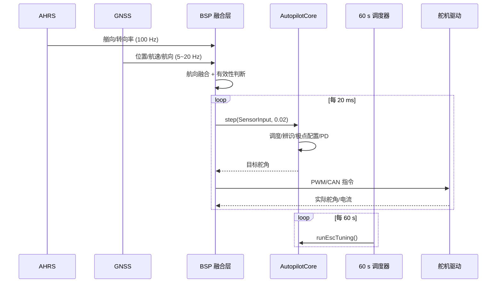

### 9.7 实时性预算

50 Hz 周期内算法层最坏执行时间预算 < 2 ms（周期的 10%）：

| 环节 | 预算 | 依据 |
|------|------|------|
| 增益调度查表 | < 10 μs | 14 条线性扫描 |
| RLS 更新（触发拍） | < 50 μs | 2×2 矩阵定长运算 |
| 极点配置 + 稳定性检查 | < 10 μs | 纯标量运算 |
| accumulate + 队列维护 | < 20 μs | deque push/pop，**建议改环形数组消除堆分配**（P2） |
| PD update | < 10 μs | 标量运算 |
| 合计 | **< 100 μs** | 裕量 20 倍 |

`computeJ()`（3000 样本遍历）只在 60 s 节拍调用，不占主循环预算。

### 9.8 测试要点

| 用例 | 场景 | 预期 |
|------|------|------|
| 模式全遍历 | 按 §9.3 状态机路径切换 | 每次切换输出连续（无 > 0.2°/拍 跳变，P9 整改后） |
| 机动自动回落 | Williamson 执行完 | 模式自动回 AUTO_HEADING，headingRef 为末段目标 |
| 高速去激活 | speedKn 从 10 → 16 | 辨识/优化停用，仅调度表增益生效 |
| 长时运行 | 仿真 2 h 连续 step | 无内存增长、无 NaN、指标稳定 |
| 周期抖动 | dt 在 18~22 ms 抖动 | 控制性能无显著劣化 |

---

## 10. 测试与验证计划

### 10.1 单元测试（V 模型右侧第 1 级）

各模块用例已列于 §3.6/§4.6/§5.6/§6.6/§7.5/§8.7/§9.8，汇总覆盖要求：

| 模块 | 用例数下限 | 关键覆盖 |
|------|-----------|----------|
| angle_utils | 6 | ±180° 边界（左开右闭）、跨零、大角度折叠 |
| pd_controller | 7 | 处理链顺序、首拍、死区、双限幅、量化 |
| gain_schedule | 6 | 段边界、越界防御、外推 |
| nomoto_identifier | 5 | 收敛性、激励门限、协方差保护、坏数据 |
| auto_tuner | 8 | 极点配置往返、负 Kd、clamp、ESC 收敛、四条件、回退 |
| maneuver_sequencer | 8 | 三类触发、切段清零、六机动推进、缺陷回归 |
| param_store | 5 | 回环、CRC 篡改、版本、IO 失败 |
| autopilot_core | 5 | 模式切换连续性、回落、长时运行 |

准出：全部通过 + ASan/UBSan 无报告 + 行覆盖率 ≥ 90%。

### 10.2 闭环仿真验证（V 模型右侧第 2 级）

仿真被控对象（PC 端，与单测同工程）：

$$
\dot r = \frac{K\delta_{\text{act}} - r}{T},\qquad
\dot\delta_{\text{act}} = \mathrm{clip}\left(\frac{\delta_{\text{cmd}} - \delta_{\text{act}}}{\tau_s},\ \pm\dot\delta_{\max}\right),\qquad
\dot\psi = r
$$

- 舵机一阶惯性 τ_s = 0.3 s + 舵速物理限幅；
- 量测噪声：ψ 加 σ = 0.2° 白噪声，r 加 σ = 0.1°/s；
- 干扰：恒值风致力矩（等效舵角 2°）+ 0.1 Hz 波浪扰动。

验证矩阵（每项跑典型船参数 K=0.2/T=8 与边界参数 K=0.5/T=3、K=0.1/T=20）：

| 验证项 | 判据（§1.5 / 设计 §3.9.6） |
|--------|---------------------------|
| 30° 航向阶跃 | 超调 ≤ 10%，5% 调节时间 ≤ 30 s |
| 航向保持（带干扰） | 稳态误差 ≤ 1°，操舵频次 ≤ 6 次/分钟 |
| 增益调度切换 | 船速斜坡 2 → 24 kn，无输出跳变 > 1° |
| RLS + 极点配置闭环 | 从偏差 50% 的初始 K/T 出发，10 min 内恢复设计指标 |
| ESC 长期运行 | 2 h 仿真 J 无发散，增益始终在界内 |
| 六机动形态 | 轨迹积分绘图与设计 §4 图样一致 |
| 稳定性回退注入 | 人为注入坏辨识值，监控拒绝并回退，无失稳 |

### 10.3 HIL 硬件在环（V 模型右侧第 3 级）

- 算法编译进目标 ECU，仿真模型运行在 PC，经 CAN/串口以 50 Hz 闭环；
- 验证项：实时性（step 最坏执行时间 < 2 ms）、定点/浮点一致性（ECU 与 PC 结果偏差 < 0.01°）、参数固化断电恢复、模式切换与急停响应 < 100 ms（设计 §1.3）；
- 设计 §6.3 要求：RLS 收敛性与 ESC 稳定性先在 HIL 验证，再分速段海试。

### 10.4 海试验证（V 模型右侧第 4 级）

对应设计文档 §7.11 场地分区与日程：

| 日程 | 区域/限速 | 验证内容 | 本文档关联 |
|------|-----------|----------|-----------|
| D1 | Z1，≤ 8 kn | Z 形试验、K/T 辨识、PD 整定 | §5、§8 标定流程 |
| D2 | Z2，≤ 15 kn | Williamson/U-Turn/Zigzag/Circles | §7 机动序列 |
| D3 | Z3，≤ 25 kn | 高速航向保持、高速机动、自动优化分速段验证 | §6、§9 |
| D4 | Z4，≤ 25 kn | 紧停、应急退出、降级切换、Search 开环 | §9 模式状态机 |

海试数据全程 50 Hz 记录（δ_cmd/δ_act/ψ/r/U/增益/模式/触发原因），格式与 §3.10.9 优化日志一致，支持岸基回放与回滚分析。

### 10.5 已知实现差距与待完善项清单

代码走查（2026-07-30，对照 `control/include/` 当前版本）发现的差距，按优先级排序。**P1~P3 必须在 M5 集成联调前关闭**：

| 编号 | 优先级 | 位置 | 问题 | 整改方案 |
|------|--------|------|------|----------|
| P1 | 高 | `autopilot_core.hpp` step() | 每周期 `pd_.setParams()`，而 `setParams` 内部 `reset()` 清空微分历史与舵速限幅基准，导致微分项恒为首拍 0、舵速限幅失效 | PdController 增加 `setGains(Kp,Kd)` 轻量接口（不清状态）；dt 单独设置 |
| P2 | 高 | `auto_tuner.hpp` | ESC 为简化解调（dJ×sin 相关），且滑动窗口用 `std::deque`（主循环堆分配） | HIL 收敛慢则升级标准 ESC 结构；deque 改定长环形数组 |
| P3 | 高 | `autopilot_core.hpp` | `identifier_.update()` 按 50 Hz 调用且 Params.dt=0.02 与设计 1 s 节拍不符，差分信噪比低 | step 内加 1 s 降频计数器，Identifier dt 配 1.0 |
| P4 | 高 | `autopilot_core.hpp` / `auto_tuner.hpp` | `stabilityCheck` 的 oscAmplitude 实参恒为 0，四条件之振荡检测永真；振荡检测算法未实装 | 开发 30 s 窗口航向误差峰峰值统计，接入 C3 条件与 §6.4.3 触发矩阵 |
| P5 | 中 | `gain_schedule.hpp` | 注释声称插值实为阶跃查表；段切换有增益跳变 | 速度维线性插值或增益斜坡限速（§4.4） |
| P6 | 中 | `nomoto_identifier.hpp` / `auto_tuner.hpp` | 辨识结果无物理范围检查；polePlacement 对 K≈0 返回 Kp=Kd=0（开环危险） | K∈(0,2]、T∈[1,60] 门限；polePlacement 改返回 bool，失败保持原增益；Kd clamp ≥ 0 |
| P7 | 中 | `maneuver_sequencer.hpp` / `autopilot_core.hpp` | Cloverleaf/Search 转向段 HEADING+270°/90° 阈值与 PD 最短路径矛盾（序列卡死）；RUDDER 段输出未过限幅；U-Turn 方向不受控 | §7.4.5 方案 A 或 B；RUDDER 段包一层幅值/速率限幅；U-Turn 加方向引导 |
| P8 | 中 | `param_store.hpp` | serialize 含 crc 字段自身与填充字节（save 后 load 校验失败、跨平台不可移植）；缺区块 D（调度表）；load 无物理范围检查；timestamp 未填 | 逐字段显式序列化（§8.5）；扩展区块 D；加载后范围检查（§8.4） |
| P9 | 低 | `autopilot_core.hpp` | `setMode` 无状态清理（切换瞬间舵角跳变）；HOLD 输出 0 与设计"保持"语义待评审；`baselineKp_` 初值 0 时 revert 会回退到 0 | setMode 内 reset PD 并以实际舵角初始化限幅基准；HOLD 语义评审；baseline 未初始化时 revert 改为保持当前值 |
| P10 | 低 | `maneuver_sequencer.hpp` | `zigzag()`/`cloverleaf()` 内 `cum` 变量未使用；`zigzag(psi0,...)` 的 psi0 未参与序列构造 | 清理死代码；zigzag 增加末段"回 ψ0 保持"可选项 |

### 10.6 验收放行结论模板

| 里程碑 | 放行条件 | 证据 |
|--------|----------|------|
| M1~M4 | §10.1 单测准出 + 对应模块仿真项通过 | 单测报告 + 仿真曲线 |
| M5 | P1~P3 关闭 + §10.2 全矩阵通过 + §10.3 HIL 通过 | HIL 报告 |
| 海试放行 | M5 通过 + P4~P8 关闭 + 场地验收清单（设计 §7.12）全勾选 | 海试大纲评审记录 |

---

## 11. 可视化调参工具开发

### 11.1 定位与现状

**定位**：可视化调参工具（`control/ui/debug_ui.html`，配套说明 `control/ui/README.md`）是贯穿 M1~M5 的开发支撑项目——参数整定、算法验证、HIL 联调、海试调参都以它为人机界面。工具内的算法实现是 C++ 头文件的 JS 镜像，**仅用于调试可视化，不可用于实船控制**（实船闭环必须走 C++ ECU）。

现有能力（V1.0，933 行单文件 Web 应用，浏览器直接打开）：

| 能力 | 说明 | 覆盖章节 |
|------|------|----------|
| 参数在线编辑 | PD / 调度表 / 辨识器 / 优化器 4 组参数，与 C++ `Params` 逐字段映射 | §3~§6 |
| 实时曲线 | 航向、舵角、误差/转向率三路 Canvas，50 Hz 刷新 | — |
| 实时滑块 | Kp / Kd / 航向目标 / 船速 / 海况 五路拖动即生效 | §3、§4 |
| 机动触发 | 6 种预置机动一键启动 + 段推进显示 | §7 |
| 自动优化观察 | K̂ / T̂ / J / ζ̂ / ω̂n 实时显示，启用 / 禁用 / ESC 单步 / 回退 | §5、§6 |
| 双模式运行 | 内置 Nomoto 仿真器（SIL）/ WebSocket 对接真实 ECU | §10.2、§10.3 |
| 数据导出 | CSV / JSON（含参数快照），供 MATLAB/Python 离线分析 | §10.4 |

### 11.2 可视化调参总流程

调参按 **SIL 仿真 → HIL 半实物 → 海试** 三阶段递进，参数只能"向上带"（上一阶段的结果作为下一阶段初值），不允许跳级：

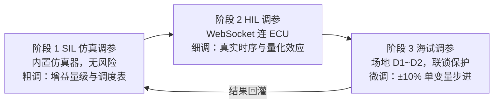

每一轮调参遵循统一的闭环（任一阶段通用）：

```mermaid
graph TD
    W["1 设定工况<br/>船速 / 海况 /（仿真时）K/T"] --> P["2 修改参数<br/>输入框或滑块，单变量原则"]
    P --> X["3 注入激励<br/>航向阶跃 / 机动序列 / 保持观察"]
    X --> C["4 采集响应<br/>曲线 + 指标面板（U1）"]
    C --> J1{"5 判据评估<br/>§1.5 指标 PASS ?"}
    J1 -->|否| A["分析方向：超调大增 Kd<br/>响应慢增 Kp、抖动增 τ/死区"]
    A --> P
    J1 -->|是| V["6 跨工况复验<br/>至少 3 个船速点 × 2 个海况"]
    V --> S["7 固化与记录<br/>下发 ECU ParamStore + 会话日志（U6）"]
```

**单变量原则**：每轮只改一个参数（与设计文档 §3.9.7 一致，海试阶段步长 ±10%）；改多个参数后无法归因，会话日志（U6）按次记录以便回滚。

### 11.3 分对象调参细则

#### 11.3.1 PD 手动整定（M1 阶段主任务）

从调度表初值出发的七步整定法：

```mermaid
graph TD
    S0["初值：调度表查得 Kp0/Kd0<br/>（或极点配置初算值）"] --> S1["30° 航向阶跃，观察响应"]
    S1 --> S2{"响应过慢 /<br/>稳态误差大 ?"}
    S2 -->|是| S3["Kp += 10%，重试"]
    S3 --> S1
    S2 -->|否| S4{"超调 > 10% /<br/>出现振荡 ?"}
    S4 -->|是| S5["Kd += 10%，重试<br/>（Kd 过大表现为高频抖舵）"]
    S5 --> S1
    S4 -->|否| S6["微调 τ / 死区：<br/>抖舵加大 τ，频繁小舵量加大死区"]
    S6 --> S7["跨速段复验（4/10/18/24 kn）<br/>回填调度表"]
```

各参数的调节现象速查表（调参时对照曲线判断方向）：

| 参数 | 调大的现象 | 调小的现象 | 建议步长 |
|------|-----------|-----------|----------|
| Kp | 响应快、超调增大、临界时等幅振荡 | 响应慢、稳态误差大 | ±10% |
| Kd | 超调受抑、噪声下高频抖舵 | 阻尼不足、二次超调 | ±10% |
| τ | 抖舵消失、微分作用滞后 | 微分灵敏、噪声放大 | ±0.05 s |
| deadzone | 操舵频次降、小误差不纠 | 频繁小幅操舵 | ±0.1° |
| ddMax | 转向凌厉、舵机负荷大 | 响应钝、大误差收敛慢 | 按舵机标定值 |

#### 11.3.2 增益调度表整定

1. 在 4 个速度段代表点（2 / 7 / 14 / 22 kn）分别按 §11.3.1 整定出局部最优 Kp/Kd；
2. 在 UI"调度"标签回填表格并应用；
3. 用船速滑块做 2 → 24 kn 斜坡扫描，确认段切换处无输出跳变超标（§10.2 判据 ≤ 1°）；
4. 海况 2~3 行：在仿真器叠加波浪扰动后重复上述流程，通常取静水增益的 60~75%。

#### 11.3.3 辨识与优化参数调参要点

| 参数 | 现象与调节方向 | 观察窗口 |
|------|---------------|----------|
| λ（遗忘因子） | 偏小：K̂/T̂ 跟踪快但噪声大；偏大：平滑但滞后。从 0.98 起 ±0.005 | K̂/T̂ 曲线（U5 平面） |
| P0 | 过小：初期收敛慢；过大：初期跳变剧烈。1e4~1e6 均可接受 | 前 30 个有效样本 |
| δ/r 激励门限 | 过低：直航噪声污染辨识；过高：长期无更新 | "激励"状态灯占空比 |
| escStep η | 过大：J 振荡不收敛；过小：收敛慢。0.01~0.05 | J 历史趋势 |
| escAmp | 过大：扰动本身劣化航向精度；过小：梯度信噪比不足 | 航向误差 1σ |
| ζ*/ωn* | 直接决定响应风格：ζ* 大更稳，ωn* 大更快 | U5 约束平面落点 |

### 11.4 工具增强开发项（V1.1，U1~U7）

现状差距：V1.0 只能"看曲线、凭经验判断"，指标计算、试验流程、对比归因、安全联锁均靠人工。V1.1 按以下 7 项增强，编号纳入 MV 里程碑（§2.2/§2.3）：

| 编号 | 项目 | 动因 | 交付随 |
|------|------|------|--------|
| U1 | 性能指标面板 | §1.5 判据自动评估，替代人工读图 | M1 |
| U2 | 一键阶跃试验 | 标准化激励，试验可重复 | M1 |
| U3 | 参数扫描与 A/B 对比 | 网格寻优 + 归因对比 | M3 |
| U4 | 数据回放 | 海试数据事后复盘 | M4 |
| U5 | ζ-ωn 约束平面 | 稳定性监控可视化 | M3 |
| U6 | 调参会话日志与回滚 | 单变量原则的记录载体 | M4 |
| U7 | 在线调参安全联锁 | 海试在线改参的安全前提 | M5 |

#### U1 性能指标面板

对最近一次阶跃/保持试验自动计算并按 §1.5 阈值显示 PASS/FAIL：

| 指标 | 计算方法 | 阈值 |
|------|----------|------|
| 超调量 | (max(ψ) − ψ_ref) / 阶跃幅值 × 100% | ≤ 10% |
| 5% 调节时间 | 误差最后一次进入 ±5%·阶跃幅值 的时刻 | ≤ 30 s |
| 稳态误差 1σ | 进入稳态后误差标准差 | ≤ 1° |
| 操舵频次 | rudderCmd 变化方向翻转次数 / 分钟（幅值 > 量化步长才计） | ≤ 6 次/min |
| ITAE J | 复用 `computeJ` 同款公式 | 趋势参考 |

#### U2 一键阶跃试验

按固定脚本执行，消除人工操作差异：稳定保持 10 s（误差 1σ < 0.5° 才继续）→ 施加 +30° 阶跃 → 采集 60 s → 施加 −30° 回程 → 采集 60 s → 自动弹出 U1 报告并可导出。左右双向各一次，检查不对称性（不对称提示舵零位偏差，联动 §8 标定）。

#### U3 参数扫描与 A/B 对比

- **网格扫描**（仅 SIL 模式）：设定 Kp ∈ [a,b]×N 点、Kd ∈ [c,d]×M 点，逐点静默仿真固定场景（30° 阶跃 + 60 s 保持），输出 J 的 N×M 热力图，点击热力图单元格即载入该组参数。为 §11.3.1 手动整定提供初值定位。
- **A/B 对比**：保存当前响应为基线曲线（灰色叠加显示），改参后新响应与基线同屏对比，指标面板双列显示差值。

#### U4 数据回放

导入 §10.4 海试记录或 UI 自身导出的 CSV/JSON，以可调倍速重放曲线并重算 U1 指标。用途：海试当晚复盘、缺陷回归（如 §7.4.5 序列卡死的现场数据回放）、向评审提供证据曲线。

#### U5 ζ-ωn 约束平面

以 ζ 为横轴、ωn 为纵轴绘制稳定性监控（§6.5）的可视化：

- 画出约束边界 ζ = 0.6（左禁区）与 ωn = 0.5 rad/s（上禁区）；
- 实时描点 (ζ̂, ω̂n)（由当前 Kp/Kd 与 K̂/T̂ 按 §6.3 验证公式反算），带 60 s 轨迹尾迹；
- 目标点 (ζ*, ωn*) 用十字标注。点落入禁区即红色告警，与 `stabilityCheck` 拒绝行为一致——调参者可在增益被拒绝**之前**直观看到趋势。

#### U6 调参会话日志与回滚

每次"应用参数"自动追加一条会话记录：

```json
{ "ts": 1722310000, "scope": "pd", "old": {"Kp":1.5,"Kd":0.6}, "new": {"Kp":1.65,"Kd":0.6},
  "metrics": {"overshoot":8.2,"ts5":22.1,"ess":0.6,"freq":4.1}, "stage": "HIL" }
```

- 侧栏时间线展示，任意条目一键恢复该组参数（含下发 ECU）；
- 导出为 JSON 附入试验报告，与设计文档 §3.10.9 优化日志格式对齐（字段命名一致，便于岸基工具统一解析）。

#### U7 在线调参安全联锁（ECU 已连接时强制生效）

| 联锁项 | 规则 | 依据 |
|--------|------|------|
| 幅度限制 | 单次下发增益变化 > 20% 时拒绝并提示分步 | 设计 §3.10.7 单次 10% 的 2 倍上限（人工权限放宽） |
| 高速禁改 | ECU 上报船速 > 15 kn 时禁用增益下发（灰化按钮） | 设计 §3.10.6 高速去激活 |
| 确认机制 | 下发前弹窗显示 old → new 差异，二次确认 | — |
| 应答超时回滚 | 2 s 内未收到 `params_ack` 或 `accepted:false`，UI 状态回滚并告警 | README §4.4 协议 |
| 机动中禁改 | 模式为 AUTO_MANEUVER 时禁用全部参数下发 | 设计 §4.10 |
| 紧急恢复 | 常驻"恢复安全参数"按钮：一键下发 EEPROM 默认安全组 | 设计 §3.9.8 |

### 11.5 与各里程碑的调参任务对照

| 阶段 | 使用工具能力 | 调参对象 | 产出 |
|------|--------------|----------|------|
| M1 PD 仿真验证 | U1 + U2 + 滑块 | Kp/Kd/τ/死区（§11.3.1） | 各速段初版增益 |
| M2 辨识调试 | 优化标签 + U5 | λ/P0/激励门限（§11.3.3） | 辨识器参数 |
| M3 自动优化 | U3 + U5 | ζ*/ωn*/ESC 参数 | 优化器参数 + J 热力图 |
| M4 机动验证 | 机动触发 + U4 | 机动幅值/阈值（dMax、δ_z 等） | 机动参数表 |
| M5 HIL | 全部 + U7 | 全参数细调 | HIL 调参报告 |
| 海试 D1~D2 | U1/U2/U6/U7 | ±10% 单变量微调（设计 §3.9.7） | 固化参数 + 会话日志 |

### 11.6 验收判据

| 编号 | 验收判据 |
|------|----------|
| U1 | 对已知解析响应的仿真数据，指标计算误差 < 2%；PASS/FAIL 与人工判读一致 |
| U2 | 连续 3 次一键试验，同参数下指标离散度 < 3%（可重复性） |
| U3 | 10×10 网格扫描 < 60 s 完成；热力图最优点与手动整定结果偏差 < 15% |
| U4 | 导入 1 h 海试 CSV（18 万样本）加载 < 5 s，回放流畅无丢点 |
| U5 | 描点值与 C++ `stabilityCheck` 反算值一致（1e-6）；禁区告警与拒绝行为同步 |
| U6 | 100 条会话记录回滚任意一条，参数与记录逐字段一致 |
| U7 | 六项联锁逐项注入违规操作，全部被拦截且有明确提示；断链时自动回滚验证通过 |

---

## 附录 A：术语与符号

| 符号 | 含义 | 单位 |
|------|------|------|
| ψ / ψ_ref | 实际 / 期望航向 | deg |
| e | 航向误差（归一化到 (−180°, 180°]） | deg |
| r | 转向率 dψ/dt | deg/s |
| δ | 舵角（右舵为正） | deg |
| K, T | Nomoto 旋回性 / 追随性指数 | 1/s, s |
| Kp, Kd | PD 比例 / 微分增益 | — |
| ζ, ωn | 闭环阻尼比 / 自然频率 | —, rad/s |
| λ | RLS 遗忘因子 | — |
| J | ITAE + 控制能耗性能指标 | — |
| ESC | Extremum Seeking Control 极值搜索 | — |
| RLS | Recursive Least Squares 递推最小二乘 | — |
| HIL | Hardware-in-the-Loop 硬件在环 | — |

---

— 文档结束 —
