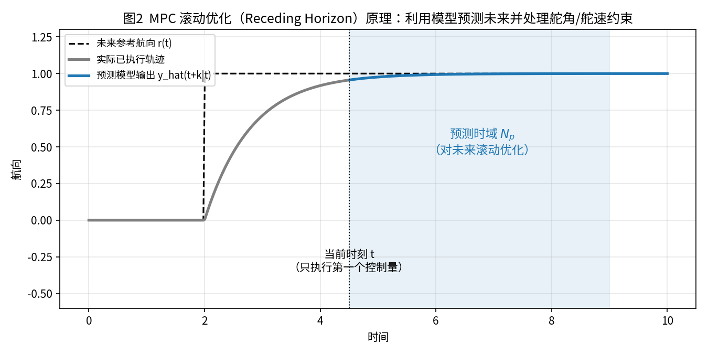
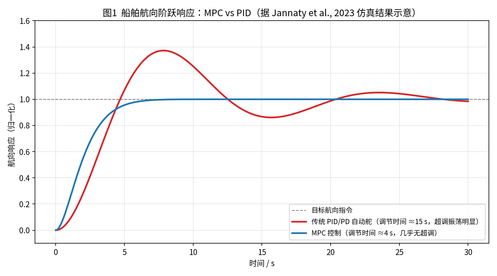
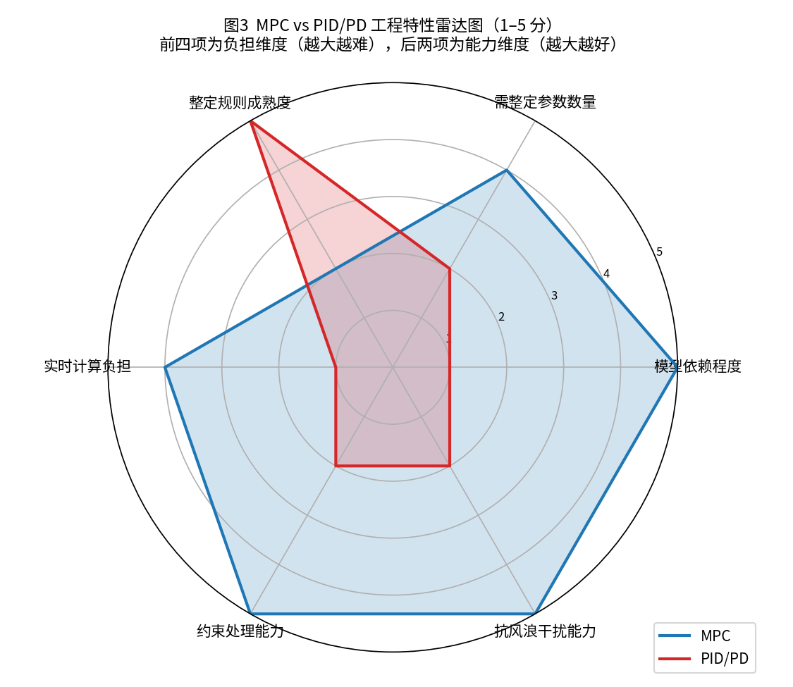
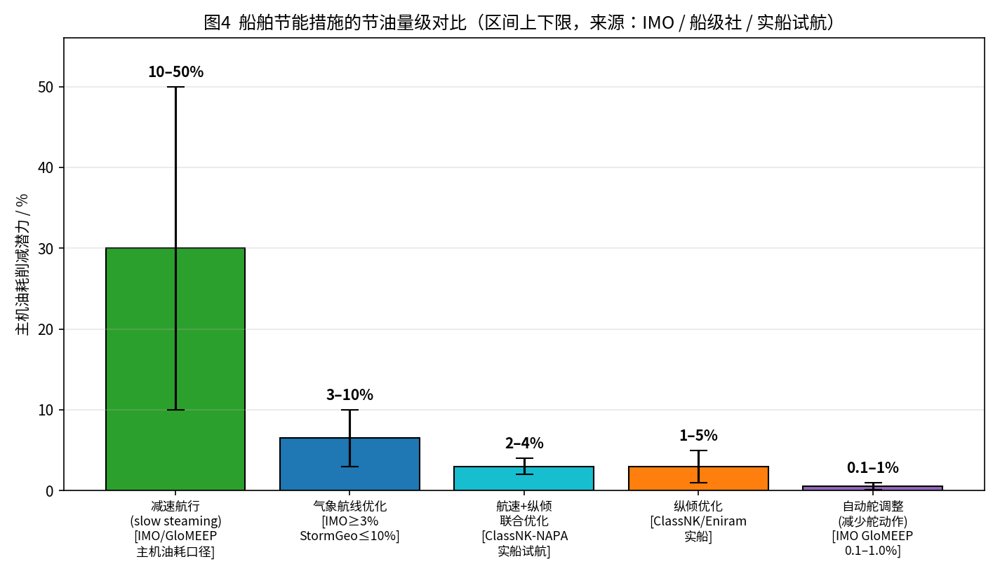
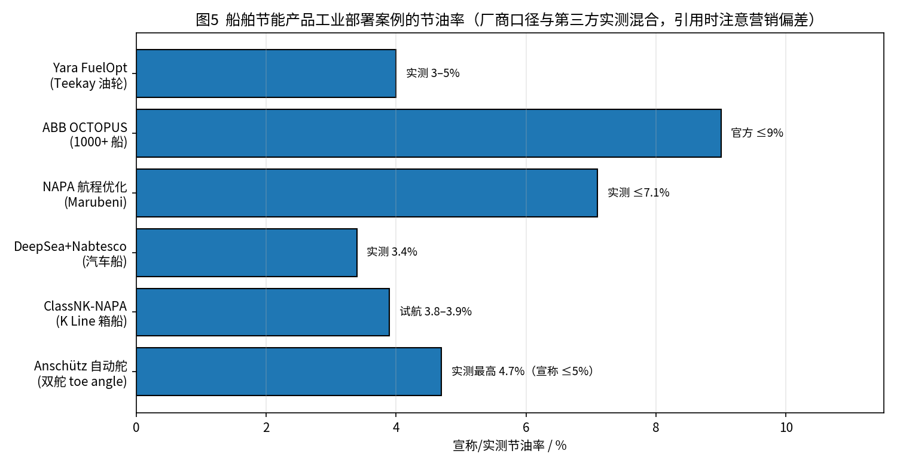
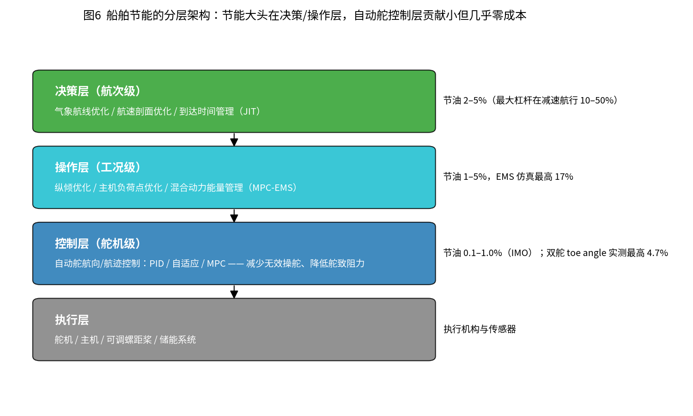

# 船舶控制与节能算法调研文档：MPC vs PD 自动舵 与 船舶节能方案综述

> 调研日期：2026-08-07（初版）；2026-08-07（第二轮来源核对与补充修订）
> 调研范围：① MPC（模型预测控制）与传统 PD/PID 自动舵在船舶上的部署对比（调试难度、控制效果）；② 船舶节能算法的学术论文与工业部署案例
> 数据来源：IEEE / ScienceDirect / MDPI / arXiv 论文，IMO / ABS / ClassNK 官方资料，ABB、Wärtsilä、Kongsberg、NAPA、Yara Marine、Anschütz 等厂商公开资料
> **核查说明**：本文全部定量数据已经过第二轮逐条与原文核对（核对结论标注为 ✅一致 / ⚠️已修正 / ❌无法证实），修正记录见附录 A；厂商宣称数据与第三方实测数据已区分标注，引用时注意营销偏差。

---

## 一、背景与问题定义

船舶航向/航迹控制（自动舵）是船舶上最基础的控制回路。当前工业自动舵的绝对主流仍是 **PID/PD 型控制器**（常叠加海浪滤波与自适应增益调度）。Källström 在 *Control Engineering Practice*（2000）记载的 Stena HSS 高速双体船实船自动舵系统（TAP）即以 PID 型与自适应控制并行提供，且"正常海况下 PID 与自适应控制性能大致相当"——但该文同时指出其参数整定工作量"comprehensive（非常庞大）"；这一"PID 为主、整定繁琐"的格局至今未根本改变。（来源：[Källström, 2000](https://www.sciencedirect.com/science/article/abs/pii/S0967066199001677)，实船应用论文，非综述）

两条外部驱动正在改变技术选型空间：

- **法规驱动**：IMO 的 EEXI（现有船舶能效指数）与 CII（营运碳强度指标）依据 MARPOL 附则 VI 修正案（MEPC.328(76)，2022-11-01 生效）强制执行：
  - **EEXI**：适用于 ≥400 GT 船舶，将"实际 EEXI（attained）"与按船型/吨位折减系数确定的"要求 EEXI（required）"对比，一次性技术合规；计算与验证指南为 MEPC.350(78)/MEPC.351(78)，轴/主机功率限制（ShaPoLi/EPL）指南为 MEPC.335(76)；
  - **CII**：适用于 ≥5,000 GT 船舶，按年度营运碳强度（常用 AER，单位运输功 CO₂）对照参考线（G2=MEPC.353(78)）与逐年折减系数（G3=MEPC.338(76)）评级，评级边界（G4=MEPC.354(78)）分为 A–E 五档；**连续 3 年 D 或 1 年 E 须在 SEEMP Part III 中提交纠正措施计划**；法规要求 2026-01-01 前完成复审。EU ETS 自 2024 年起将航运纳入碳交易。
  （来源：[IMO 官方 EEXI/CII FAQ](https://www.imo.org/en/MediaCentre/HotTopics/Pages/EEXI-CII-FAQ.aspx)；[MarineLink, 2023](https://ports.marinelink.com/ports/port/port-allen-uspal/news/imos-eexi-and-cii-decarbonization-regulations-enter-enforcement-in-2023)）
- **控制理论下沉**：MPC 在过程工业成熟后，正随嵌入式求解器（OSQP、qpSWIFT、acados、HPIPM 等）的成熟向船舶控制渗透；学术界已有大量船舶 MPC 仿真与船模试验成果（见 2.2、2.4 节）。

本文回答两个工程问题：

1. 把 MPC 换上船替代传统 PD 自动舵，**调试有多难、效果差多少、值不值**？
2. 船舶节能有哪些算法路线，**各自节能多少、有什么坑、业界实际部署情况如何**？

---

## 二、MPC 与传统 PD/PID 自动舵的部署对比

### 2.1 两种方法的原理差异

**PD/PID 自动舵**：根据航向误差 e(t) 及其微分（转首角速度 r）直接计算舵角 δ = Kp·e + Kd·r（+ Ki·∫e）。结构简单、无模型在线计算，是"看着误差打舵"的反馈控制。

**MPC 自动舵**：每个控制周期求解一个有限时域优化问题——用船舶运动模型（如 Nomoto 一阶/二阶模型）预测未来 Np 步航向响应，在**舵角幅值约束（如 |δ|≤35°）、舵速约束（如 |δ̇|≤3°/s）** 下最小化航向偏差与操舵能量的加权和，只执行第一个控制量，下一周期滚动重解（图2）。

MPC 相对 PD 的本质增量有三点：**前视预测**（对未来参考轨迹与干扰做出预判）、**显式约束处理**（舵角/舵速限幅进入优化问题而非事后饱和截断）、**目标可组合**（在代价函数中直接加入"少打舵省油""限制转首角速度保证乘坐舒适"等多目标）。

### 2.2 控制效果差异

多项对比研究的一致结论是：**在模型可用、约束明确的场景，MPC 的响应速度、超调抑制、抗干扰、舵机动作经济性全面优于 PID/PD**。

| 研究 | 场景 | 关键结果（均已与原文核对） | 验证方式 |
|------|------|----------|----------|
| Jannaty et al., 2023（[PDF](https://pdfs.semanticscholar.org/d822/3e9163b9d78bbae541b1e9820cbe36d81daf.pdf)，Kadikma 14(3)） | SIGMA 级轻型护卫舰航向控制（Nomoto 模型，0°→30° 阶跃，Np=40，离散步长 0.1 s） | 原文："using PID, system reach reference angle in **15 seconds**, while using MPC, in **4 seconds**"；约束 |δ|≤35°、|r|≤0.0932 rad/s；摘要："MPC can compensate the disturbance better than PID"（注：扰动为人工正弦形式 w(k)=[0.00001+0.1cos t; 0.001+0.1sin t]，非真实海浪谱） | 仿真 |
| Zhang et al., 2025, *Ocean Engineering* 334:121592（[全文](https://repository.tudelft.nl/file/File_4dca60ee-8635-4954-bee2-d55ab94a6f2c?preview=1)） | 内河船 NMPC 路径跟踪，浅水/岸壁效应/流干扰 | 摘要："NMPC effectively reduces course deviations and cross-track errors… while also requiring fewer rudder deflections"。全文无百分比，定量在 Table 5：T 型交汇下游平均横偏误差 AAXTE **PID 9.497 m vs NMPC 1.731 m（≈降 82%）**，直道 1.244 vs 0.292 m；正文："NMPC 的 XTE 稳定在 5 m 以内，PID 几乎为其两倍"。**边界**：控制投入指标 AACE 在直道与弯道工况下 PID 反而更优，"舵角更少"主要体现在 T 型交汇工况与舵角振荡幅度 | 仿真 |
| MDPI Applied Sciences, 2026, 16(9):4477（[全文](https://www.mdpi.com/2076-3417/16/9/4477)） | 桥区受限水域 FFRLS-MPC（前馈+递推最小二乘自适应） | 工况：6.5 m/s 航速，180° 方向持续干扰（10 m/s 风 + 3 m 有义波高 + 1.2 m/s 流）；45° 阶跃调节时间 **ts≈120–160 s**（改进 MPC），固定参数 MPC 280–340 s，PID **超过 600 s** | 仿真 |
| 《基于DMPC的船舶航向控制算法研究》，《舰船科学技术》2024 年第 7 期（DOI:10.3404/j.issn.1672-7649.2024.07.009，[全文](https://html.rhhz.net/jckxjsgw/html/74000.htm)） | 舵角 ±30°、舵速 ±3°/s 硬约束 | DMPC（Laguerre 参数化 + Hildreth QP，采样 0.1 s）；海浪频段辅助滤波"达到减小无效操舵的目的"；引言引用刘程的对比仿真表明约束下 MPC 优于 LQR 与 PID（二手引用，已标注） | 仿真 |
| Fernández & Hollinger, 2017, *IEEE RA-L* 2(1):88–95（ICRA 2017 选项，[PDF](https://research.engr.oregonstate.edu/rdml/sites/research.engr.oregonstate.edu.rdml/files/mpc_icra.pdf)） | 波浪场水下机器人位置保持（预测时域 0.8 s） | 原文："simulated and found to show a **74% reduction** in position error over traditional feedback control"（对照为 PD；波浪由浮标数据重构）——**纯仿真结果**，佐证"前视预测对抗波浪干扰"的机理 | 仿真 |
| He et al., 2023, *Ocean Engineering*（[摘要页](https://www.sciencedirect.com/science/article/abs/pii/S0029801823023557)） | 内河船 MPC 路径跟踪 | 拖曳水池自由自航船模实验，采样 8 Hz；明确警示"预测模型与仿真模型几乎相同时，仿真结果不具说服力（cannot be convincing）" | **船模实验** |

**必须指出的证据边界**：上述对比几乎全部来自**仿真或水池船模试验**。经第二轮检索确认，**仍未发现全尺度实船 MPC 自动舵 vs PID 的公开定量对比数据**；最接近的实船先例是 van Amerongen 的 MRAS 自适应自动舵全尺度试航（见 3.5 节），但 MRAS 并非 MPC。实船产品层面，节能自动舵仍以"自适应/ECO 模式（滤波抑制高频操舵）"为主，而非 MPC（Zheng et al. 自动舵综述，JMSE 2025;13(5):851，[链接](https://www.mdpi.com/2077-1312/13/5/851)——该综述将预测控制列为先进自动舵关键技术之一，但通篇无实船油耗数据）。

### 2.3 调试难度对比

这是 MPC 上船的最大障碍。He et al., 2023 直言：**"The determination of the model parameters is a big handicap in implementing MPC"（模型参数确定是实现 MPC 的最大障碍）**——实船无法都做约束模试验，必须转向数据驱动/系统辨识（该文用 Z 形机动数据辨识带偏置项的简化 Nomoto 航向模型作预测模型）。

#### 2.3.1 PID/PD 侧：整定规则成熟、可现场操作

- **Ziegler-Nichols 临界比例度法**（无模型）：增大 Kp 至系统等幅振荡，记录临界增益 Ku 与振荡周期 Tu，取 Kp=0.6Ku、Ti=Tu/2、Td=Tu/8。步骤机械、船员可执行（步骤描述见 [Wikipedia: Ziegler–Nichols method](https://en.wikipedia.org/wiki/Ziegler–Nichols_method)；学术溯源 Åström & Hägglund 教材）。
- **基于 Nomoto 模型的极点配置**（有模型）：将 PD 律 δ=Kp(ψd−ψ)−Kd·ψ̇ 代入一阶 Nomoto 模型，闭环特征式与标准二阶比较即得解析整定公式 **Kp=ωn²T/K，Kd=(2ζωnT−1)/K**（一般取阻尼比 ζ≈1），积分项另有启发式公式（溯源 Fossen 1994；完整推导见 [Unar, 1999, 格拉斯哥大学博士论文 §3.6.1](https://theses.gla.ac.uk/4493/)；工程化转述见 [Świder et al., 2023, *Polish Maritime Research* 30(1):78–85](http://www.bg.pg.gda.pl/pmr/pdf/PMRes_2023_1.pdf)）。
- **进阶**：模糊自整定 PID（Nomoto 模型 + 极点配置初值 + 模糊在线修正，[Tomera, 2017, TransNav](https://www.researchgate.net/publication/318658447)；注：蚁群算法整定是 Tomera 另一篇 2014 年论文，Procedia CS 35:83–92）。

#### 2.3.2 MPC 侧：模型辨识 + 多参数耦合整定

- **模型获取是硬门槛**：需 Z 形/回转等机动试验数据做系统辨识，且模型随装载、污底、海况漂移，需在线再辨识或自适应机制。
- **整定参数多且耦合**：Np、Nc、Q、R、采样周期、约束边界需同时考虑（[Koetje, 2011, UCT 硕士论文](https://open.uct.ac.za/bitstreams/a690377e-3b85-455b-bb5e-60635f854e79/download)："Due to the structure of the MPC design, many parameters are involved that need to be considered to tune the controller performance"）。
- **缺乏系统化整定规则**：DTU 2025 年四容水箱对比研究（[arXiv:2509.11235](https://arxiv.org/abs/2509.11235)，预印本）原文："the tuning of the MPC were based on **trial-and-error** adjustment of the weights"，而 "The PID tuning was based on the SIMC tuning rules"；并引 Maciejowski 指出 MPC 整定问题在文献中"常被忽视（less addressed）"。通用整定指南见 [Alhajeri & Soroush, 2020, *I&EC Research* 59(10):4177–4191](https://par.nsf.gov/servlets/purl/10299968)，但其前提是先要辨识出足够精确的模型。

| 维度 | 传统 PD/PID | MPC |
|------|-------------|-----|
| **模型依赖** | 可无模型整定（Z-N），或有 Nomoto 模型时用解析公式 | **必须有足够精度的预测模型**；模型失配直接劣化性能 |
| **整定参数** | 2–3 个增益；规则成熟、船员可现场整定 | Np、Nc、Q、R、采样周期、约束边界多参数耦合；多靠 trial-and-error |
| **实时计算** | 几次乘加，单片机即可 | 每周期解一次 QP/NLP（详见 2.4 节，船舶慢动态下可满足） |
| **约束与安全** | 事后饱和截断，约束下性能退化 | 约束**显式进入优化问题**，舵角/舵速/转首角速度限值天然满足 |
| **稳定性理论** | 成熟（频域裕度、极点配置） | 需专门构造（终端约束/Lyapunov 约束，详见 2.5 节） |
| **现场可维护性** | 船员与服务商普遍掌握 | 依赖控制工程师；模型漂移需配套自适应机制 |

> 注：图3 为作者基于本节文献证据的**主观打分示意**（1–5 分），用于直观呈现轮廓差异，非实测数据。

### 2.4 实时性与嵌入式求解器（补充）

船舶航向动态慢（控制周期 0.1–0.2 s 足够），MPC 实时性在船舶场景通常可满足，但需要嵌入式求解器工程化：

- He et al., 2023：船模自由自航系统采样 **8 Hz**，要求单步求解小于 125 ms，为此将优化问题大幅简化（无导数优化器 + scenario-based MPC）。
- Hu et al., 2024, *JMSE* 12(1):94（[链接](https://www.mdpi.com/2077-1312/12/1/94)）：BlueROV2 水下机器人（4 自由度慢动态 marine vehicle），acados 实时迭代 + multiple shooting，预测时域 60、采样 0.05 s（20 Hz），**OCP 平均求解时间 7 ms**（仅为采样周期的 14%），原文确认可实时运行。
- 嵌入式 QP 求解器基准：[arXiv:2510.21773（2025）](https://arxiv.org/abs/2510.21773)在 x86（LattePanda Alpha）与 ARM（Jetson Orin NX）嵌入式平台实测 HPIPM/PROXQP/OSQP/qpOASES/qpSWIFT 解 MPC 型 QP：稀疏结构内点法（HPIPM）长时域最快，OSQP 靠热启动在中等精度下稳定可用。
- 经典求解器文献：OSQP（Stellato et al., 2020）、qpSWIFT（Pandala et al., 2019, IEEE RA-L）、acados（Verschueren et al., 2021）。
- 自主拖船 MPC 采样周期 0.2 s（[You et al., 2024, UCL](https://discovery.ucl.ac.uk/id/eprint/10197595/1/03_Time_efficient_model_predictive_control_for_autonomous_tugs_with_adaptive_input_constraints.pdf)）。

### 2.5 稳定性与安全性（补充）

- **PID/PD**：基于 Nomoto 模型的闭环分析成熟，频域裕度与极点配置提供直观稳定性保证——这是其工业信任的根基。
- **MPC**：有限时域优化本身不天然保证闭环稳定，需专门构造。经典框架为终端约束集 + 终端代价（[Mayne et al., 2000, *Automatica* 36(6)](https://www.sciencedirect.com/science/article/abs/pii/S0005109899002149)，被引逾万的奠基性文献）；船舶/海洋机器人领域的落地形式：
  - Gong et al., 2021, *Ocean Engineering*（[链接](https://www.sciencedirect.com/science/article/abs/pii/S0029801821004455)）：Lyapunov-based MPC 用于 AUV 轨迹跟踪，Lyapunov 约束嵌入优化问题保证闭环稳定；
  - Zhang et al., 2023, *JMSE* 11(2):281（[开放获取](https://www.mdpi.com/2077-1312/11/2/281)）：动力定位船抗扰 Lyapunov-based MPC + 扰动观测器，含稳定性证明。

### 2.6 优缺点小结

**MPC 上船的优点**：
- 响应快、超调小、抗风浪干扰能力强（前视预测机理）；
- 舵角/舵速约束显式满足，舵机动作更少（特定工况下）→ 舵机磨损低、舵致附加阻力小（间接节能）；
- 代价函数可直接编码多目标（跟踪精度 + 操舵能量 + 舒适性），与上层节能优化天然衔接。

**MPC 上船的缺点**：
- 模型辨识是硬门槛（原文 "a big handicap"），且模型随工况漂移，需配套自适应/再辨识机制；
- 整定参数多、缺系统化规则，调试依赖控制工程师而非船员（trial-and-error 权重整定有原文佐证）；
- 需要嵌入式优化求解器与实时性保障工程，认证（船级社型式认可）路径不如 PID 成熟；
- 稳定性需专门构造（终端约束/Lyapunov 约束），不能默认获得；
- 实船定量验证数据稀缺，工程风险集中在"仿真到实船"的 gap。

**PD/PID 的优点**：结构简单、整定规则成熟（Z-N、Nomoto 极点配置解析公式）、可无模型整定、计算量可忽略、稳定性分析成熟、工业生态与认证完备。
**PD/PID 的缺点**：无前瞻、约束处理粗糙、海浪频段易引起无效操舵（需外加海浪滤波/死区/自适应增益），多目标扩展能力弱；且实船整定工作量并不 trivial（Källström 2000 记载其整定"comprehensive"）。

**结论性判断**：对本项目（自动舵）而言，合理的工程路线是 **PD/PID 打底保证可靠性，MPC 作为性能增强层**——先交付经过整定规则整定的 PD 基线，MPC 在其上做 A/B 验证；模型辨识能力（这正是本仓库 `docs/auto_tuning/` 自动调参/辨识流程的价值所在）是 MPC 能否落地的前置条件。

---

## 三、船舶节能算法：学术方案调研与优缺点分析

船舶节能措施的量级差异极大，先给出总览（图4），再逐方案分析。

**量级排序**：减速航行（主机油耗口径 10–50%，最大杠杆）> 气象航线优化（IMO 口径 ≥3%，集装箱船可达 10%）> 航速+纵倾联合优化（实船试航 3.8–3.9%）> 纵倾单项（1–5%）> 自动舵调整（0.1–1.0%）。

### 3.1 航速优化 / 减速航行（Slow Steaming）

| 代表文献 | 方法 | 定量结果（已核对） | 验证 |
|----------|------|----------|------|
| Pelić et al., 2023, *JMSE* 11(3):675（[链接](https://www.mdpi.com/2077-1312/11/3/675)） | 船模水池试验 + 准稳态柴油机数值模型 | 后巴拿马型集装箱船设计航速 23 kn → 12 kn，每海里油耗降 **72.36%–76.25%**（原文）；模型 BSFC 与厂商数据"in all cases is less than 2%"；引言引 Cariou (2011)：2008–2010 年集装箱船减速使行业油耗与 CO₂ 排放降超 11% | 船模试验+仿真 |
| Du et al., 2019, *TR-B* 121:88–114（[链接](https://www.sciencedirect.com/science/article/abs/pii/S0191261517305738)，OpenAlex 被引 169） | 基于实船航次报告数据 + ANN 油耗模型的两阶段优化（岸上航速规划 + 海上纵倾优化） | 原文：动态纵倾（C1）省 **4.96%/5.83%**，ANN 模型航速优化（C2）省 **7.63%/7.57%**，综合（C3）平均省 **8.25%**；"0.57%/3.69%"是 ANN 航速优化相对**三次方定律航速优化**的额外节油（初版文档误述为"两阶段再省"，已修正） | 实船数据 |
| IMO GreenVoyage2050（[链接](https://greenvoyage2050.imo.org/technology/speed-management/)） | 官方技术评估 | "一艘 56,000 DWT 敞舱口货船，13% 减速省约 34% **日油耗**"（特定船案例，非普适值）；另"10% 减速 → 功率/推进油耗降 27%，计入航时后航次总节油约 19%"；削减潜力 **10–50% 为主机油耗口径，全船总油耗口径约 3–12%** | 官方口径 |

- **优点**：杠杆最大（油耗近似与航速立方成正比）；无需任何硬件改装；直接改善 CII 评级。
- **缺点**：以牺牲船期为代价，受租约/班期约束；需供应链端配合（JIT 到港）；低速可能偏离主机最佳负荷点，部分收益被主机效率下降抵消（IMO 口径下全船总节油仅 3–12% 即为例证）。

### 3.2 纵倾优化（Trim Optimization）

| 代表成果 | 方法 | 定量结果（已核对） | 验证 |
|----------|------|----------|------|
| ClassNK-NAPA GREEN 全尺度试航, 2014-04 新闻稿（[链接](https://www.classnk.or.jp/hp/en/hp_pressrelease.aspx?id=834&layout=3)） | 自学习动态性能模型 | 2014 年 1 月 "K" Line 8,000+ TEU 集装箱船（地中海/欧洲航线）全尺度试航：航速/航程优化省 2.7% + 最优纵倾再省 1.2% = **合计 3.8%**（新闻稿标题另写 3.9%，故 3.8–3.9% 均有出处）；油耗预测精度 99.6%；另两次印度洋横渡专项研究显示纵倾优化最多可再省 4% | **实船试航** |
| 高现娇等, 2017,《舰船科学技术》（[链接](https://html.rhhz.net/jckxjsgw/html/53629.htm)） | Fluent CFD + 拖曳水池船模试验 | 确定 46,000 t 油船三工况最优纵倾（摘要无百分比） | CFD+船模 |
| Vasilev et al., 2024, *JMSE* 12(8):1265（[链接](https://www.mdpi.com/2077-1312/12/8/1265)） | CFD 生成数据 + ANN 训练成实用软件工具 | 摘要级无百分比 | 全尺度仿真 |
| Cadence FINE/Marine（[链接](https://resources.system-analysis.cadence.com/computational-fluid-dynamics-articles/fuel-savings-up-to-5-thanks-to-ship-trim-optimization-with-fine-marine)） | CFD 纵倾分析 | 宣称最高 **5%**（厂商口径，未独立核实） | 厂商资料 |

- **优点**：几乎零硬件成本（调整压载水即可）；节油 1–5%；有 ClassNK 级实船试航背书。
- **缺点**：最优纵倾随航速/吃水/海况变化，需准确的"油耗-纵倾"曲面（CFD 或实船学习）；压载调整受稳性与装卸约束；节油幅度在节能家族中偏小。

### 3.3 气象航线优化（Weather Routing）

| 代表文献 | 方法 | 定量结果（已核对） | 验证 |
|----------|------|----------|------|
| Zaccone et al., 2018, *Ocean Engineering*（[链接](https://www.academia.edu/109716159/Optimal_ship_routing)） | 三维动态规划联合优化航线+航速剖面，计入风浪增阻与耐波性约束 | 摘要级无百分比 | 仿真 |
| Wang et al., Chalmers（[链接](https://core.ac.uk/download/pdf/289287244.pdf)） | 北大西洋案例，基准对比 5 种算法（Isochrone/Isopone/DP/3D-DP/Dijkstra） | 算法横向基准 | 仿真 |
| Li et al., 2022 | 航线分段 + 气象载荷-航速优化 | 节油 **2.1–5.2%**——⚠️ 该数字来自 Aredah & Rakha 2024 年 ShipNetSim 结题报告的文献综述转引（[报告 PDF](https://www.morgan.edu/Documents/ACADEMIA/CENTERS/ntc/SMARTER/Year%201%20Core%20Projects/SM07_Final_Door_to_Door.pdf)），**原始论文未直接核实**，引用时请标注为二手来源 | 实船（据转引） |
| IMO 口径（经 [StormGeo](https://stormgeo.com/insights/how-the-evolution-of-weather-routing-is-reducing-greenhouse-gas-emissions) 转引） | 官方评估 | "The IMO has publicly stated that weather routing saves **at least 3%**… for container ships, that number can be **as high as 10%**"（初版文档"2–4%"与转引页不符，已修正；MEPC 58/INF.21 原文未直接核实） | 官方口径（转引） |

- **优点**：节能与避离恶劣海况（安全收益）兼得；IMO 口径至少 3%；商用服务成熟（StormGeo、DTN、ABB 等）。
- **缺点**：依赖气象预报精度与船体增阻模型的准确性；收益随航线与海况波动大；需要岸基-船端数据链路。

### 3.4 基于 MPC 的船舶能量管理（混合动力 EMS）

| 代表文献 | 方法 | 定量结果（已核对） | 验证 |
|----------|------|----------|------|
| Zhang et al., 2022, *J. Energy Storage*（[链接](https://www.sciencedirect.com/science/article/abs/pii/S2352152X22007733)，Scopus 被引 44） | 两时间尺度双层 MPC（30 kW 柴电混合动力船 + 电池/超级电容混合储能） | 原文 Highlights："saves **17.2%** fuel **compared to the conventional MPC-based strategy**"（基线为传统单层 MPC，非规则策略）；与 DP 全局优化对比"接近理论最优" | 仿真 |
| 周妍、陈俐, 2024,《中国舰船研究》19(Supp1):74–83（[链接](https://www.sciopen.com/article/10.19693/j.issn.1673-3185.03104)） | 双柴电机组+储能+岸电的客滚船混合动力 MPC-EMS | 相比**传统规则控制方法**：节油 **4.85%**、CO₂ 减排 **3.54%**（原文） | 仿真 |
| Yan et al., 2025, *JMSE* 13(2):269（[链接](https://www.mdpi.com/2077-1312/13/2/269)） | 工况识别 + NMPC | 考虑随机工况（摘要无百分比） | 仿真 |

- **优点**：MPC 的滚动时域结构天然适合"预测负载需求 → 优化电源分配/储能充放"；仿真节油 4.85–17.2%；可同时编码电池寿命、排放等多目标。
- **缺点**：**全部为仿真验证，未见实船数据**；依赖负载预测精度；仅适用于混合动力/电力推进船型；同样面临模型辨识与实时求解门槛（参见 2.3、2.4 节）。

### 3.5 舵/推进协同节能（自动舵节能、舵致阻力）

| 来源 | 结论（已核对） | 性质 |
|------|------|------|
| IMO GloMEEP（[链接](https://greenvoyage2050.imo.org/technology/autopilot-adjustment-and-use/)） | 原文："Estimated reduction on main engine fuel consumption is **0.1 – 1.0%**, through effective autopilot and rudder settings"（初版"0.25–1.25%"有误，已修正），几乎零实施成本 | 官方口径 |
| ABS《Ship Energy Efficiency Measures Advisory》（[PDF](https://ww2.eagle.org/content/dam/eagle/advisories-and-debriefs/ABS_Energy_Efficiency_Advisory.pdf)） | "Autopilot Improvements — Savings: **Up to 1 percent** reduction in propulsion fuel consumption"；"Cost for fully adaptive autopilot … **$20,000**"（在现有线性自动舵上改进约零成本） | 船级社 |
| Anschütz（[Toe Angle](https://www.anschuetz.com/news/article/anschuetz-autopilots-save-up-to-5-fuel-on-twin-rudder-vessels)；[舵动作分析](https://www.anschuetz.com/news/article/want-to-know-how-efficiently-your-ship-steers)） | 双舵船 Toe Angle 宣称"最高 5%"，公开测试细节：85,000 dwt 成品油轮实测**最大省 4.7%、平均约 2%**，现场试验总体潜力 1–4%；自适应模式平均减少舵动作 **约 25%**，案例折算节油 4% | 厂商实测 |
| van Amerongen MRAS 自适应自动舵（[讲稿 PDF](https://www.dynamicalsystems.nl/intelligentcontrol/Intelligent_Control_MRAS.pdf)，内容即其 1984 Automatica 论文） | 原文："During full-scale trials the speed increase has been shown to be **0.5–1.5%**… fuel savings **between 1 and 3%**"；另摘要"up to 5%"为**模型试验**口径，引用时需区分 | **经典实船试验** |

- **优点**：实施成本最低（软件级改造）；减少无效操舵同时降低舵机磨损；对既有船队改造友好。
- **缺点**：单项节油幅度最小（IMO 口径 0.1–1.0%，双舵特例除外）；收益高度依赖海况（大风浪中操舵节能空间才显著）。

---

## 四、工业部署案例

| 厂商/产品 | 技术路线 | 部署规模与节油数据（已核对） | 来源 |
|-----------|----------|--------------------|------|
| **ABB OCTOPUS** | 船舶咨询系统（航速/纵倾/航线多模块） | 原文："case studies have shown that a combination of OCTOPUS modules can save **up to 9%** in propulsion energy costs"；Dynamic Trim 模块单项 "up to 5%"；回收期原文为 "just over a couple of **months**"（几个月，初版"约一年"已修正）。"连接 1000+ 船"出自 [ABB 2022 资本市场日材料](https://global.abb/content/dam/abb/global/group/investors/documents/ir-events/2022/pa-cmd/ABB-PA-CMD-Digital.pdf)（">1,000 vessels connected"），非产品 PDF | [ABB 官方 PDF](https://library.e.abb.com/public/b92c10c2533647b08601322d2f9ffef4/Detailed%20Description_ABB%20Ability%20Marine%20Advisory%20Suite%20-%20OCTOPUS.pdf) |
| **Wärtsilä / Eniram** | 纵倾优化 + 性能监测 | 2016 年收购价 **4,300 万欧元**（企业价值），其时已装 **270+ 船**；纵倾优化实测 1–5%（Navigator 杂志引 Eniram 原话 ✅）；VLCC 案例（320,000+ DWT、450 天数据）：年燃油成本省 **2.6%**（约 48.2 万美元 / 730 吨燃油） | [Wärtsilä, 2016](https://www.wartsila.com/media/news/30-06-2016-wartsila-enhances-its-digital-offering-by-acquiring-eniram)；[Navigator, 2017](https://navigatormagazine.fi/news/eniram-optimising-through-data/)；[SAFETY4SEA](https://safety4sea.com/study-on-vlcc-impact-of-real-fuel-savings-from-trim-optimization-and-hull-fouli/) |
| **Yara Marine FuelOpt** | 推进功率闭环优化（直接干预主机/桨） | Teekay 4 艘油轮 2022 实测 **3–5%**（Zenith Spirit 2021 首装），随后追加 25 艘订单；厂商宣称典型 5–15%；**NAPA 独立分析确认 10–18%**（Sten Bothnia 12 个月 17.9%、Ekfjord 24 个月 10.3%——初版"独立测试最高 10%"已修正） | [Ship Technology, 2023](https://www.ship-technology.com/news/teekay-tankers-to-install-yara-marines-fuelopt-technology-on-25-vessels/)；[Riviera, 2023](https://www.rivieramm.com/news-content-hub/news-content-hub/yara-marines-fuelopt-demonstrates-significant-fuel-savings-75433) |
| **Kongsberg EcoAdvisor** | 非线性优化求解器（主机/推进器停机建议） | 源自 DOF Subsea/SINTEF 联合项目；发布稿仅有定性描述（DOF 试点 Skandi Vega/Skandi Africa），**"DP 工况节油 8–10%"无法证实**（发布稿无数字，MTS DP 2023 会议 PDF 多次抓取失败），已删除该数字 | [MarineLink, 2022](https://www.marinelink.com/news/kongsberg-maritime-launches-ecoadvisor-499099) |
| **NAPA Voyage Optimization** | 航程优化（航线+航速+纵倾） | Marubeni 试航"up to **7.1%** fuel savings"（结果最早见于 2023 年发布，案例页标注 2026-02）；与 Norsepower 联合研究：转筒帆+航程优化六条航线平均 CO₂ 减排 **19%**（纽约–阿姆斯特丹线 28%，其中 NAPA 贡献 10–12 个百分点） | [NAPA 案例](https://www.napa.fi/case/marubeni-sails-with-napa-fleet-intelligence-voyage-optimization/)；[NAPA×Norsepower](https://www.napa.fi/news/napa-norsepower-sumitomo-study/) |
| **DeepSea + Nabtesco** | AI 性能模型（Cassandra）+ 自动航速控制（Telegraph Agent） | 汽车运输船 Malaysia Grace 结构化测试（10 天、每 3 小时交替开关、平均航速 17.0 kn）实测 **3.4%**；Eastern Pacific 全船队约 **300 艘**部署（2024-11 报道）；6 个月后船队**周油耗预报误差降至 0.8%**（1% 以内） | [Hellenic Shipping News, 2025](https://www.hellenicshippingnews.com/nabtesco-combines-telegraph-agent-and-cassandra-to-deliver-unmatched-fuel-optimisation-for-eastern-car-liner-co/)；[vesselperformance.info, 2024-11](https://vesselperformance.info/2024/11/15/eastern-pacific-uses-deepsea-to-improve-fuel-consumption-forecasts-to-within-1-per-cent/) |
| **Anschütz NautoPilot 5000 NX** | 节能自动舵（ECO 自适应+航迹控制+双舵 Toe Angle） | 2023-03 首装（系列成员 NautoPilot **5400** NX）于双舵 RoRo 船 MV Corona Sea；"自动舵功能与设置单独或组合可减少油耗 **2.5%**"出自经销商 [Syberg 产品页](https://www.syberg.no/products/nautopilot-5000)（注意初版所挂 Anschütz 官网新闻不含 2.5%，且旧 URL 已 404，均已修正） | [Anschütz, 2023](https://www.anschuetz.com/news/article/nautopilot-5000-nx-reduces-fuel-consumption-and-emissions)；[Syberg](https://www.syberg.no/products/nautopilot-5000) |
| **Orca AI**（补充） | AI 态势感知 + 航行决策辅助（减少避碰机动与无谓变速） | 2024 年船队数据：告警使近距遭遇事件减少 **54%**，平均每船年省燃油 **约 10 万美元**、全年合计减排约 **19.5 万吨 CO₂**；Seaspan 已部署 **267+ 船**（单船年省约 $100k / 减 500 t CO₂）。注意：节油路径是"减少机动损失"而非直接优化推进，口径与上表其他产品不同 | [Riviera, 2025-05](https://www.rivieramm.com/news-content-hub/news-content-hub/us725m-investment-drives-further-autonomous-navigation-development-84755)；[Riviera, 2025-08](https://www.rivieramm.com/news-content-hub/news-content-hub/seaspan-cuts-fuel-navigation-incidents-using-ai-85840) |

**部署格局观察**：
- 工业界节能产品的主战场在**决策/操作层**（航线、航速、纵倾、推进功率），第三方实测节油集中在 **3–10%**；厂商宣传值普遍高于第三方实测，引用时应以船级社/试航数据为准。
- **自动舵层面没有公开的 MPC 实船部署案例**——节能自动舵（Anschütz ECO 模式等）走的是"自适应 + 海浪滤波抑制高频操舵"路线，这从工程上印证了第 2.3 节的判断：MPC 上船的门槛不在算力而在**模型获取与整定**。

---

## 五、综合架构与落地建议

### 5.1 技术趋势判断

1. **节能的大头在决策层，控制层的价值在"少损耗"**：自动舵本身贡献 0.1–1.0% 量级节油（IMO 口径），但它是唯一 7×24 小时在线、几乎零边际成本的环节，且舵机磨损降低带来维护收益。
2. **MPC 在船舶上的可行域正在打开**：船舶航向动态慢（0.1–0.2 s 控制周期），嵌入式 QP 求解器实测毫秒级求解（7 ms @ 20 Hz，见 2.4 节）；真正的瓶颈是**模型辨识与整定自动化**——谁能把"辨识-整定-验证"流程工具化，谁就能让 MPC 上船。
3. **数据驱动自学习模型成为标配**：ClassNK-NAPA（预测精度 99.6%）、DeepSea（周油耗预测误差 0.8%）均以实船数据自学习模型为核心，纯机理模型的路线在商用产品中已少见。
4. **EEXI/CII/EU ETS 持续加码**：节能软件的采购决策已从"节油回本"转向"合规刚需"（CII 纠正计划机制 + 2026 年法规复审可能进一步收紧），利好一切可量化节油的技术。

### 5.2 对本项目（auto_rudder）的建议

- **短期（1–3 个月）**：以 PD 自动舵为基线交付，用 Nomoto 极点配置公式（Kp=ωn²T/K，Kd=(2ζωnT−1)/K，ζ≈1）整定，叠加海浪滤波与死区抑制无效操舵（对标 IMO 0.1–1.0% 的低成本收益区间）；利用本仓库已有的辨识/自动调参流程固化 PD 整定。
- **中期（3–6 个月）**：在仿真与船模层面开发 MPC 航向控制器，重点攻克 Nomoto 模型在线辨识与权重整定工具化（文献公认的最大障碍）；嵌入式实现参考 acados/OSQP 实测数据（2.4 节）；与 PD 基线做同场景 A/B 对比，积累实船/半实物数据。
- **长期（6–12 个月）**：将自动舵纳入分层节能架构——向上对接航速/纵倾优化指令（MPC 代价函数中直接计入操舵能量项），向下输出舵机磨损/能耗统计，形成"控制层节能 + 决策层节能"的组合方案；稳定性设计参考 Lyapunov-based MPC（2.5 节）。

---

## 六、参考文献

**MPC vs PID 控制对比**
1. [Jannaty et al., 2023, Kadikma 14(3)](https://www.researchgate.net/publication/377637467)（[PDF](https://pdfs.semanticscholar.org/d822/3e9163b9d78bbae541b1e9820cbe36d81daf.pdf)）— MPC 与 PID 护卫舰航向控制对比
2. [Zhang et al., 2025, Ocean Engineering 334:121592](https://repository.tudelft.nl/file/File_4dca60ee-8635-4954-bee2-d55ab94a6f2c?preview=1) — 内河船 NMPC 路径跟踪 vs PID
3. [MDPI Applied Sciences, 2026, 16(9):4477](https://www.mdpi.com/2076-3417/16/9/4477) — 桥区受限水域 FFRLS-MPC 航向控制
4. [He et al., 2023, Ocean Engineering](https://www.sciencedirect.com/science/article/abs/pii/S0029801823023557) — 实船模验证的 MPC 路径跟踪（模型辨识障碍）
5. [Fernández & Hollinger, 2017, IEEE RA-L 2(1)](https://research.engr.oregonstate.edu/rdml/sites/research.engr.oregonstate.edu.rdml/files/mpc_icra.pdf) — 波浪场 MPC vs PD（仿真，74%）
6. [《基于DMPC的船舶航向控制算法研究》，《舰船科学技术》2024(7)](https://html.rhhz.net/jckxjsgw/html/74000.htm)
7. [Källström, 2000, Control Engineering Practice 8(2)](https://www.sciencedirect.com/science/article/abs/pii/S0967066199001677) — Stena HSS 高速船自动舵实船应用
8. [Zheng et al., 2025, JMSE 13(5):851](https://www.mdpi.com/2077-1312/13/5/851) — 船舶自动舵技术综述

**整定与实时性**
9. [Koetje, 2011, UCT 硕士论文](https://open.uct.ac.za/bitstreams/a690377e-3b85-455b-bb5e-60635f854e79/download) — MPC 多参数整定
10. [Christensen et al., 2025, arXiv:2509.11235](https://arxiv.org/abs/2509.11235) — PID（SIMC 规则）vs MPC（trial-and-error）整定对比
11. [Alhajeri & Soroush, 2020, I&EC Research 59(10)](https://par.nsf.gov/servlets/purl/10299968) — MPC 整定指南综述
12. [Tomera, 2017, TransNav](https://www.researchgate.net/publication/318658447) — 模糊自整定 PID 船舶自动舵（Nomoto+极点配置）
13. [Unar, 1999, 格拉斯哥大学博士论文](https://theses.gla.ac.uk/4493/) — Nomoto 极点配置整定公式推导（§3.6.1）
14. [Świder et al., 2023, Polish Maritime Research 30(1)](http://www.bg.pg.gda.pl/pmr/pdf/PMRes_2023_1.pdf) — 自动舵 PID 一致性设计
15. [Hu et al., 2024, JMSE 12(1):94](https://www.mdpi.com/2077-1312/12/1/94) — acados 嵌入式 MPC 实测 7 ms @ 20 Hz
16. [arXiv:2510.21773, 2025](https://arxiv.org/abs/2510.21773) — 嵌入式实时 QP 求解器基准
17. [You et al., 2024, UCL](https://discovery.ucl.ac.uk/id/eprint/10197595/1/03_Time_efficient_model_predictive_control_for_autonomous_tugs_with_adaptive_input_constraints.pdf) — 自主拖船 MPC（Ts=0.2 s）

**稳定性**
18. [Mayne et al., 2000, Automatica 36(6)](https://www.sciencedirect.com/science/article/abs/pii/S0005109899002149) — 约束 MPC 稳定性奠基文献
19. [Gong et al., 2021, Ocean Engineering](https://www.sciencedirect.com/science/article/abs/pii/S0029801821004455) — Lyapunov-based MPC（AUV）
20. [Zhang et al., 2023, JMSE 11(2):281](https://www.mdpi.com/2077-1312/11/2/281) — DP 船抗扰 Lyapunov-based MPC

**节能算法**
21. [Pelić et al., 2023, JMSE 11(3):675](https://www.mdpi.com/2077-1312/11/3/675) — 减速航行对集装箱船油耗与排放的影响
22. [Du et al., 2019, TR-B 121:88–114](https://www.sciencedirect.com/science/article/abs/pii/S0191261517305738) — 航速-纵倾两阶段优化
23. [IMO GreenVoyage2050 — Speed management](https://greenvoyage2050.imo.org/technology/speed-management/) / [Autopilot adjustment](https://greenvoyage2050.imo.org/technology/autopilot-adjustment-and-use/)
24. [ClassNK-NAPA GREEN 全尺度试航, 2014](https://www.classnk.or.jp/hp/en/hp_pressrelease.aspx?id=834&layout=3)
25. [Zaccone et al., 2018, Ocean Engineering](https://www.academia.edu/109716159/Optimal_ship_routing) — 动态规划气象航线优化
26. [Wang et al., Chalmers](https://core.ac.uk/download/pdf/289287244.pdf) — 气象航线五算法基准
27. [Aredah & Rakha, 2024, ShipNetSim 结题报告](https://www.morgan.edu/Documents/ACADEMIA/CENTERS/ntc/SMARTER/Year%201%20Core%20Projects/SM07_Final_Door_to_Door.pdf) — 转引 Li et al. 2022 气象航线节油 2.1–5.2%
28. [StormGeo — 气象航线 IMO 口径转引](https://stormgeo.com/insights/how-the-evolution-of-weather-routing-is-reducing-greenhouse-gas-emissions)
29. [Zhang et al., 2022, J. Energy Storage](https://www.sciencedirect.com/science/article/abs/pii/S2352152X22007733) — 混合动力船双层 MPC 能量管理
30. [周妍、陈俐, 2024,《中国舰船研究》19(Supp1)](https://www.sciopen.com/article/10.19693/j.issn.1673-3185.03104) — 客滚船 MPC-EMS
31. [Yan et al., 2025, JMSE 13(2):269](https://www.mdpi.com/2077-1312/13/2/269) — 工况识别 NMPC 能量管理
32. [高现娇等, 2017,《舰船科学技术》](https://html.rhhz.net/jckxjsgw/html/53629.htm) — 油船纵倾优化 CFD+船模
33. [Vasilev et al., 2024, JMSE 12(8):1265](https://www.mdpi.com/2077-1312/12/8/1265) — CFD+ANN 纵倾优化工具
34. [ABS Advisory on Ship Energy Efficiency Measures](https://ww2.eagle.org/content/dam/eagle/advisories-and-debriefs/ABS_Energy_Efficiency_Advisory.pdf)
35. [Anschütz — 双舵 Toe Angle 节油](https://www.anschuetz.com/news/article/anschuetz-autopilots-save-up-to-5-fuel-on-twin-rudder-vessels)；[舵动作减少 25%](https://www.anschuetz.com/news/article/want-to-know-how-efficiently-your-ship-steers)
36. [van Amerongen — MRAS 自适应自动舵实船试验](https://www.dynamicalsystems.nl/intelligentcontrol/Intelligent_Control_MRAS.pdf)

**部署案例与法规**
37. [ABB OCTOPUS 官方资料](https://library.e.abb.com/public/b92c10c2533647b08601322d2f9ffef4/Detailed%20Description_ABB%20Ability%20Marine%20Advisory%20Suite%20-%20OCTOPUS.pdf)；[ABB 2022 资本市场日](https://global.abb/content/dam/abb/global/group/investors/documents/ir-events/2022/pa-cmd/ABB-PA-CMD-Digital.pdf)
38. [Wärtsilä 收购 Eniram, 2016](https://www.wartsila.com/media/news/30-06-2016-wartsila-enhances-its-digital-offering-by-acquiring-eniram)；[Navigator, 2017](https://navigatormagazine.fi/news/eniram-optimising-through-data/)；[VLCC 案例](https://safety4sea.com/study-on-vlcc-impact-of-real-fuel-savings-from-trim-optimization-and-hull-fouli/)
39. [Yara FuelOpt / Teekay, 2023](https://www.ship-technology.com/news/teekay-tankers-to-install-yara-marines-fuelopt-technology-on-25-vessels/)；[Riviera 独立测试报道](https://www.rivieramm.com/news-content-hub/news-content-hub/yara-marines-fuelopt-demonstrates-significant-fuel-savings-75433)
40. [Kongsberg EcoAdvisor 发布, 2022](https://www.marinelink.com/news/kongsberg-maritime-launches-ecoadvisor-499099)
41. [NAPA × Marubeni 案例](https://www.napa.fi/case/marubeni-sails-with-napa-fleet-intelligence-voyage-optimization/)；[NAPA × Norsepower](https://www.napa.fi/news/napa-norsepower-sumitomo-study/)
42. [DeepSea × Nabtesco 汽车船实测](https://www.hellenicshippingnews.com/nabtesco-combines-telegraph-agent-and-cassandra-to-deliver-unmatched-fuel-optimisation-for-eastern-car-liner-co/)；[EPS 船队油耗预报误差 0.8%](https://vesselperformance.info/2024/11/15/eastern-pacific-uses-deepsea-to-improve-fuel-consumption-forecasts-to-within-1-per-cent/)
43. [Anschütz NP5000 NX, 2023](https://www.anschuetz.com/news/article/nautopilot-5000-nx-reduces-fuel-consumption-and-emissions)；[Syberg 产品页（2.5% 出处）](https://www.syberg.no/products/nautopilot-5000)
44. [Orca AI / Seaspan 部署](https://www.rivieramm.com/news-content-hub/news-content-hub/seaspan-cuts-fuel-navigation-incidents-using-ai-85840)；[Orca AI 融资与数据](https://www.rivieramm.com/news-content-hub/news-content-hub/us725m-investment-drives-further-autonomous-navigation-development-84755)
45. [IMO EEXI/CII 官方 FAQ](https://www.imo.org/en/MediaCentre/HotTopics/Pages/EEXI-CII-FAQ.aspx)；[EEXI/CII 生效报道, 2023](https://ports.marinelink.com/ports/port/port-allen-uspal/news/imos-eexi-and-cii-decarbonization-regulations-enter-enforcement-in-2023)

---

## 附录 A：第二轮核查修正记录（2026-08-07）

| # | 位置 | 初版表述 | 核查结论与修正 |
|---|------|----------|----------------|
| 1 | 2.2 节 Zhang 2025 | 仅定性"偏差更小、舵角更少" | 补充 Table 5 定量（AAXTE 9.497→1.731 m ≈82%）；新增边界：AACE 指标直道/弯道 PID 反优 |
| 2 | 2.2 节 MDPI 2026 | ts≈120 s | 修正为 ts≈120–160 s（固定 MPC 280–340 s、PID >600 s）；控制器正名 FFRLS-MPC |
| 3 | 2.2 节 ICRA 论文 | "实验"验证，未标年份 | 修正为**仿真**；补年份 2017（IEEE RA-L 2(1)，ICRA 2017 选项） |
| 4 | 2.2 节 DMPC 论文 | "约 2024" | 坐实为《舰船科学技术》2024 年第 7 期，补 DOI |
| 5 | 2.2 节 Jannaty | 未说明扰动形式 | 补充：扰动为人工正弦形式，非真实海浪谱；补 Np=40 等细节 |
| 6 | 一、背景 | Källström 2000 称为"综述" | 修正为"实船应用论文"，并补充其"整定工作量庞大"的原文结论 |
| 7 | 2.3 节 | "MPC 公认难整定"挂 UCT 论文 | 修正：强表述改挂 arXiv:2509.11235（有原句），UCT 论文仅支撑"多参数耦合"；补该 arXiv 标题与年份 |
| 8 | 2.3 节 Tomera 2017 | "Kempf Z 形试验 + ACO 寻优 + Blue Lady 实船" | 修正：2017 文为模糊自整定 PID + Nomoto + 极点配置；ACO 属其 2014 年论文；Blue Lady/Kempf 无法在该文证实，已删 |
| 9 | 3.1 节 Du 2019 | "两阶段优化再省 0.57%/3.69%" | 修正对比基线：0.57%/3.69% 是 ANN 航速优化相对三次方定律的额外节油；补 C1/C2/C3 完整数据 |
| 10 | 3.1 节 IMO 航速 | "13% 减速省 34%"（普适表述） | 修正为 56,000 DWT 敞舱口货船特定案例；补"主机口径 10–50% vs 全船总油耗 3–12%"的口径区分 |
| 11 | 3.3 节 IMO 气象航线 | "2–4%（MEPC58/INF.21）" | 修正为"至少 3%，集装箱船可达 10%"（StormGeo 转引原文）；"2–4%"与转引页不符 |
| 12 | 3.3 节 Li 2022 | 直接引用 2.1–5.2% | 标注为二手转引（ShipNetSim 报告），原始论文未直接核实 |
| 13 | 3.5 节 IMO 自动舵 | "0.25–1.25%" | 修正为 **0.1–1.0%**（原文），图4/图6 同步修正 |
| 14 | 3.5 节 Anschütz | "最高 5%、舵动作 −25%" | 补充公开测试细节：实测最大 4.7%、平均约 2%、案例 4% |
| 15 | 四、ABB | "回收期约一年、3–5% 口径" | 修正为"回收期几个月（a couple of months）"、"Dynamic Trim 模块最高 5%"；"1000+ 船"出处改挂 ABB 2022 资本市场日材料 |
| 16 | 四、Yara | "独立测试最高 10%" | 修正为"NAPA 独立分析确认 10–18%（Sten Bothnia 17.9%、Ekfjord 10.3%）" |
| 17 | 四、Kongsberg | "DP 工况节油 8–10%" | **无法证实**（发布稿无数字、会议 PDF 抓取失败），已删除该数字 |
| 18 | 四、Anschütz NP | "2.5%"挂 Anschütz 官网 | 修正出处为 Syberg 经销商页（官网新闻无此数；旧 URL 404 已更正）；首装型号正名 NautoPilot 5400 NX |
| 19 | 四、DeepSea | "EPS 约 300 艘"挂 deepsea.ai | 数字正确但出处不当，改挂 2024-11 报道；补"周油耗预报误差 0.8%"出处 |
| 20 | 新增 | — | 新增 2.4（实时性与嵌入式求解器）、2.5（稳定性与安全性）、EEXI/CII 详细法规背景、Orca AI 案例、PID 整定公式与出处 |
