# 自动舵定位与控制设计文档

> **文档编号**：AR-DOC-2026-002
> **版本**：V1.0
> **编制日期**：2026-07-28
> **密级**：内部公开
> **范围**：仅覆盖定位（GNSS）与控制（PD 航向控制）两部分

---

## 目录

1. [概述](#1-概述)
2. [系统定位设计](#2-系统定位设计)
3. [PD 航向控制](#3-pd-航向控制)
   - [3.9 控制算法标定](#39-控制算法标定)
   - [3.10 控制参数自动优化算法](#310-控制参数自动优化算法)
4. [仅航向条件下的机动功能方案](#4-仅航向条件下的机动功能方案)
5. [定位与控制联合工作流](#5-定位与控制联合工作流)
7. [结论](#6-结论)
8. [调试场地要求](#7-调试场地要求)

---

## 1. 概述

### 1.1 编制目的

本文档聚焦自动舵系统中的 **定位** 与 **控制** 两大核心模块，明确其技术方案、算法实现、参数定义与接口关系。控制律采用 **PD（比例-微分）航向控制**，不引入积分项，以避免低速/长时漂移与积分饱和问题，依靠定位模块提供的位置反馈实现航迹闭环。

### 1.2 模块关系

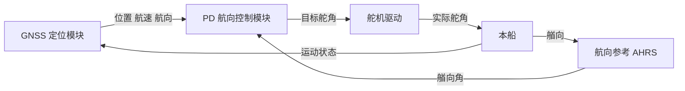

### 1.3 设计指标

| 指标项 | 设计目标 | 备注 |
|--------|----------|------|
| 定位精度 | ≤ ±15 m（GNSS） | 1σ |
| 定位更新率 | ≥ 20 Hz | — |
| 航向控制精度 | ≤ ±1.0°（静水）/ ±2.0°（2 级海况） | 1σ |
| 控制周期 | 100 ms（10 Hz） | — |
| 舵角分辨率 | 0.1° | 12-bit |
| 系统响应延时 | < 100 ms | 感知到执行 |

---

## 2. 系统定位设计

### 2.1 定位方案选型

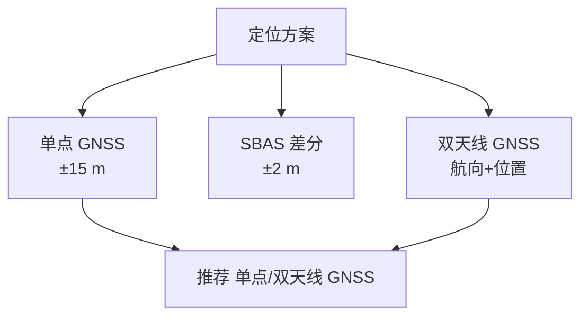

| 方案 | 精度 | 更新率 | 成本 | 适用 |
|------|------|--------|------|------|
| 单点 GNSS | ±15 m | 5~10 Hz | 低 | 一般航向保持 |
| SBAS | ±1~2 m | 5 Hz | 低 | 沿海/内河 |
| 双天线 GNSS | ±15 m + 航向 0.5° | 5 Hz | 中 | 推荐 |

### 2.2 硬件配置

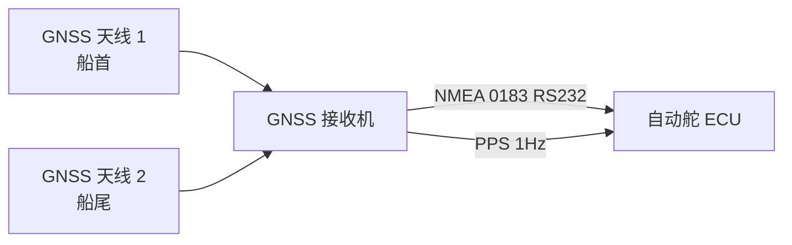

- **天线布局**：双天线沿艏艉线布置，基线长度 $L_b$ 取 1~3 m，越长航向精度越高。
- **接收机**：支持 GPS/BeiDou/GLONASS 多频点单点定位。

### 2.3 定位解算流程

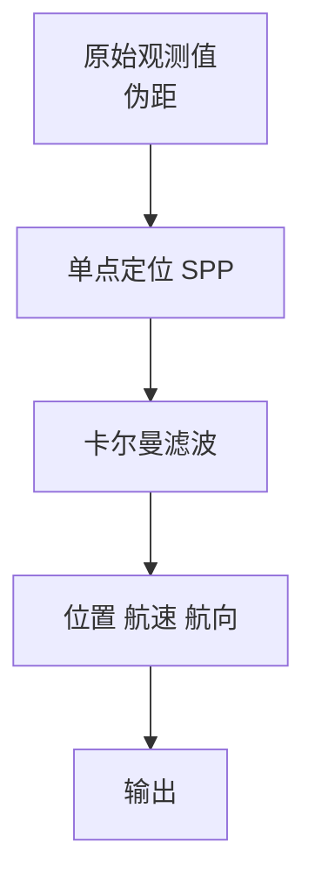

### 2.4 卡尔曼滤波状态

状态向量：

$$
x = [p_x,\ p_y,\ v_x,\ v_y,\ \psi,\ \dot\psi]^T
$$

预测：

$$
\hat x_{k|k-1} = F\hat x_{k-1},\quad P_{k|k-1}=FP_{k-1}F^T+Q
$$

观测：GNSS 提供位置 $(p_x,p_y)$、速度 $(v_x,v_y)$、航向 $\psi$。

### 2.5 双天线航向解算

基线向量 $\vec b$ 在 ENU 坐标系下：

$$
\psi = \text{atan2}(b_E,\ b_N)
$$

由双天线位置差分得到基线向量，航向精度随基线长度 $L_b$ 增大而提高。

### 2.6 定位接口

| 项 | 规格 |
|----|------|
| 电气 | RS-232 / RS-422 |
| 协议 | NMEA 0183 |
| 波特率 | 38400 bps |
| 句子 | 自定义 |
| 周期 | 5 Hz（GGA/RMC），10 Hz（VTG） |


---

## 3. PD 航向控制

### 3.1 控制结构

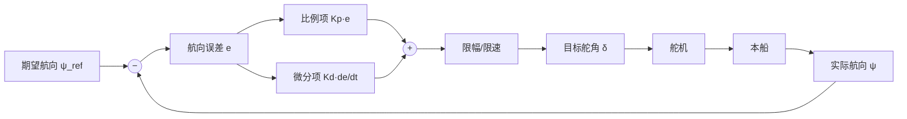

### 3.2 控制律

PD 控制律：

$$
\delta_k = K_p\,e_k + K_d\,\dot e_k
$$

其中航向误差：

$$
e_k = \psi_{\text{ref}} - \psi_k
$$

航向误差需做 **角度归一化** 至 $(-180°,180°]$：

$$
e = \text{atan2}(\sin(\psi_{\text{ref}}-\psi),\ \cos(\psi_{\text{ref}}-\psi))
$$

微分项采用 **带滤波的差分**（一阶低通），抑制噪声：

$$
\dot e_k = \alpha\cdot\frac{e_k - e_{k-1}}{\Delta t} + (1-\alpha)\cdot\dot e_{k-1}
$$

其中 $\alpha = \frac{1}{1+\tau/\Delta t}$，$\tau$ 为滤波时间常数。

### 3.3 输出限幅

```mermaid
graph TD
    A[PD 输出 δ_raw] --> B{ |δ_raw| > δ_max? }
    B -->|是| C[δ = sign(δ_raw)·δ_max]
    B -->|否| D[δ = δ_raw]
    C --> E{ |δ - δ_prev| > dδ_max? }
    D --> E
    E -->|是| F[δ = δ_prev + sign·dδ_max]
    E -->|否| G[输出 δ]
    F --> G
```

- 舵角限幅：$\delta_{\max}=35°$
- 舵速限幅：$\dot\delta_{\max}=10°/s$
- 死区：$|e|<0.3°$ 时输出 0，避免频繁操舵

### 3.4 船舶运动模型（Nomoto 一阶）

$$
T\dot r + r = K\delta
$$

- $r=\dot\psi$ 艏向角速度
- $\delta$ 舵角
- $K$ 旋回性指数
- $T$ 追随性指数

### 3.5 PD 参数整定

由 Nomoto 模型，闭环传递函数（仅 P 控制）：

$$
\frac{\psi(s)}{\psi_{\text{ref}}(s)} = \frac{K_p K}{Ts^2 + s + K_p K}
$$

整定原则：

| 参数 | 作用 | 过大 | 过小 |
|------|------|------|------|
| Kp | 提高响应速度 | 振荡、过冲 | 响应慢、稳态误差大 |
| Kd | 抑制超调、改善阻尼 | 噪声放大、抖动 | 阻尼不足、超调大 |

推荐初值（按船速 $U$ 归一化）：

$$
K_p = \frac{1}{K_{\text{nomoto}}}\cdot\omega_n^2,\quad
K_d = \frac{2\zeta\omega_n}{K_{\text{nomoto}}}
$$

取 $\omega_n = 0.1~0.3$ rad/s，$\zeta = 0.8~1.0$。

示例参数表：

| 船速区间 | 海况 | Kp | Kd |
|----------|------|-----|-----|
| < 4 kn | 0~1 | 2.0 | 0.8 |
| 4~10 kn | 0~1 | 1.5 | 0.6 |
| 4~10 kn | 2~3 | 1.0 | 0.4 |
| > 10 kn | 0~1 | 0.8 | 0.4 |
| > 10 kn | 2~3 | 0.6 | 0.3 |

### 3.6 增益调度

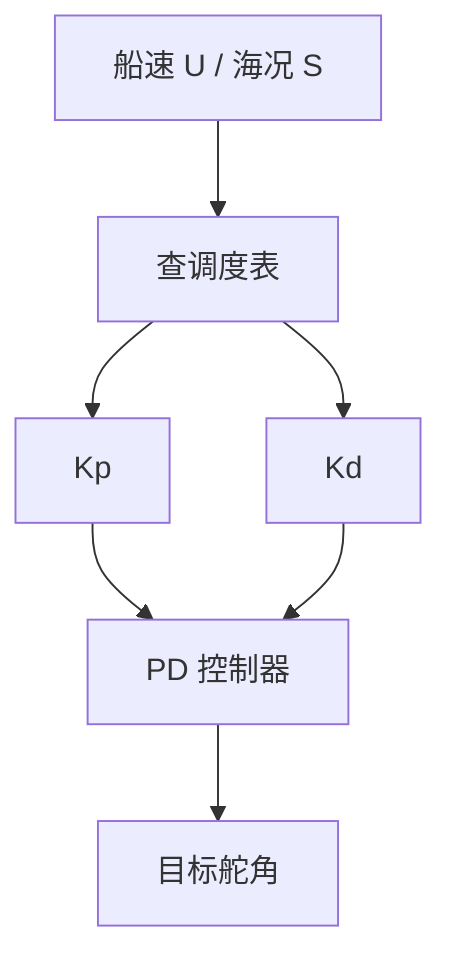

### 3.7 抗噪与死区

- **微分项低通**：$\tau = 0.2$ s，抑制 GNSS/AHRS 高频噪声。
- **误差死区**：$|e|<0.3°$ 输出 0，减少舵机磨损。
- **输出量化**：目标舵角量化到 0.1°。

### 3.8 稳定性分析

闭环特征方程：

$$
Ts^2 + s + K_p K + K_d K s = 0
$$

即：

$$
Ts^2 + (1+K_d K)s + K_p K = 0
$$

阻尼比与自然频率：

$$
\omega_n = \sqrt{\frac{K_p K}{T}},\quad
\zeta = \frac{1+K_d K}{2\sqrt{T\,K_p K}}
$$

要求 $\zeta \ge 0.7$，$\omega_n \le 0.5$ rad/s（避免激发船体高频模态）。

### 3.9 控制算法标定

#### 3.9.1 标定目标

PD 控制律依赖船舶 Nomoto 模型参数 $K$（旋回性指数）与 $T$（追随性指数），并据此整定 $K_p$、$K_d$。标定的目标为：

1. 辨识船舶操纵模型参数 $K$、$T$；
2. 据模型整定 PD 增益，使闭环 $\zeta \ge 0.7$、$\omega_n \le 0.5$ rad/s；
3. 标定舵角零位、满舵、舵速限幅等执行器参数；
4. 验证并固化参数至 ECU 非易失存储。

#### 3.9.2 标定流程

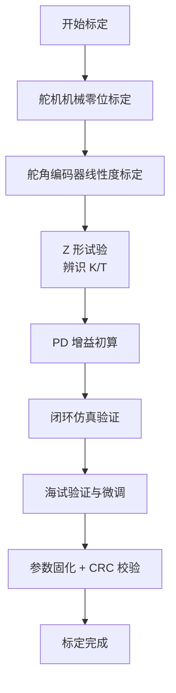

#### 3.9.3 舵角零位与满舵标定

1. **机械脱开**：脱开舵机离合，手动将舵叶置中（用直尺/角度规校验）。
2. **零位采样**：连续采样 10 s 编码器原始值，取均值作为零位 $N_0$。
3. **左/右满舵标定**：手动推至机械左满舵、右满舵，分别记录 $N_L$、$N_R$。
4. **线性度校验**：每 5° 取一点，记录原始码值，拟合 $y=ax+b$，残差应 < 0.2°。
5. **舵速标定**：阶跃 ±20°，记录达到稳态时间 $t_r$，计算 $\dot\delta_{\max} = 40°/t_r$。

#### 3.9.4 Nomoto 模型参数辨识（Z 形试验）

执行 **Z 形试验（±10°/10°）**：

1. 舵角阶跃至 +10°，待艏向转至 +10° 时反向操舵至 -10°；
2. 循环 3~5 次，记录 $\delta(t)$ 与 $r(t)=\dot\psi(t)$；
3. 对 $T\dot r + r = K\delta$ 离散化：

$$
\frac{r_k - r_{k-1}}{\Delta t}\cdot T + r_k = K\delta_k
$$

整理为线性回归形式：

$$
r_k = K\delta_k - \frac{T}{\Delta t}(r_k - r_{k-1})
$$

4. 最小二乘辨识：

$$
\hat\theta = (\Phi^T\Phi)^{-1}\Phi^T y,\quad \theta=[K,\ T]^T
$$

其中 $\Phi_k = [\delta_k,\ -\frac{r_k-r_{k-1}}{\Delta t}]$，$y_k = r_k$。

5. 拟合残差 RMS 应 < 5% $\cdot r_{\max}$。

#### 3.9.5 PD 增益初算

由 §3.5 整定原则：

$$
K_p = \frac{\omega_n^2 T}{K},\quad K_d = \frac{2\zeta\omega_n T - 1}{K}
$$

取 $\omega_n = 0.2$ rad/s，$\zeta = 0.85$，代入辨识得到的 $K$、$T$，得到初值 $K_{p0}$、$K_{d0}$。

#### 3.9.6 闭环仿真验证

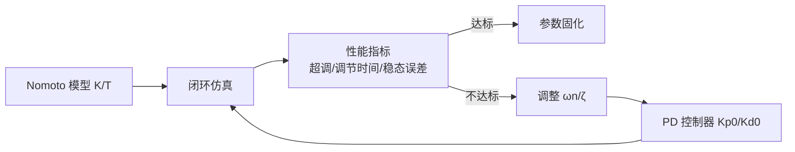

性能指标要求：

| 指标 | 阈值 |
|------|------|
| 阶跃超调 | ≤ 10% |
| 5% 调节时间 | ≤ 30 s |
| 稳态航向误差 | ≤ 1° |
| 操舵频次 | ≤ 6 次/分钟 |

#### 3.9.7 海试验证与微调

1. 直线航行航向保持试验，记录航向误差 1σ；
2. 30° 航向阶跃试验，记录超调与调节时间；
3. 若超调过大 → 增大 $K_d$；若响应过慢 → 增大 $K_p$；
4. 微调步长：每次 ±10% 增益，单变量调整。

#### 3.9.8 标定参数存储

| 参数项 | 存储位置 | 校验 |
|--------|----------|------|
| 舵角零位/满舵 $N_0/N_L/N_R$ | EEPROM 区块 A | CRC32 |
| 舵速限幅 $\dot\delta_{\max}$ | EEPROM 区块 A | CRC32 |
| 模型参数 $K$、$T$ | EEPROM 区块 B | CRC32 |
| PD 增益 $K_p$、$K_d$ | EEPROM 区块 C | CRC32 |
| 增益调度表 | EEPROM 区块 D | CRC32 |

上电时逐块校验 CRC，任一失败则加载默认安全参数并告警。

#### 3.9.9 标定周期与重标定条件

| 触发条件 | 处置 |
|----------|------|
| 首次装船 | 全流程标定 |
| 舵机/船体改装 | 全流程标定 |
| 累计运行 2000 h | 模型参数复标 |
| 航向保持精度超限告警 | 触发重标定流程 |
| 固件升级 | 校验参数兼容性，必要时重标 |

### 3.10 控制参数自动优化算法

#### 3.10.1 必要性与可行性

25 kn 游艇的操纵性随船速、载荷、吃水、海况显著变化，固定 PD 增益难以全工况最优。引入在线自动优化可：

1. 跟踪模型参数 $K$、$T$ 的慢变；
2. 按当前工况自动重算 PD 增益，减少人工整定；
3. 持续优化性能指标（ITAE/控制能耗），提升航向保持品质。

**可行性结论**：RLS 在线辨识 + 极点配置 + 极值搜索（ESC）均为成熟方法，计算量小，可在 ECU 50 Hz 周期内完成，**可行**。

#### 3.10.2 三层架构

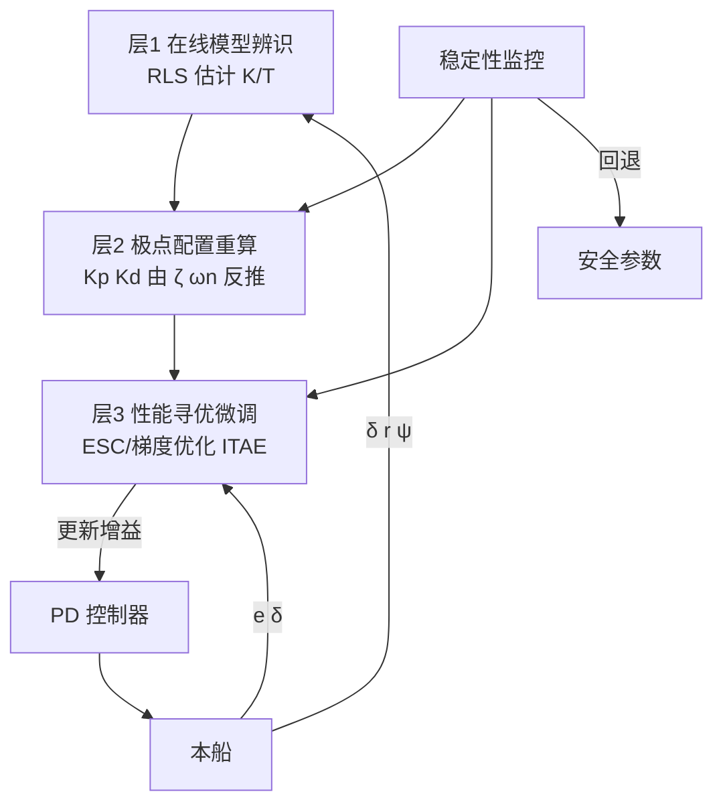

#### 3.10.3 层 1：在线模型辨识（RLS）

对 Nomoto 离散方程 $r_k = K\delta_k - \frac{T}{\Delta t}(r_k - r_{k-1})$，构造回归：

$$
\phi_k = \left[\delta_k,\ -\frac{r_k - r_{k-1}}{\Delta t}\right]^T,\quad y_k = r_k,\quad \theta = [K,\ T]^T
$$

带遗忘因子 $\lambda$ 的递推最小二乘：

$$
K_k = \frac{P_{k-1}\phi_k}{\lambda + \phi_k^T P_{k-1}\phi_k}
$$

$$
\hat\theta_k = \hat\theta_{k-1} + K_k(y_k - \phi_k^T\hat\theta_{k-1})
$$

$$
P_k = \frac{1}{\lambda}(P_{k-1} - K_k\phi_k^T P_{k-1})
$$

参数：

- 遗忘因子 $\lambda = 0.98$（跟踪慢变，抑制噪声）
- 辨识使能条件：$|\delta| > 3°$ 且 $|r| > 0.5°/s$（充分激励）
- 辨识周期：每 1 s 更新一次，避免 50 Hz 计算负担

#### 3.10.4 层 2：极点配置重算

由期望闭环 $\zeta^\ast$、$\omega_n^\ast$ 反推 PD 增益：

$$
K_p = \frac{(\omega_n^\ast)^2\, \hat T}{\hat K},\quad
K_d = \frac{2\zeta^\ast\omega_n^\ast\, \hat T - 1}{\hat K}
$$

按船速分段设定 $\zeta^\ast$、$\omega_n^\ast$：

| 船速区间 | $\zeta^\ast$ | $\omega_n^\ast$ (rad/s) | 说明 |
|----------|--------------|--------------------------|------|
| < 4 kn | 0.9 | 0.15 | 低速大增益 |
| 4~10 kn | 0.85 | 0.20 | 中速 |
| 10~18 kn | 0.85 | 0.25 | 中高速 |
| 18~25 kn | 0.90 | 0.20 | 高速降保守 |

#### 3.10.5 层 3：性能寻优微调（ESC）

以 ITAE 为性能指标：

$$
J = \int_0^{T_w} \left(t\,|e(t)| + w_u|\delta(t)| + w_{\dot u}|\dot\delta(t)|\right) dt
$$

其中 $T_w$ 为评估窗口（如 60 s），$w_u, w_{\dot u}$ 为控制能耗权重。

采用 **极值搜索（ESC）** 对 $K_p, K_d$ 解耦微调：


- 扰动幅值 $a = 5\%\, K_p$，频率 $\omega = 0.05$ rad/s
- 步长 $\eta = 0.02$
- 更新律：$K_{p,k+1} = K_{p,k} - \eta\,\widehat{\partial J/\partial K_p}$
- $K_d$ 同理，相位错开 90° 避免耦合

#### 3.10.6 触发与去激活

| 触发条件 | 动作 |
|----------|------|
| 船速变化 > 2 kn | 重算层 2 |
| 累计运行 100 h | 启动层 3 微调 |
| 稳态误差 > 2° 持续 30 s | 启动层 2 + 层 3 |
| 振荡检测（超调 > 15%） | 触发层 2 重算 |
| 操作员手动指令 | 立即去激活 |
| 船速 > 15 kn | **默认去激活**（高速保守） |
| AHRS/GNSS 异常 | 去激活，回退安全参数 |

#### 3.10.7 稳定性监控与回退

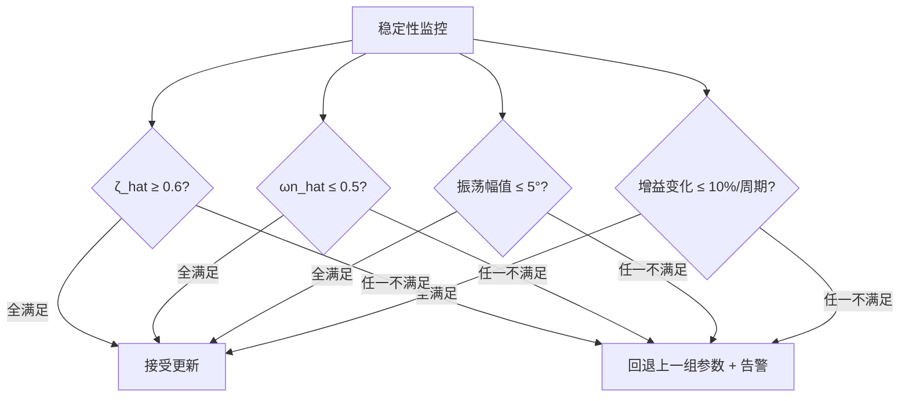

约束：

- 单次更新幅值：$|\Delta K_p| \le 10\%\, K_p$，$|\Delta K_d| \le 10\%\, K_d$
- 参数上下界：$K_p \in [K_{p,\min}, K_{p,\max}]$，$K_d \in [K_{d,\min}, K_{d,\max}]$
- 回退缓存：保留最近 3 组验证通过的参数组

#### 3.10.8 与 §3.9 标定的关系

| 项 | §3.9 离线标定 | §3.10 在线优化 |
|----|---------------|----------------|
| 时机 | 装船/改装/海试 | 运行中持续 |
| 激励 | Z 形试验（人工） | 正常操舵（自然激励） |
| 输出 | 初始 K/T、Kp/Kd | 持续更新的 K/T、Kp/Kd |
| 存储 | EEPROM 区块 B/C | 同区块，带版本号递增 |
| 安全 | 人工把关 | 自动监控 + 回退 |

两者共享 EEPROM 参数区块，§3.10 写入时带 **版本号 + 时间戳 + CRC**，§3.9 人工标定优先级高于自动优化（人工标定后自动优化重置基线）。

#### 3.10.9 参数存储与日志

| 参数项 | 存储位置 | 内容 |
|--------|----------|------|
| 在线辨识 K/T | EEPROM 区块 B | 版本号 + 时间戳 + K/T + CRC |
| 优化后 Kp/Kd | EEPROM 区块 C | 版本号 + 时间戳 + Kp/Kd + CRC |
| 优化日志 | SD 卡 | 每次更新的 K/T、Kp/Kd、J、ζ/ωn、触发原因 |

日志条目示例：

```json
{
  "ts": 1722146400,
  "trigger": "speed_change",
  "U": 12.3,
  "K_hat": 0.18, "T_hat": 8.5,
  "Kp": 1.42, "Kd": 0.58,
  "zeta": 0.86, "wn": 0.21,
  "J": 12.3,
  "accepted": true
}
```

#### 3.10.10 安全约束汇总

- 高速（>15 kn）默认去激活，仅层 1 辨识运行
- 单次更新幅值 ≤ 10%
- 稳定性监控四条件全满足才接受
- 操作员指令优先级最高，可随时禁用
- 异常工况（AHRS/GNSS 失效、舵机过流）立即去激活
- 全程日志可回溯，支持岸基分析与回滚

---

## 4. 仅航向条件下的机动功能方案

### 4.1 前提与可行性总览

本节针对 **仅已知航向（AHRS/罗经）、无定位** 的降级工况，分析七类典型机动的可行性。核心判据：机动是否可由 **航向角触发** 与 **航向变化率闭环** 实现，而不依赖绝对地理位置。

| 机动 | 可行性 | 实现方式 | 说明 |
|------|--------|----------|------|
| Circles 绕圈 | ✅ 完全可行 | 恒定转向率闭环 | 等效恒舵角，航向匀速变化即圆航迹 |
| Williamson Turn 威廉逊掉头 | ✅ 完全可行 | 航向分段触发 | 该机动本就为"仅罗经"场景设计 |
| U-Turn U 型掉头 | ✅ 完全可行 | 单次 180° 航向转向 | PD 跟踪目标航向 |
| Zigzag Z 字形 | ✅ 完全可行 | 航向阈值触发舵角切换 | Z 形试验本就是航向触发 |
| Cloverleaf 三叶草 | ⚠ 开环可行 | 航向段 + 定时直航 | 无位置闭合，漂移不可消除 |
| Search 搜索 | ⚠ 开环可行 | 航向 + 定时 + 计程仪速度 | 精度依赖速度估计 |
| Orbit 绕点 | ❌ 不可行（绕外部固定点） | 需位置闭环 | 若"点"为本船当前位置则退化为 Circle |

### 4.2 通用机动调度框架

所有机动统一抽象为 **航段序列（Leg Sequence）**，每段由触发条件与目标航向/舵角描述：

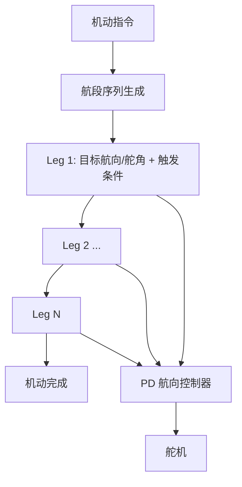

| Leg 字段 | 取值 | 说明 |
|----------|------|------|
| mode | HEADING / RUDDER | 航向跟踪 / 固定舵角 |
| target | ψ_ref 或 δ_cmd | 目标航向(°) 或 目标舵角(°) |
| trigger | HEADING_REACHED / TIME / RATE | 完成触发条件 |
| threshold | Δψ / t / r | 触发阈值 |
| next | Leg idx | 下一段 |

### 4.3 Circles 绕圈

**原理**：保持恒定转向率 $r_{\text{cmd}}$，由 PD 控制器跟踪 $r_{\text{cmd}}$（航向环外环输出转向率，内环 PD 跟踪），等效恒舵角圆航迹。

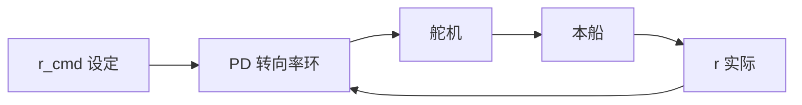

参数：

- 转向率设定：$r_{\text{cmd}} = 3°/s$（对应中等舵角）
- 完成条件：累计航向变化 $\ge 360°$ 或 操作员停止
- 注意：水流漂移使绝对轨迹偏离圆心，但机动形态正确

### 4.4 Williamson Turn 威廉逊掉头

**用途**：人落水等紧急返点机动，仅靠罗经即可执行。

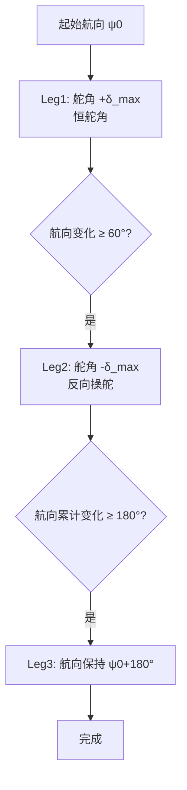

参数（典型值，可按船型调整）：

| 段 | 模式 | 目标 | 触发 | 阈值 |
|----|------|------|------|------|
| Leg1 | RUDDER | +δ_max（如 +25°） | HEADING_REACHED | Δψ = 60° |
| Leg2 | RUDDER | -δ_max（如 -25°） | HEADING_REACHED | Δψ累计 = 180° |
| Leg3 | HEADING | ψ0 + 180° | — | 保持 |

### 4.5 U-Turn U 型掉头

**原理**：单次 180° 航向转向，PD 跟踪目标航向 $\psi_0 \pm 180°$。

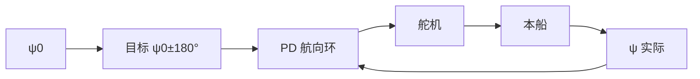

参数：

- 转向方向：操作员指定（左/右），缺省取当前舵角倾向
- 舵角限幅：可临时放宽至 $\delta_{\max}$ 加快转向
- 完成条件：$|e| < 1°$ 持续 2 s

### 4.6 Zigzag Z 字形

**原理**：航向阈值触发舵角切换，与 Z 形试验一致。

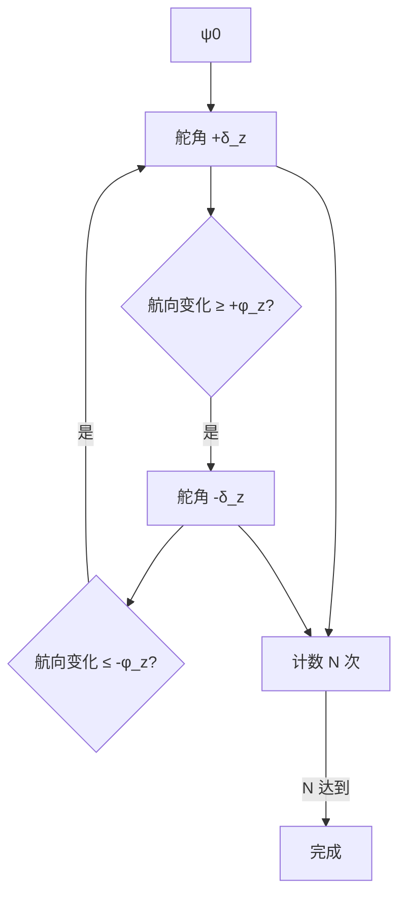

参数：

- 舵角幅值 $\delta_z = 10°$（可配）
- 航向幅值 $\phi_z = 10°$（可配）
- 重复次数 $N$（缺省 5）

### 4.7 Cloverleaf 三叶草（开环）

**原理**：4 叶环，每叶为"转向 270° + 直航定长"。仅航向条件下，直航段以 **定时 + 计程仪速度** 估算距离，无位置闭合。

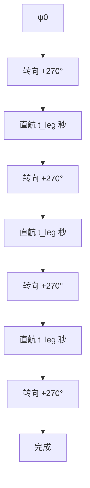

参数：

- 每叶转向：$270°$（PD 跟踪）
- 直航时长：$t_{\text{leg}} = L_{\text{leg}} / V_{\text{log}}$，$L_{\text{leg}}$ 为叶长，$V_{\text{log}}$ 为计程仪速度
- **风险**：水流/风致漂移使图案不闭合，建议每叶后插入航向校正

### 4.8 Search 搜索（开环）

**原理**：扩张方搜，以"航向 + 定时直航 + 90° 转向"循环，搜索边长逐次递增。

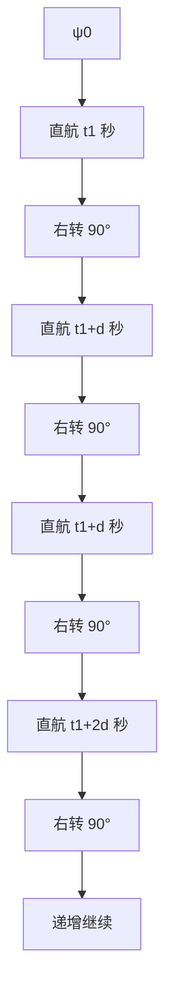

参数：

- 初始边长 $L_0$、增量 $\Delta L$，由计程仪速度换算时长
- **风险**：无位置闭环，搜索覆盖率随漂移下降；建议配合雷达/视觉辅助

### 4.9 Orbit 绕点

**结论**：绕 **外部固定地理点** 需位置闭环，仅航向 **不可行**。

**退化方案**：若"点"为本船当前位置，则退化为 §4.3 Circles；若"点"由雷达/视觉相对方位提供，可由"相对方位+距离"闭环实现绕点，但已超出"仅航向"前提。

### 4.10 仅航向机动的安全约束

| 约束项 | 说明 |
|--------|------|
| 舵角限幅 | 机动中仍受 $\delta_{\max}$、$\dot\delta_{\max}$ 约束 |
| 转向率限幅 | $r_{\max}$ 按船速查表，防止横倾过大 |
| 紧急退出 | 任意时刻操作员指令可中断当前 Leg，切手动 |
| 漂移告警 | 开环机动（Cloverleaf/Search）累计直航时长 > 阈值时告警提示漂移 |
| 周期自检 | 机动中 AHRS 失效立即切手动 |

---

## 5. 定位与控制联合工作流

### 5.1 主循环

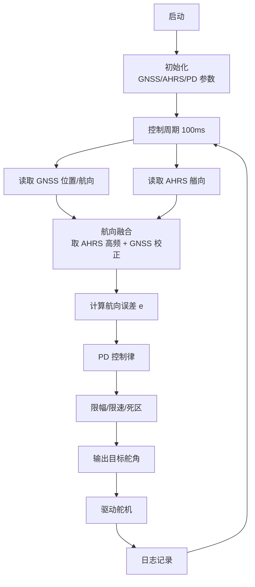

### 5.2 模式切换

```mermaid
stateDiagram-v2
    [*] --> Manual
    Manual --> Auto: 操作员指令 + 定位 OK
    Auto --> Manual: 操作员指令 / 急停
    Auto --> Hold: 定位失锁
    Hold --> Auto: 定位恢复
    Hold --> Manual: 操作员指令
    Auto --> [*]: 系统关闭
```

### 5.3 定位失效降级

| 失效情况 | 处置 |
|----------|------|
| GNSS 失锁 | 转航向保持（仅 AHRS），告警 |
| 双天线航向异常 | 用 GNSS COG 替代，告警 |
| AHRS 失效 | 切手动，告警 |

### 5.4 数据流时序

```mermaid
sequenceDiagram
    participant GNSS
    participant AHRS
    participant ECU
    participant DRV
    GNSS->>ECU: 位置/航速/航向 (20Hz)
    AHRS->>ECU: 艏向 (100Hz)
    ECU->>ECU: 融合 + PD 解算 (50Hz)
    ECU->>DRV: 目标舵角 (50Hz)
    DRV->>ECU: 实际舵角/电流 (50Hz)
```

---

## 6. 结论

### 6.1 方案小结

| 模块 | 方案 | 关键指标 |
|------|------|----------|
| 定位 | 单点/双天线 GNSS，卡尔曼滤波 | 精度 ±15 m，5 Hz |
| 控制 | PD 航向控制 + 增益调度 + 限幅死区 | 精度 ±1°（静水），50 Hz |
| 标定 | Z 形试验辨识 K/T + PD 增益整定 + EEPROM 固化 | 残差 < 5%，超调 ≤ 10% |
| 自动优化 | RLS 在线辨识 + 极点配置 + ESC 性能寻优 | 全工况自适应，高速默认去激活 |
| 机动 | 仅航向实现 4 类闭环 + 2 类开环机动 | Williamson/U-Turn/Zigzag/Circles 可靠 |

### 6.2 PD 控制特点

- **优点**：结构简单、无积分饱和、对噪声敏感度低、参数整定直观。
- **代价**：存在稳态误差（由 $K_p$ 与模型增益决定），通过定位模块的航迹闭环补偿。
- **适用**：航向保持为主的中小型船舶自动舵，避免长时积分漂移。

### 6.3 后续工作

1. 选定 GNSS 接收机与 AHRS 型号，完成接口联调。
2. 基于船舶 Nomoto 模型进行 PD 参数仿真整定。
3. 海试：Z 形试验辨识 $K$、$T$，验证航向保持精度。
4. 评估稳态误差，必要时引入弱积分项（PI→PID）作为可选增强。
5. 建立标定参数版本管理，记录每次标定的海况、船速与残差，支持回溯。
6. 海试验证仅航向机动：Williamson、U-Turn、Zigzag、Circles，记录航向跟踪精度与漂移。
7. 评估 Cloverleaf/Search 开环机动的覆盖率，必要时引入计程仪或雷达辅助。
8. 实现并验证 §3.10 自动优化算法：先在 HIL 平台验证 RLS 收敛性与 ESC 稳定性，再分速段海试。
9. 建立自动优化参数版本管理，记录每次更新的 K/T、Kp/Kd、J、触发原因，支持岸基回滚。

---

## 7. 调试场地要求

### 7.1 被控对象特征

| 项 | 参数 | 备注 |
|----|------|------|
| 船型 | 中大型游艇 | 半滑行/滑行型 |
| 最大航速 | 25 kn（≈12.86 m/s） | 高速工况 |
| 船长参考 $L$ | 12 ~ 18 m（取 15 m 计算） | 40 ~ 60 ft 级 |
| 操纵性 | 高速下转向直径增大 | 需按航速分级测试 |

### 7.2 调试场地总体要求

```mermaid
graph TD
    SITE[调试场地]
    SITE --> A1[水域尺度]
    SITE --> A2[水深/底质]
    SITE --> A3[海况/气象]
    SITE --> A4[交通/通航]
    SITE --> A5[岸基保障]
    SITE --> A6[应急与安全]
    SITE --> A7[定位/通信基准]
```

### 7.3 水域尺度

#### 7.3.1 刹车距离与安全裕度核算

被控对象为 25 kn 游艇，需先核算高速刹车距离与机动惯性，再反推场地尺度。

**基本参数**：

$$
V_{\max} = 25\ \text{kn} = 12.86\ \text{m/s},\quad L = 15\ \text{m}
$$

**紧停（Crash Stop）距离分解**：

| 阶段 | 时间 | 距离 | 说明 |
|------|------|------|------|
| 操作员/系统反应 | 3 s | 39 m | 急停识别 + 离合脱开 |
| 全速倒车制动 | 16~26 s | 100~170 m | 滑行艇减速度 0.5~0.8 m/s² |
| 惯性滑行余量 | — | 50 m | 船体残余动能 |
| **单次紧停距离 $D_{\text{stop}}$** | — | **≈ 250 m** | 不含安全裕度 |

**高速机动尺度**（25 kn 下放大系数 $k_v = 2.5\sim 3.0$）：

| 机动 | 低速尺度 | $k_v$ | 25 kn 实际尺度 |
|------|----------|-------|-----------------|
| 高速转向直径 | 3~5 L ≈ 75 m | 2.5× | ≈ 190 m |
| Williamson Turn | 5L × 3L ≈ 75 × 45 m | 2.7× | ≈ 200 × 120 m |
| U-Turn 直径 | 3~4 L ≈ 60 m | 2.5× | ≈ 150 m |
| Circles 直径 | 3~5 L ≈ 75 m | 2.5× | ≈ 190 m |
| Cloverleaf 单叶 | 8~10 L ≈ 150 m | 2.0× | ≈ 300 m |
| Search 扩张方搜 | 边长递增至 200 m | 2.0× | 边长递增至 400 m |

#### 7.3.2 单次试验所需直线长度

高速直航 + 紧停单次所需长度：

$$
L_{\text{run}} = L_{\text{accel}} + L_{\text{hold}} + D_{\text{stop}} + 2 \times L_{\text{buffer}}
$$

| 段 | 距离 | 说明 |
|----|------|------|
| 加速段 $L_{\text{accel}}$ | 400 m | 0 → 25 kn 加速 |
| 稳速保持段 $L_{\text{hold}}$ | 386 m | 25 kn × 30 s |
| 紧停段 $D_{\text{stop}}$ | 250 m | 见 §7.3.1 |
| 单端安全缓冲 $L_{\text{buffer}}$ | 300 m | 失控漂移 + 救援 |
| **单次直航总长** | **≈ 1636 m** | — |

#### 7.3.3 高速机动所需方形尺度

```mermaid
graph TD
    M[机动足迹]
    M --> F1[机动本体尺度 D_m]
    M --> F2[刹车距离 D_stop]
    M --> F3[失控漂移 D_drift]
    M --> F4[安全裕度 D_safe]
    F1 & F2 & F3 & F4 --> S[场地边长 = D_m + D_stop + D_drift + 2·D_safe]
```

| 项 | 取值 | 说明 |
|----|------|------|
| 机动本体 $D_m$ | 300 m | 取最大机动（Cloverleaf 单叶 / Search 边） |
| 刹车距离 $D_{\text{stop}}$ | 250 m | 见 §7.3.1 |
| 失控漂移 $D_{\text{drift}}$ | 200 m | 25 kn 失控后惯性 + 风流漂移 |
| 安全裕度 $D_{\text{safe}}$ | 300 m | 障碍物/他船缓冲 |
| **场地边长** | **≈ 1350 m** | — |

#### 7.3.4 推荐场地尺度（扩大版）

综合 §7.3.1~7.3.3，并按 3 倍安全裕度复核，**扩大后**推荐：

| 用途 | 最小水域 | 推荐水域 | 说明 |
|------|----------|----------|------|
| 低速标定（≤ 8 kn） | 600 m × 600 m | 1 km × 1 km | 含紧停 + 缓冲 |
| 中速机动（8~15 kn） | 1.5 km × 1.5 km | 2 km × 2 km | 含 15 kn 紧停 |
| **高速机动（15~25 kn）** | **3 km × 2 km** | **3 n mile × 2 n mile（≈5.5 km × 3.7 km）** | 含 25 kn 紧停 + 失控漂移 |
| 高速直航专项 | 2 km × 0.5 km | 3 km × 0.8 km | 单次直航总长 + 双向 |
| Cloverleaf/Search 专项 | 2 km × 2 km | 3 km × 3 km | 大尺度图案 |

**与原方案对比**：

| 项 | 原推荐 | 扩大后 | 增量 |
|----|--------|--------|------|
| 高速机动区 | 2 n mile × 1 n mile | 3 n mile × 2 n mile | 长边 +50%，宽边 +100% |
| 高速区面积 | 6.8 km² | 20.4 km² | 3.0× |

#### 7.3.5 场地分区与缓冲带

```mermaid
graph TD
    SITE[总场地 3×2 n mile]
    SITE --> BUF[外围缓冲带 300 m<br/>禁航]
    BUF --> Z1[低速标定区 1×1 km]
    BUF --> Z2[中速机动区 2×2 km]
    BUF --> Z3[高速机动区 3×2 km]
    BUF --> Z4[直航紧停区 3×0.8 km]
    Z1 & Z2 & Z3 & Z4 --> SEP[区间隔离 200 m]
```

| 区域 | 尺度 | 用途 | 限速 |
|------|------|------|------|
| 外围缓冲带 | 300 m 全周 | 禁航、警戒船巡逻 | — |
| 区间隔离 | 200 m | 区域间安全间距 | — |
| Z1 低速标定区 | 1 × 1 km | Z 形试验、模型辨识 | ≤ 8 kn |
| Z2 中速机动区 | 2 × 2 km | Williamson/U-Turn/Zigzag/Circles | ≤ 15 kn |
| Z3 高速机动区 | 3 × 2 km | 高速机动验证 | ≤ 25 kn |
| Z4 直航紧停区 | 3 × 0.8 km | 高速直航 + crash stop | ≤ 25 kn |

### 7.4 水深与底质

| 项 | 要求 | 说明 |
|----|------|------|
| 水深 | ≥ 10 m（高速区） / ≥ 5 m（低速区） | 避免浅水效应影响操纵性 |
| 底质 | 泥/沙底，避免礁石 | 紧急情况下安全 |
| 岸距 | 离岸 ≥ 500 m | 高速失控留有缓冲 |
| 障碍物 | 无暗礁/浅滩/渔网/养殖区 | 全程可视 |

### 7.5 海况与气象窗口

| 测试类型 | 风速 | 浪高 | 能见度 | 海况等级 |
|----------|------|------|--------|----------|
| 模型标定（Z 形试验） | ≤ 3 m/s | ≤ 0.3 m | ≥ 1 n mile | 0~1 级 |
| PD 参数整定 | ≤ 5 m/s | ≤ 0.5 m | ≥ 1 n mile | ≤ 2 级 |
| 机动功能验证 | ≤ 8 m/s | ≤ 1.0 m | ≥ 1 n mile | ≤ 3 级 |
| 高速工况验证 | ≤ 5 m/s | ≤ 0.8 m | ≥ 2 n mile | ≤ 2 级 |
| 流速 | ≤ 1 kn | — | — | 避免强流干扰 |

### 7.6 交通与通航

- 选择 **低密度通航区**，避开主航道、锚地、客运航线。
- 试验期间向海事/VTS 报备，发布航行警告（NAVTEX/VHF）。
- 配置 **警戒船** 1 艘，半径 500 m 内拦截无关船舶。
- 试验区域设 **临时禁航圈**，AIS 标识。

### 7.7 岸基保障

```mermaid
graph LR
    DOCK[母港码头<br/>30 min 内可达] --> TEST[试验区]
    BASE[岸基指挥点] -->|VHF/4G| TEST
    BASE --> RADAR[岸基雷达/AIS 监视]
    BASE --> LOG[数据回传与录制]
    HOSP[最近医疗机构] -.≤ 1 h.- DOCK
```

| 保障项 | 要求 |
|--------|------|
| 母港 | 距试验区 ≤ 30 min 航程 |
| 岸基指挥 | VHF 全程覆盖 + 4G/卫星回传 |
| 监视 | 岸基雷达 + AIS，全程记录试验船轨迹 |
| 医疗 | 最近医院 ≤ 1 h；船上备急救包/AED |
| 燃料 | 试验船油量 ≥ 80%，警戒船油量 ≥ 50% |

### 7.8 应急与安全

| 项 | 要求 |
|----|------|
| 急停 | 船首/舵位/岸基三处急停按钮，硬线切断舵机离合 |
| 救生 | 每人救生衣；救生圈 ≥ 4；救生筏 1 只 |
| 警戒船 | 配备救援人员、救生设备、拖曳能力 |
| 限速预案 | 25 kn 高速试验前先完成 ≤ 8 kn、≤ 15 kn 分级验证 |
| 失控保护 | 舵角/转向率超限、AHRS 失效自动切手动 |
| 黑匣子 | 全程录制航向/舵角/控制输出/故障码，≥ 30 天可回溯 |

### 7.9 定位与通信基准

虽然本系统降级工况仅依赖航向，但调试阶段需 **外部基准** 用于验证：

| 基准 | 用途 | 精度 |
|------|------|------|
| 岸基 RTK 参考站 | 轨迹真值 | ±2 cm |
| 双天线 GNSS 仪 | 航向真值 | 0.1° |
| 岸基激光测距 | 航迹精度验证 | ±0.1 m |
| VHF + 4G | 指令与数据 | 冗余 |
| AIS SART | 应急定位 | — |

### 7.10 调试场地选址建议

```mermaid
graph TD
    SITE[推荐选址特征]
    SITE --> B1[遮蔽海湾<br/>风浪小]
    SITE --> B2[水深 ≥ 10 m<br/>开阔水域]
    SITE --> B3[低通航密度<br/>非主航道]
    SITE --> B4[母港 ≤ 30 min]
    SITE --> B5[4G/VHF 全覆盖]
    SITE --> B6[岸基雷达可视]
```

**典型合格场地示例**：半封闭海湾、湖泊水库（水深足够）、专用试验海区。**不推荐**：河口强流区、航道交汇区、浅滩礁区、渔业养殖区。

### 7.11 试验分区与日程

```mermaid
graph TD
    AREA[试验水域 3×2 n mile]
    AREA --> BUF[外围缓冲带 300 m]
    BUF --> Z1[低速标定区<br/>1×1 km]
    BUF --> Z2[中速机动区<br/>2×2 km]
    BUF --> Z3[高速机动区<br/>3×2 km]
    BUF --> Z4[直航紧停区<br/>3×0.8 km]
    Z1 --> D1[第1天 标定]
    Z2 --> D2[第2天 机动验证]
    Z3 --> D3[第3天 高速验证]
    Z4 --> D4[第4天 应急机动]
```

| 日程 | 区域 | 内容 | 限速 |
|------|------|------|------|
| D1 | Z1 | Z 形试验、模型辨识、PD 整定 | ≤ 8 kn |
| D2 | Z2 | Williamson/U-Turn/Zigzag/Circles 验证 | ≤ 15 kn |
| D3 | Z3 | 高速航向保持、高速 U-Turn/Circles/Cloverleaf | ≤ 25 kn |
| D4 | Z4 | 紧停、应急退出、降级切换、Search 开环 | ≤ 25 kn |

### 7.12 调试场地验收清单

- [ ] 水域尺度满足 §7.3.4 推荐值（高速区 ≥ 3×2 n mile）
- [ ] 外围缓冲带 300 m 禁航，警戒船就位
- [ ] 水深 ≥ 10 m，无障碍物
- [ ] 海况窗口符合 §7.5
- [ ] 已向海事/VTS 报备并发布航行警告
- [ ] 警戒船就位，禁航圈设置
- [ ] 岸基指挥、雷达、AIS、VHF/4G 就绪
- [ ] 急停按钮（船首/舵位/岸基）测试通过
- [ ] 救生设备齐全，医疗预案确认
- [ ] 外部基准（RTK/双天线 GNSS 仪）架设完成
- [ ] 黑匣子录制验证通过

---

— 文档结束 —
