# 自动舵系统设计技术可行性分析文档

> **文档编号**：AR-DOC-2026-001
> **版本**：V1.0
> **编制日期**：2026-07-28
> **密级**：内部公开

---

## 目录

1. [概述](#1-概述)
2. [系统技术架构](#2-系统技术架构)
3. [航向感知](#3-航向感知)
4. [控制算法](#4-控制算法)
5. [标定方法](#5-标定方法)
6. [故障诊断](#6-故障诊断)
7. [技术风险](#7-技术风险)
8. [接口定义](#8-接口定义)
9. [结论](#9-结论)

---

## 1. 概述

### 1.1 编制目的

本文档针对自动舵（Autopilot / Auto-Rudder）系统进行技术可行性分析，明确系统总体技术方案、关键模块实现路径、潜在技术风险及接口规范，为后续详细设计与产品化开发提供技术依据。

### 1.2 适用范围

适用于中小型船舶（含游艇、渔船、科考船、无人水面艇 USV 等）的自动舵系统设计与集成，舵机功率覆盖 0.5 kN·m ~ 25 kN·m 范围。

### 1.3 术语与缩略语

| 缩略语 | 全称 | 说明 |
|--------|------|------|
| AHRS | Attitude and Heading Reference System | 姿态航向参考系统 |
| GNSS | Global Navigation Satellite System | 全球导航卫星系统 |
| PID | Proportional-Integral-Derivative | 比例-积分-微分控制器 |
| ECU | Electronic Control Unit | 电子控制单元 |
| MCU | Microcontroller Unit | 微控制器单元 |
| FDIR | Fault Detection, Isolation and Recovery | 故障检测隔离与恢复 |
| CAN | Controller Area Network | 控制器局域网总线 |
| RTK | Real-Time Kinematic | 实时动态差分定位 |

---

## 2. 系统技术架构

### 2.1 总体架构

自动舵系统采用 **"感知—决策—执行"** 三层分布式架构，遵循船级社规范的可冗余设计原则。

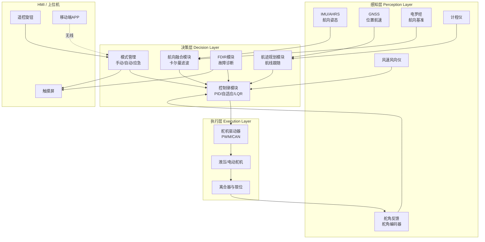

### 2.2 硬件拓扑

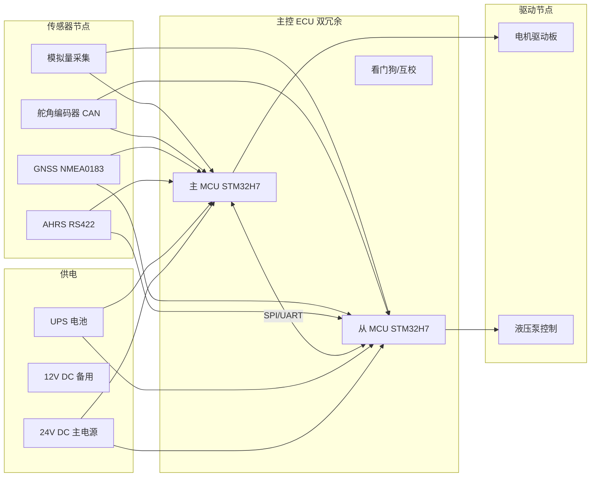

### 2.3 软件分层

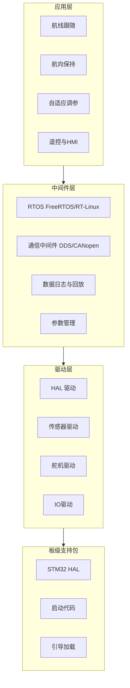

### 2.4 关键技术指标

| 指标项 | 设计目标 | 备注 |
|--------|----------|------|
| 航向保持精度 | ≤ ±1.0°（静水） / ±2.0°（2 级海况） | 1σ |
| 航迹保持精度 | ≤ ±5 m（RTK）/ ±15 m（GNSS） | 1σ |
| 舵角分辨率 | 0.1° | 12-bit 编码器 |
| 控制周期 | 20 ms（50 Hz） | 舵机 10 Hz |
| 系统响应延时 | < 100 ms | 感知到执行 |
| MTBF | ≥ 10000 h | 单通道 |
| MTBCF | ≥ 50000 h | 双冗余 |
| 工作温度 | -25 ℃ ~ +70 ℃ | 户外型 |

---

## 3. 航向感知

### 3.1 感知源选型

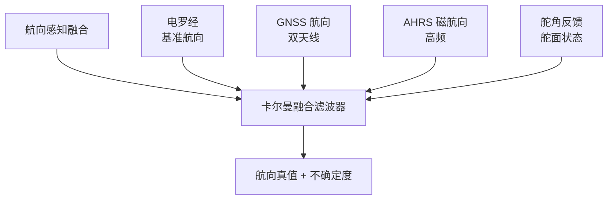

| 感知源 | 优点 | 缺点 | 采样率 | 用途 |
|--------|------|------|--------|------|
| 电罗经 | 精度高、稳定 | 启动慢、价格高 | 10 Hz | 长时基准 |
| 双天线 GNSS | 绝对航向、无磁干扰 | 更新慢、依赖卫星 | 5 Hz | 校准/校验 |
| AHRS（磁+IMU） | 高频、低成本 | 受铁磁干扰 | 100 Hz | 实时控制 |
| 舵角编码器 | 直接反馈 | 仅舵面 | 100 Hz | 闭环 |

### 3.2 数据融合算法

采用 **误差状态卡尔曼滤波（ESKF）**，状态向量：

$$
x = [\delta\psi,\ \delta b_\omega,\ \delta b_a]^T
$$

预测方程（简）：

$$
\hat{x}_{k|k-1} = F_{k-1}\hat{x}_{k-1},\quad P_{k|k-1}=F_{k-1}P_{k-1}F_{k-1}^T+Q
$$

更新方程：

$$
K_k = P_{k|k-1}H_k^T(H_kP_{k|k-1}H_k^T+R)^{-1}
$$

$$
\hat{x}_k = \hat{x}_{k|k-1}+K_k(z_k-H_k\hat{x}_{k|k-1})
$$

其中观测 $z_k$ 为电罗经航向与 GNSS 航向之差，AHRS 提供高频插值。

### 3.3 磁偏差补偿

磁航向需经 **两点标定法**（"8 字法"）补偿硬铁与软铁效应：

$$
\begin{bmatrix} x \\ y \end{bmatrix}_{\text{true}} =
\begin{bmatrix} a & b \\ c & d \end{bmatrix}
\begin{bmatrix} x \\ y \end{bmatrix}_{\text{raw}} +
\begin{bmatrix} x_0 \\ y_0 \end{bmatrix}
$$

通过采集旋转一周的椭圆拟合，求解 4 个椭圆参数 + 2 个偏置，将磁力计输出校正为圆心在原点的单位圆。

---

## 4. 控制算法

### 4.1 算法选型对比

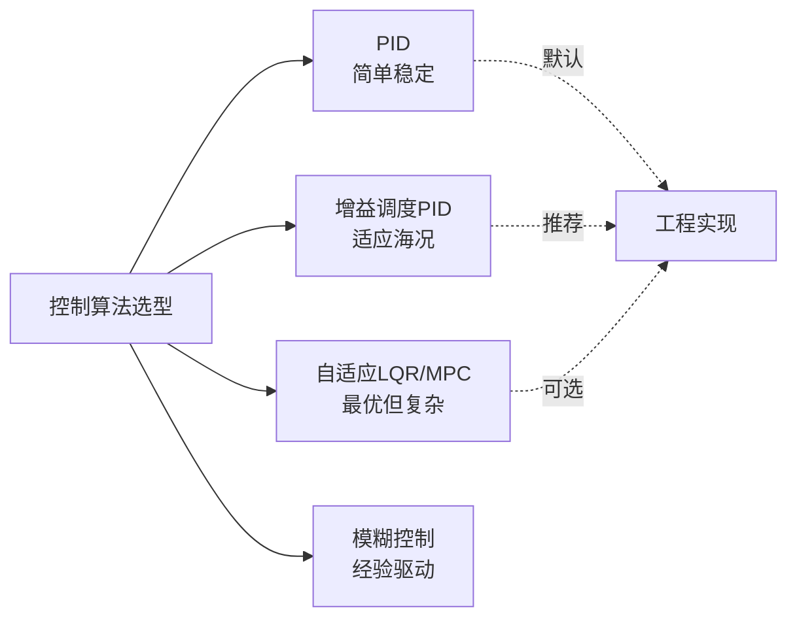

| 算法 | 复杂度 | 鲁棒性 | 调参难度 | 适用场景 |
|------|--------|--------|----------|----------|
| 经典 PID | 低 | 中 | 易 | 静水/低海况 |
| 增益调度 PID | 中 | 高 | 中 | 全海况（推荐） |
| 自适应 LQR | 高 | 高 | 难 | 高性能要求 |
| 模糊 PID | 中 | 中 | 中 | 非线性船型 |

### 4.2 船舶运动学模型（Nomoto 一阶）

$$
T\dot{r} + r = K\delta
$$

其中 $r$ 为艏向角速度，$\delta$ 为舵角，$K$ 为旋回性指数，$T$ 为追随性指数。

### 4.3 增量式 PID 控制律

$$
\Delta\delta_k = K_p(e_k - e_{k-1}) + K_i e_k + K_d(e_k - 2e_{k-1} + e_{k-2})
$$

其中 $e_k = \psi_{\text{ref}} - \psi_k$ 为航向误差。输出限幅：

$$
\delta_k = \text{clip}(\delta_{k-1} + \Delta\delta_k,\ \delta_{\min},\ \delta_{\max})
$$

并引入 **舵速限幅** $\dot\delta_{\max}$ 防止舵机过载。

### 4.4 增益调度策略

按航速 $U$ 与海况等级 $S$ 调度：

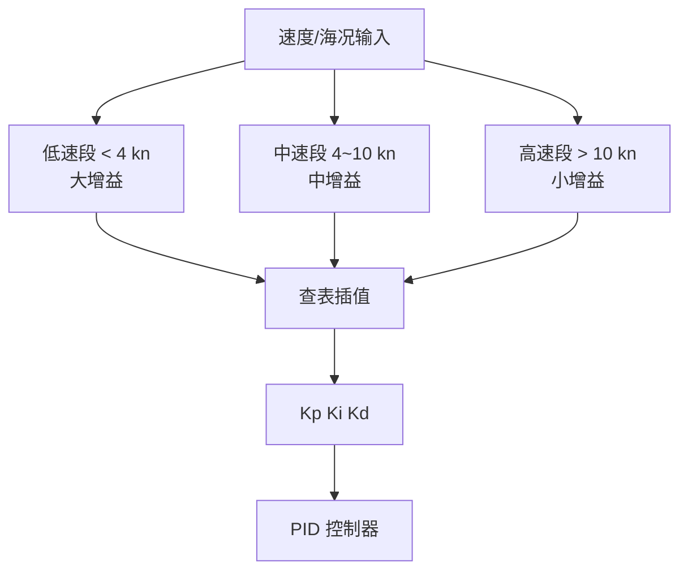

调度表（示例）：

| 航速区间 | 海况 | Kp | Ki | Kd |
|----------|------|-----|-----|-----|
| < 4 kn | 0~1 | 2.5 | 0.10 | 0.8 |
| 4~10 kn | 0~1 | 1.8 | 0.08 | 0.6 |
| 4~10 kn | 2~3 | 1.2 | 0.05 | 0.4 |
| > 10 kn | 0~1 | 1.0 | 0.05 | 0.4 |
| > 10 kn | 2~3 | 0.7 | 0.03 | 0.3 |

### 4.5 抗积分饱和

采用 **条件积分法（Clamping）**：当输出饱和或误差符号反转时冻结积分项，避免过冲。

### 4.6 航迹跟随（Line-of-Sight）

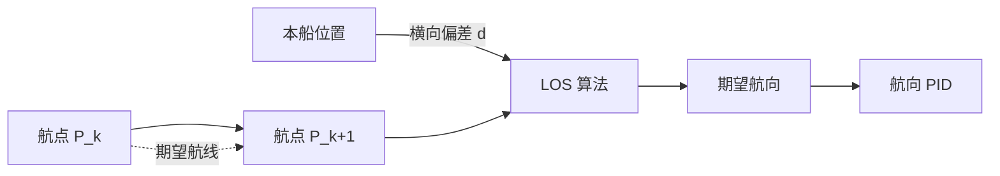

期望航向：

$$
\psi_{\text{LOS}} = \text{atan2}(P_{k+1,y}-P_{y},\ P_{k+1,x}-P_{x}) + \arctan\left(\frac{-d}{R}\right)
$$

其中 $d$ 为横向偏差，$R$ 为前瞻距离（一般取 2~5 倍船长）。

---

## 5. 标定方法

### 5.1 标定流程总览

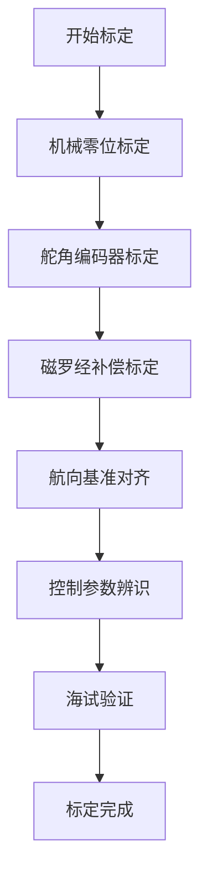

### 5.2 舵角零位与满舵标定

1. **机械脱开**：脱开舵机离合，手动将舵叶置中（用直尺/角度规校验）。
2. **零位采样**：连续采样 10 s 编码器原始值，取均值作为零位 $N_0$。
3. **左/右满舵标定**：手动推至机械左满舵、右满舵，分别记录 $N_L$、$N_R$。
4. **线性度校验**：每 5° 取一点，记录原始码值，拟合 $y=ax+b$，残差应 < 0.2°。

### 5.3 磁罗经补偿（两点法 / 椭圆拟合法）


### 5.4 航向基准对齐

将 AHRS 输出航向与电罗经（或双天线 GNSS）航向做静态比对 5 min，计算偏置 $\Delta\psi_0$ 并写入。要求：

- 静态航向偏差：≤ 0.5°
- 动态航向延迟：≤ 80 ms

### 5.5 Nomoto 模型参数辨识（Z 形试验）

执行 **Z 形试验（如 ±10°/10°）**：

1. 舵角阶跃至 +10°，待艏向转至 +10° 时反向操舵至 -10°；
2. 循环 3~5 次，记录 $\delta(t)$ 与 $r(t)$；
3. 最小二乘拟合 $T\dot r + r = K\delta$，得到 $K$、$T$；
4. 由 $K$、$T$ 初算 PID 增益，再现场微调。

### 5.6 标定数据存储

| 参数项 | 存储位置 | 校验 |
|--------|----------|------|
| 舵角零位/满舵 | ECU EEPROM 区块 A | CRC32 |
| 磁补偿系数 | ECU EEPROM 区块 B | CRC32 |
| 航向偏置 | ECU EEPROM 区块 C | CRC32 |
| PID 增益表 | ECU EEPROM 区块 D | CRC32 |
| 模型参数 K/T | ECU EEPROM 区块 E | CRC32 |

---

## 6. 故障诊断

### 6.1 FDIR 总体框架

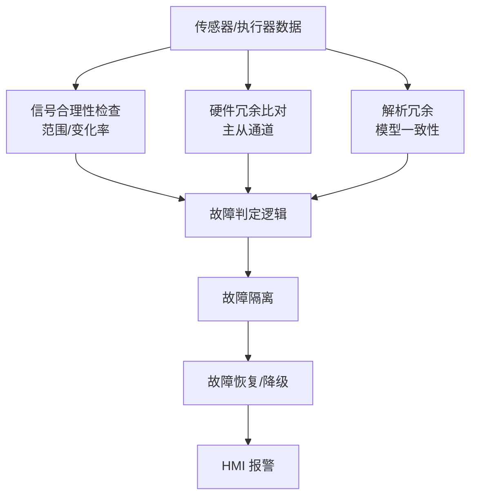

### 6.2 故障码定义（节选）

| 故障码 | 描述 | 触发条件 | 处置策略 |
|--------|------|----------|----------|
| E001 | AHRS 通信丢失 | RS422 帧超时 > 200 ms | 切电罗经航向 |
| E002 | AHRS 数据异常 | 姿态角变化率超阈值 | 冻结输出 + 报警 |
| E003 | GNSS 失锁 | 卫星数 < 4 持续 5 s | 转航向保持模式 |
| E004 | 舵角编码器故障 | 编码器跳变/无变化 | 切备用编码器 |
| E005 | 舵机驱动过流 | 电流 > 阈值 1 s | 脱开离合 + 报警 |
| E006 | 主从 MCU 不一致 | 双机输出差 > 5° 持续 3 个周期 | 安全停车 |
| E007 | 电源异常 | 24V 跌落 > 10% | 切 UPS + 报警 |

### 6.3 故障树分析（FTA）示例

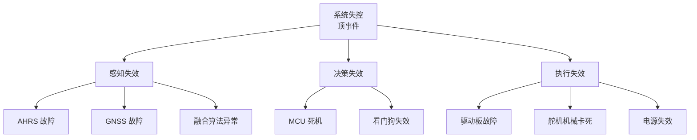

### 6.4 冗余切换逻辑

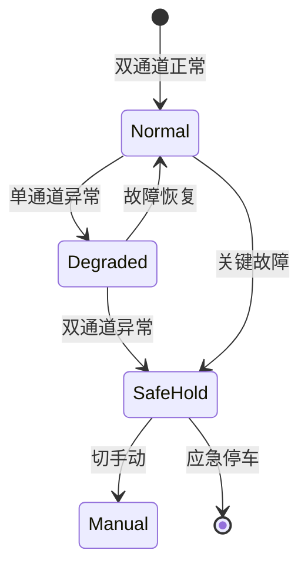

### 6.5 在线诊断与日志

- 周期 1 Hz 写入循环日志（≥ 30 天），含：航向、舵角、控制输出、故障码、模式状态。
- 支持 SD 卡 / USB 导出，CSV 格式，便于岸基分析。

---

## 7. 技术风险

### 7.1 风险矩阵

```mermaid
quadrantChart
    title 风险概率—影响矩阵
    x-axis 低概率 --> 高概率
    y-axis 低影响 --> 高影响
    quadrant-1 重点防控
    quadrant-2 监控
    quadrant-3 接受
    quadrant-4 优先缓解
    R1[磁干扰]: [0.7, 0.4]
    R2[舵机过载]: [0.4, 0.85]
    R3[MCU死机]: [0.15, 0.9]
    R4[GNSS失锁]: [0.6, 0.5]
    R5[算法发散]: [0.2, 0.8]
    R6[EMC干扰]: [0.5, 0.6]
    R7[标定漂移]: [0.55, 0.45]
```

### 7.2 风险清单与对策

| 编号 | 风险描述 | 概率 | 影响 | 风险等级 | 缓解措施 |
|------|----------|------|------|----------|----------|
| R1 | 铁磁环境磁航向漂移 | 中 | 中 | 中 | 双天线 GNSS 校正 + 磁补偿 |
| R2 | 大舵角工况舵机过载 | 中 | 高 | 高 | 电流闭环 + 舵速限幅 + 离合器保护 |
| R3 | 主 MCU 死机 | 低 | 高 | 高 | 双 MCU 冗余 + 看门狗 + 安全停车 |
| R4 | GNSS 信号失锁 | 中 | 中 | 中 | 转航向保持 + 告警 |
| R5 | 控制算法参数发散 | 低 | 高 | 高 | 增益边界校验 + 防积分饱和 |
| R6 | 舱内 EMC 干扰 | 中 | 中 | 中 | 屏蔽双绞线 + 光耦隔离 + 滤波 |
| R7 | 长期标定参数漂移 | 中 | 中 | 中 | 周期自检 + 远程重标定 |
| R8 | 极端海况下失稳 | 低 | 高 | 高 | 海况自适应 + 降速保护 |
| R9 | 软件缺陷导致误操舵 | 低 | 高 | 高 | SIL 评估 + 单元/集成测试 + HIL |
| R10 | 接口协议不兼容 | 中 | 中 | 中 | 统一 NMEA 2000 + CANopen |

### 7.3 风险应对原则

- **高等级风险**：必须有冗余设计或主动保护机制，纳入 FDIR。
- **中等级风险**：建立监控指标，必要时通过软件升级缓解。
- **低等级风险**：记录跟踪，定期评审。

---

## 8. 接口定义

### 8.1 外部接口总览

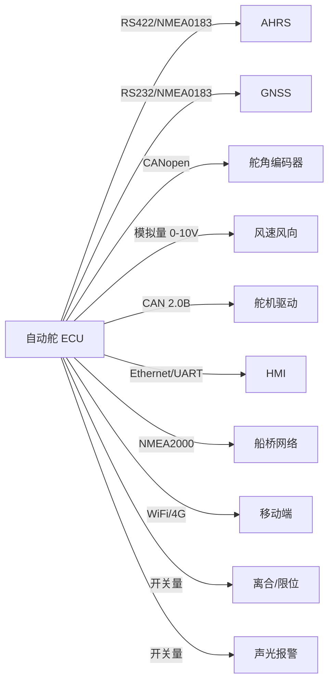

### 8.2 传感器接口

#### 8.2.1 AHRS（RS422）

| 项 | 规格 |
|----|------|
| 电气 | RS-422 差分，120 Ω 终端 |
| 波特率 | 115200 bps |
| 协议 | NMEA 0183 扩展（HDM/HDG/HDT） |
| 帧 | ASCII，`$` 起始，`*XX` 校验 |
| 周期 | 10 Hz |
| 字段 | 时间戳、艏向、横滚、俯仰、温度 |

帧示例：

```
$PASHR,123459.00,012.4,T,+02.1,-03.5,0.012,0.045,25.3*1A
```

#### 8.2.2 GNSS（RS232）

| 项 | 规格 |
|----|------|
| 电气 | RS-232，9600/38400 可配 |
| 协议 | NMEA 0183（GGA/RMC/VTG/HDT） |
| 周期 | 5 Hz（GGA/RMC），10 Hz（VTG） |

#### 8.2.3 舵角编码器（CANopen）

| 项 | 规格 |
|----|------|
| 电气 | CAN 2.0B，ISO 11898，120 Ω |
| 速率 | 250 kbps / 500 kbps |
| 协议 | CANopen DS406 |
| PDO | 0x180 + NodeID，10 ms 周期 |
| 数据 | 12-bit 角度 + 状态位 |

### 8.3 执行器接口

#### 8.3.1 舵机驱动（CAN 2.0B 自定义）

| ID | 方向 | 周期 | 长度 | 内容 |
|----|------|------|------|------|
| 0x101 | ECU→驱动 | 50 ms | 8 B | 控制字(2) + 目标舵角(2) + 限速(2) + 校验(2) |
| 0x181 | 驱动→ECU | 20 ms | 8 B | 状态字(2) + 实际舵角(2) + 电流(2) + 温度(1) + 校验(1) |
| 0x201 | 驱动→ECU | 事件 | 8 B | 故障码 + 详细信息 |

控制字位定义：

| Bit | 含义 |
|-----|------|
| 0 | 使能 |
| 1 | 手动/自动 |
| 2 | 离合器结合 |
| 3 | 急停 |
| 4-7 | 保留 |
| 8-15 | 模式码 |

#### 8.3.2 模拟量备份接口

- 目标舵角：0~10 V 对应 -35°~+35°
- 反馈舵角：0~10 V 对应 -35°~+35°
- 精度：12-bit DAC/ADC

### 8.4 HMI 接口

| 项 | 规格 |
|----|------|
| 物理 | Ethernet 100M / UART 115200 |
| 协议 | 自定义 JSON over TCP（端口 5000） |
| 心跳 | 1 s 双向 |
| 报文 | 模式设置、航向设定、参数读写、状态查询、日志导出 |

JSON 报文示例：

```json
{
  "type": "set_heading",
  "ts": 1722146400,
  "payload": { "heading": 128.5, "mode": "AUTO" }
}
```

```json
{
  "type": "status",
  "ts": 1722146401,
  "payload": {
    "mode": "AUTO",
    "heading_ref": 128.5,
    "heading_act": 128.1,
    "rudder": 3.2,
    "faults": [],
    "soc": 87
  }
}
```

### 8.5 NMEA 2000 桥接

| PGN | 名称 | 方向 |
|-----|------|------|
| 127250 | Vessel Heading | ECU→网络 |
| 127257 | Attitude | ECU→网络 |
| 127245 | Rudder | ECU→网络 |
| 129025 | Position Rapid Update | ECU→网络 |
| 129026 | COG & SOG Rapid Update | ECU→网络 |
| 126208 | Command Group Function | 网络→ECU |

### 8.6 电源接口

| 通道 | 电压 | 电流 | 保护 |
|------|------|------|------|
| 主电源 | 24 V DC ±20% | 30 A | 反接/过压/过流 |
| 备用电源 | 12 V DC ±15% | 15 A | 同上 |
| UPS | 24 V 锂电 7 Ah | — | 低电压切断 |

### 8.7 离合与限位接口

| 信号 | 类型 | 用途 |
|------|------|------|
| 离合结合 | DO 24V | 切换手动/自动 |
| 左满舵限位 | DI | 硬件保护 |
| 右满舵限位 | DI | 硬件保护 |
| 急停 | DI 常闭 | 全系统脱开 |
| 手动优先 | DI | 强制手动 |

---

## 9. 结论

### 9.1 技术可行性结论

| 维度 | 评估结论 |
|------|----------|
| 系统架构 | 三层冗余架构成熟，业界有大量成功案例，**可行** |
| 航向感知 | 多源融合 + ESKF 方案精度满足指标，**可行** |
| 控制算法 | 增益调度 PID + LOS 航迹跟随为工程主流，**可行** |
| 标定方法 | 机械/磁/航向/模型四步标定流程清晰，**可行** |
| 故障诊断 | FDIR + 故障树 + 冗余切换设计完整，**可行** |
| 技术风险 | 高风险项已识别并有缓解措施，**可控** |
| 接口定义 | 标准化协议（NMEA/CANopen）+ 自定义补充，**可行** |

### 9.2 后续工作建议

1. **关键器件选型定型**：AHRS、双天线 GNSS、舵机驱动板锁定型号并完成样品测试。
2. **原理样机搭建**：完成双冗余 ECU 原理样机与 HIL 测试平台。
3. **算法仿真验证**：基于船舶六自由度模型进行蒙特卡洛仿真，验证全海况鲁棒性。
4. **海试验证**：选定试验船型，按标定流程完成 Z 形试验、回转试验、航向/航迹保持精度试验。
5. **船级社认证准备**：依据 CCS《钢制海船入级规范》及 IEC 60945 准备型式认可资料。
6. **安全完整性评估**：对关键控制环路进行 SIL 评估，必要时引入第三方独立审查。

### 9.3 总体判断

综合架构、感知、控制、标定、诊断、风险与接口七个维度分析，本自动舵系统在现有成熟技术与器件水平下 **技术可行性充分**，可在 12 个月内完成原理样机交付，18 个月内完成型式认可与首批产品交付。

---

> **附录 A**：关键器件清单（略）
> **附录 B**：仿真模型参数表（略）
> **附录 C**：海试大纲（略）
> **附录 D**：故障码全表（略）

— 文档结束 —
