# 自动舵控制系统 软件设计与架构文档

> **文档编号**：AR-DOC-2026-003
> **版本**：V1.0
> **编制日期**：2026-07-31
> **密级**：内部公开
> **适用范围**：`auto_rudder` 项目全部软件代码（算法库、仿真、测试、工具、调试界面）

---

## 目录

1. [概述](#1-概述)
2. [总体架构设计](#2-总体架构设计)
3. [核心算法模块设计](#3-核心算法模块设计)
4. [核心流程设计](#4-核心流程设计)
5. [接口设计](#5-接口设计)
6. [数据与参数设计](#6-数据与参数设计)
7. [仿真与验证设计](#7-仿真与验证设计)
8. [工具链与调试设计](#8-工具链与调试设计)
9. [非功能设计](#9-非功能设计)
10. [构建与部署](#10-构建与部署)

---

## 1. 概述

### 1.1 文档目的

本文档描述 `auto_rudder` 项目的**软件架构与代码设计**，从实现角度说明系统的模块划分、依赖关系、核心算法实现、关键流程、接口约定、仿真验证体系与工程化工具链，作为代码维护、二次开发与评审的权威参考。

### 1.2 系统定位

本项目实现船用**自动舵（Autopilot）**的航向保持与机动控制软件，采用 **PD（比例-微分）航向控制律**，配合增益调度、模型在线辨识与参数自动优化。定位（GNSS）仅作为位置反馈的辅助信息，控制闭环在航向层完成。

### 1.3 设计原则

| 原则 | 说明 |
|------|------|
| **纯算法层** | 算法代码为 header-only，不含任何 IO；传感器读取、舵机输出、存储介质由外部（BSP/ECU）注入 |
| **确定性** | 全部浮点计算可复现；仿真扰动使用确定性 LCG，不依赖 `<random>` |
| **ECU 友好** | 核心算法无堆分配（固定环形数组），C++17，可无缝移植到嵌入式环境 |
| **接口最小化** | 对外仅暴露 `SensorInput` 结构体与 `step()` 单入口 |
| **安全优先** | 输入范围校验、物理合理性校验、增益更新限幅、稳定性监控与回退 |

---

## 2. 总体架构设计

### 2.1 软件总体架构

整个仓库按"算法 → 仿真 → 测试 → 工具 → 界面"五层组织，算法库为核心，其他部分均围绕其构建：

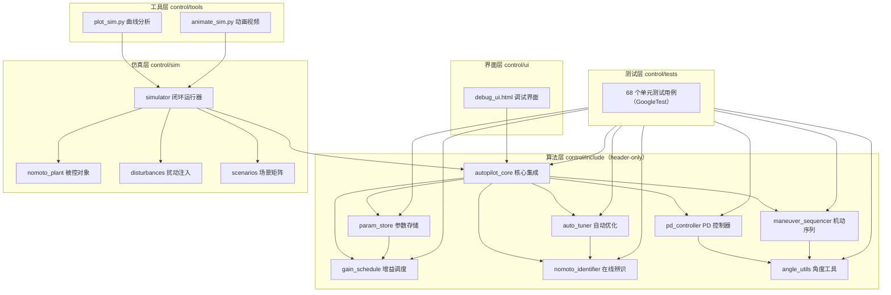

### 2.2 软件分层架构

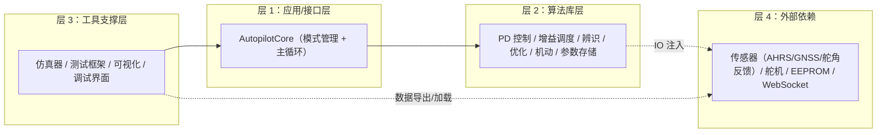

### 2.3 目录结构

```
auto_rudder/
├── 自动舵定位与控制设计文档.md        # 需求/算法设计文档
├── 自动舵设计技术可行性分析文档.md    # 可行性分析文档
├── md2pdf.py                          # Markdown → PDF 转换脚本
└── control/
    ├── CMakeLists.txt                 # 顶层构建脚本
    ├── include/                       # ★ 算法库（header-only，8 个头文件）
    │   ├── angle_utils.hpp
    │   ├── pd_controller.hpp
    │   ├── gain_schedule.hpp
    │   ├── nomoto_identifier.hpp
    │   ├── auto_tuner.hpp
    │   ├── maneuver_sequencer.hpp
    │   ├── param_store.hpp
    │   └── autopilot_core.hpp
    ├── sim/                           # 闭环仿真（ar_sim 可执行文件）
    ├── tests/                         # GoogleTest 单元测试（ar_tests）
    ├── tools/                         # Python 可视化工具
    ├── ui/                            # Web 调试界面
    ├── build/                         # CMake 构建产物（被 .gitignore 忽略）
    └── out/                           # 仿真 CSV/图片输出
```

### 2.4 模块清单

| 模块 | 文件 | 类型 | 职责 |
|------|------|------|------|
| 角度工具 | `angle_utils.hpp` | header-only | 角度归一化、最小角差 |
| PD 控制器 | `pd_controller.hpp` | header-only | 航向误差→舵角：控制律、限幅、死区、滤波、量化 |
| 增益调度 | `gain_schedule.hpp` | header-only | 按船速/海况查询 Kp/Kd，段中点线性插值 |
| 模型辨识 | `nomoto_identifier.hpp` | header-only | Nomoto 一阶模型 RLS 在线辨识 |
| 自动优化 | `auto_tuner.hpp` | header-only | 极点配置 + ESC 性能寻优 + 稳定性监控 |
| 机动序列 | `maneuver_sequencer.hpp` | header-only | 航段序列框架 + 6 种预置机动 |
| 参数存储 | `param_store.hpp` | header-only | 参数序列化、CRC32、范围校验、读写注入 |
| 核心集成 | `autopilot_core.hpp` | header-only | 模式状态机 + 50 Hz 主循环编排 |
| 仿真器 | `sim/simulator.hpp` | 头文件 | 闭环 runner、指标计算、CSV 导出 |
| 被控对象 | `sim/nomoto_plant.hpp` | 头文件 | Nomoto 模型 + 舵机一阶惯性 + 物理限幅 |
| 扰动模型 | `sim/disturbances.hpp` | 头文件 | 恒值风、波浪、量测噪声（按海况缩放） |
| 场景定义 | `sim/scenarios.hpp` | 头文件 | 验证矩阵、辨识/ESC/机动/验证场景 |
| 仿真入口 | `sim/main.cpp` | 可执行 | `ar_sim` 命令行执行器 |
| 单元测试 | `tests/test_*.cpp`（8 个） | 可执行 | 68 个测试用例 |

---

## 3. 核心算法模块设计

### 3.1 模块依赖关系

所有算法模块都位于 `namespace ar` 下，无环依赖：

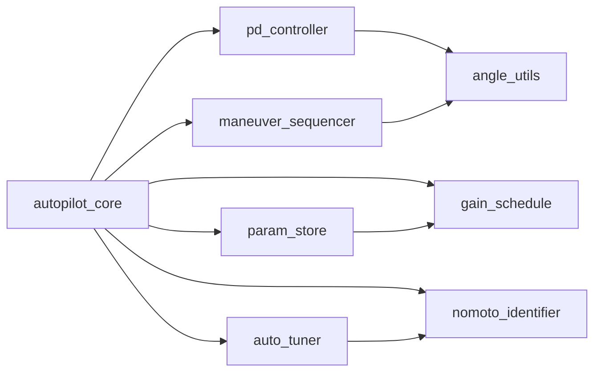

### 3.2 角度工具（angle_utils）

提供两个核心原语，被 PD 控制器与机动序列复用：

- `normalizeAngleRad / normalizeAngleDeg`：将角度归一化到 $(-\pi,\pi]$ 与 $(-180,180]$
- `angleDiffRad / angleDiffDeg`：计算**最小带符号角差** $\text{ref}-\text{act}$，消除 359°→1° 跳变问题

### 3.3 PD 航向控制器（pd_controller）

#### 控制律

$$\delta = K_p \cdot e + K_d \cdot \frac{de}{dt}, \quad e = \text{angleDiffDeg}(\psi_{ref}, \psi_{act})$$

不引入积分项，避免低速/长时漂移与积分饱和问题；依靠位置反馈实现航迹闭环。

#### 处理流程

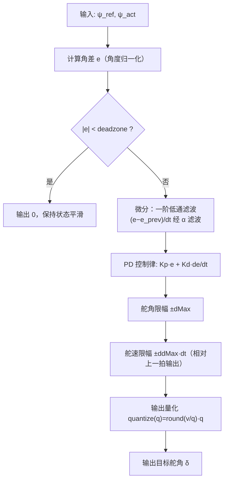

#### 关键参数

| 参数 | 默认值 | 含义 |
|------|--------|------|
| `Kp` / `Kd` | 1.0 / 0.5 | 比例 / 微分增益 |
| `dMax` | 35° | 舵角限幅 |
| `ddMax` | 10°/s | 舵速限幅 |
| `deadzone` | 0.3° | 误差死区 |
| `tau` | 0.2 s | 微分滤波时间常数 |
| `quant` | 0.1° | 输出量化步长 |
| `dt` | 0.02 s | 控制周期（50 Hz） |

设计要点：
- **P1 整改**：`setGains()/setDt()` 轻量更新参数且**不重置内部状态**，供增益调度每周期调用，避免状态清空造成输出跳变。
- `saturate()` 公开限幅工具：机动序列 RUDDER 段复用，且推进 `prevOut_` 基准保证舵速限幅连续。
- `initBaseline(actualRudder)`：上电/切模式时以实际舵角初始化基准，避免从 0 爬升跳变。

### 3.4 增益调度（gain_schedule）

按**船速分段 × 海况**查询名义增益，速度维在**段中点**间线性插值，消除段切换跳变：

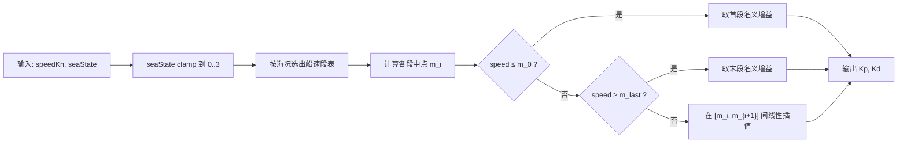

默认调度表（`GainPoint{speedMin, speedMax, seaState, Kp, Kd}`）：

| 船速段 (kn) | sea 0 | sea 1 | sea 2 | sea 3 |
|-------------|-------|-------|-------|-------|
| < 4 | 2.0 / 0.8 | 2.0 / 0.8 | — | — |
| 4~10 | 1.5 / 0.6 | 1.5 / 0.6 | 1.0 / 0.4 | 1.0 / 0.4 |
| 10~18 | 1.2 / 0.5 | 1.2 / 0.5 | 0.9 / 0.4 | 0.9 / 0.4 |
| 18~25 | 1.0 / 0.4 | 1.0 / 0.4 | 0.7 / 0.3 | 0.7 / 0.3 |

（"Kp / Kd"，"—" 表示该组合不在默认表中，查询时回退相邻海况）支持 `setTable()` 整表替换，供标定结果或仿真场景注入。

### 3.5 在线辨识（nomoto_identifier）

对 Nomoto 一阶模型做带遗忘因子的 RLS 在线辨识：

$$T\dot r + r = K\delta \;\Rightarrow\; \phi_k = \left[\tfrac{\delta_k}{d_{scale}},\; -\tfrac{r_k-r_{k-1}}{\Delta t \cdot dr_{scale}}\right]^T,\quad \theta=[K,\ T]^T$$

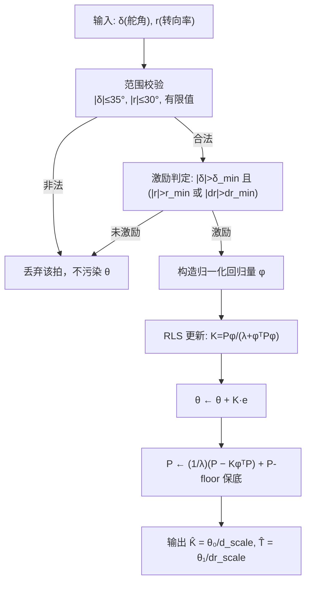

设计要点：
- **激励条件**：保留转向率过零附近的高 $dr$ 瞬态，否则 $T$ 欠定。
- **回归量归一化**：消除 δ 与 dr 量级差导致的协方差矩阵病态。
- **P-floor**：协方差对角元保底，防止协方差塌陷导致丧失长期自适应能力。
- **`valid()` 物理校验**：$K \in (0,2]$、$T \in [1,60]$s，越界视为无效结果。
- **P3 整改**：调用节拍 1 s（50 拍一次），降低 ECU 负担并保证差分信噪比。

### 3.6 自动优化（auto_tuner）

两层在线优化结构：

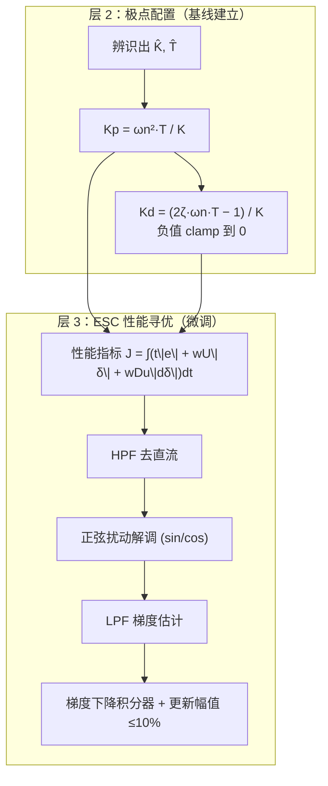

| 安全机制 | 说明 |
|----------|------|
| `stabilityCheck` | 四条件全满足才接受：$\zeta \geq \zeta_{min}$、$\omega_n \leq \omega_{n,max}$、K/T 非退化、振荡幅值 ≤ 阈值 |
| `OscillationDetector` | 基于航向误差过零的峰-峰幅值实测，代替理论估计 |
| `clampUpdate` | 单次增益更新幅值 ≤ 当前值 10% |
| `revert` | 校验失败回退到基线增益 |
| 高速去激活 | 船速 > 15 kn 自动禁用（高速下辨识信噪比差） |
| 无堆分配 | `RingBuffer` 固定环形数组替代 `std::deque`（60 s × 50 Hz = 3000 点） |

### 3.7 机动序列（maneuver_sequencer）

通用航段框架，每段为一个 `Leg`：

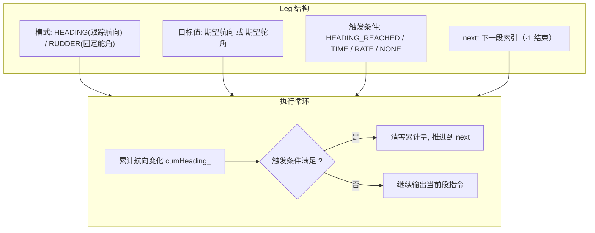

预置六种机动形态：

| 机动 | 段模式 | 说明 |
|------|--------|------|
| Circles | RUDDER 恒舵角 | 累计转向达 360° |
| Williamson | RUDDER→RUDDER→HEADING | 满舵转 60° → 反向满舵转 180° → 保持 ψ₀+180° |
| U-Turn | RUDDER→HEADING | 恒舵角转满 180° 后保持目标航向 |
| Zigzag | RUDDER×2N | ±δ_z 交替，每次航向变化 ±φ_z |
| Cloverleaf | RUDDER×4 + HEADING×4 | 4 次 270° 转向 + 直航 |
| Search | HEADING + RUDDER 交替 | 边长递增的扩张方形搜索 |

完成末段后自动切回 `AUTO_HEADING`。

### 3.8 参数存储（param_store）

参数持久化格式（纯算法层，EEPROM 读写由注入函数完成）：

```
[区块 A: 舵角标定 4×f64][区块 B: 模型 K/T 2×f64][区块 C: PD 增益 2×f64]
[version u32][timestamp u32][schedCount u32][增益调度表 schedCount×(...)]
[CRC32 u32（IEEE 802.3，覆盖上述全部字节）]
```

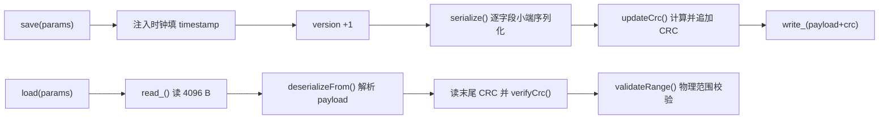

### 3.9 核心集成（autopilot_core）

`AutopilotCore` 是唯一对外入口，持有全部算法模块并编排主循环；`SensorInput` 定义最小传感器接口。

---

## 4. 核心流程设计

### 4.1 主控制循环（50 Hz 单拍时序）

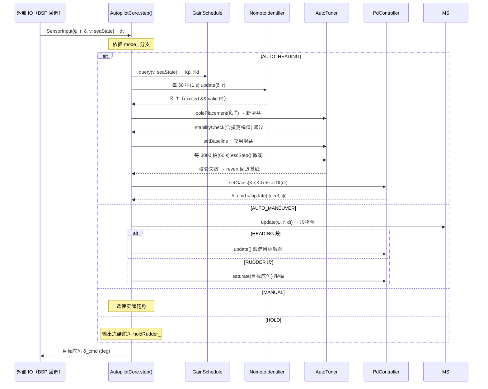

### 4.2 模式状态机

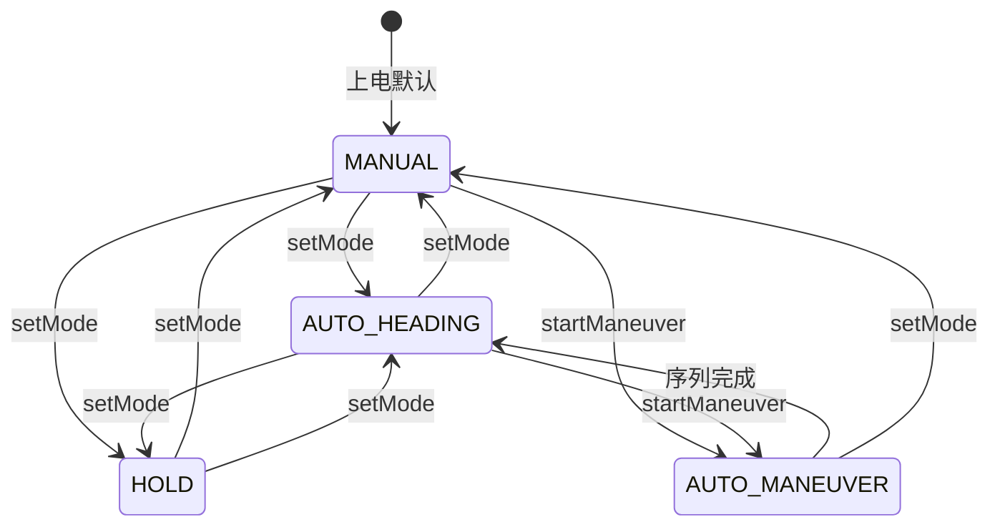

`setMode()` 的**状态清理**策略（P9 整改）：
- 切入新模式前：`pd_.reset()`、辨识/ESC 计数器清零
- 切出 AUTO 模式：`tuner_.disable()`，防止残留优化状态
- 切入 HOLD：冻结当前舵角指令 `holdRudder_`（非输出 0，避免舵机瞬间回中）

### 4.3 AUTO_HEADING 完整流程

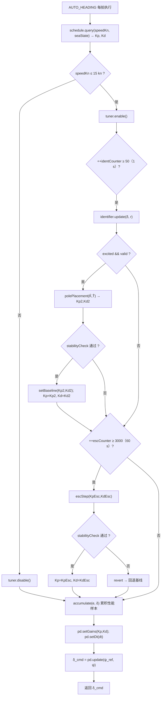

### 4.4 机动序列执行流程

`startManeuver(legs)` 装载航段并切换模式；执行期间若序列完成自动回 AUTO_HEADING。RUDDER 段经 `pd.saturate()` 施加舵角/舵速限幅，保证指令物理可行。

---

## 5. 接口设计

### 5.1 对外算法接口

```cpp
struct SensorInput {
    double headingDeg;   // AHRS 艏向 (°)
    double rateDegS;     // AHRS 转向率 (°/s)
    double rudderDeg;    // 舵角反馈 (°)
    double speedKn;      // 船速 (kn)
    int    seaState;     // 海况 0..3
};

double AutopilotCore::step(const SensorInput& s, double dt);  // 返回目标舵角
```

调用约定：
- 控制周期固定 50 Hz（`dt = 0.02 s`），由调用方（BSP 定时回调）保证
- 单拍计算量极小（实测峰值 < 5 ms，见 §7.4）

### 5.2 数据流图

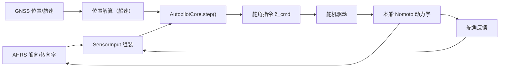

### 5.3 调试界面 WebSocket 接口

`debug_ui.html` 与真实 ECU 之间通过 WebSocket 交互：

| 消息方向 | type | 内容 |
|----------|------|------|
| UI → ECU | `cmd` | 舵角 / 模式 / 目标航向 |
| UI → ECU | `set_params` | `scope`：pd / sched / id / tuner / store / mode |
| ECU → UI | `sensor` | 5 路传感器数据（与 `SensorInput` 对应） |
| ECU → UI | `params_ack` | 参数确认（含 version） |
| ECU → UI | `status` | 故障码上报 |

---

## 6. 数据与参数设计

### 6.1 参数模型

全部可调参数集中在 4 个 `Params` 结构体，通过 `setParams()` 整组设置（附带重置内部状态）：

| 结构体 | 主要参数 |
|--------|----------|
| `PdController::Params` | Kp, Kd, dMax, ddMax, deadzone, tau, quant, dt |
| `GainSchedule`（表） | 船速段 × 海况 × {Kp, Kd} |
| `NomotoIdentifier::Params` | λ=0.98, 激励阈值, P₀, 归一化尺度 |
| `AutoTuner::Params` | ζ=0.85, ωn=0.2, ESC 参数, 性能权重, 安全约束 |

### 6.2 参数持久化安全

- **CRC32**（IEEE 802.3，多项式 0xEDB88320）覆盖全部 payload 字节，CRC 字段自身排除
- **逐字段显式小端序列化**：不依赖结构体内存布局/填充字节，跨平台可移植
- **加载三步校验**：格式完整 → CRC 校验 → 物理范围校验，任一失败即拒绝

### 6.3 默认控制参数（节选）

| 参数 | 值 | 依据 |
|------|-----|------|
| 控制周期 | 0.02 s（50 Hz） | §1.3 设计指标 |
| 增益调度默认表 | §3.4 表 | 船速/海况分段 |
| 极点配置目标 | ζ=0.85, ωn=0.20 rad/s | 典型船超调 ≤10% |
| ESC 窗口 | 60 s | 性能指标统计周期 |
| 辨识节拍 | 1 s | P3 整改 |
| 振荡告警阈值 | 5° | §3.10.7 |

---

## 7. 仿真与验证设计

### 7.1 仿真架构

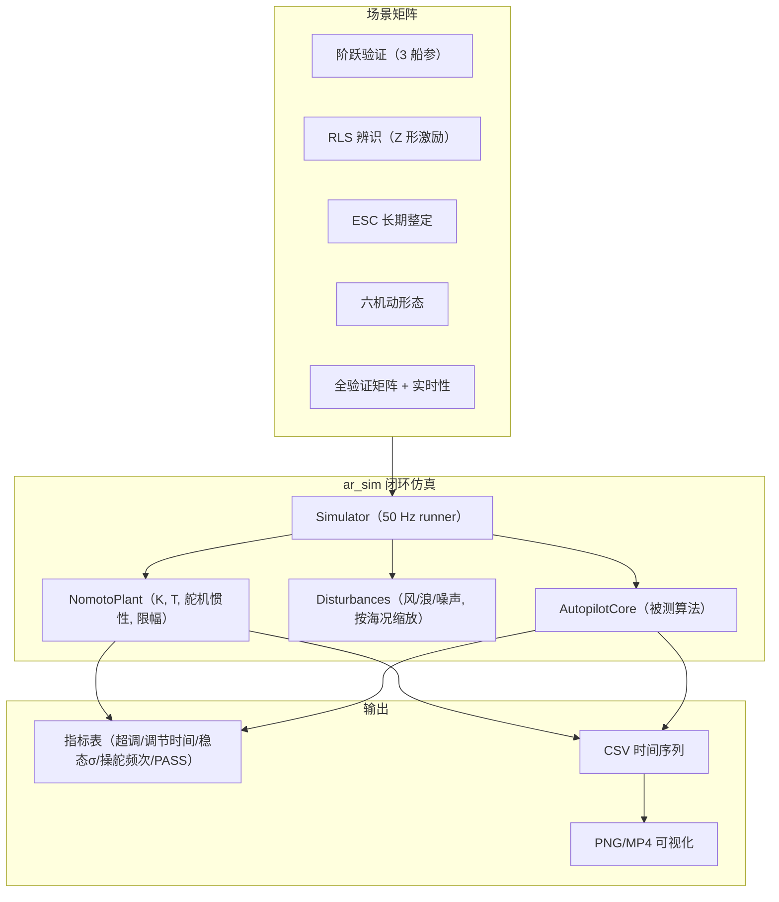

### 7.2 被控对象与扰动模型

- **被控对象**：Nomoto 一阶模型 $T\dot r + r = K(\delta_{act}+d)$，舵机一阶惯性 + 舵速/舵角物理限幅
- **扰动注入**：恒值风致力矩 + 0.1 Hz 波浪 + ψ/r 量测白噪声，强度随海况（0~3）线性缩放
- **扰动确定性**：LCG 伪随机（seed 固定），跨平台完全可复现

### 7.3 仿真验证结果（真实运行数据）

下表为 `ar_sim` 实际运行输出（K=0.2, T=8.0, 10 kn, 海况 0，30° 阶跃）：

| 指标 | 数值 | 设计要求 |
|------|------|----------|
| 超调量 | 1.31% | ≤ 10% |
| 调节时间（5%） | 27.44 s | ≤ 30 s |
| 稳态误差 1σ | 0.000° | ≤ 1° |
| 操舵频次 | 0.00 次/min | ≤ 6 次/min |

阶跃响应曲线（航向 / 舵角 / 转首率 / 误差 / 增益五子图）：


RLS 在线辨识场景（Z 形激励，辨识结果 K̂=0.229 / T̂=9.07，真值 K=0.20 / T=8.0，`valid=1`）：


Williamson 机动（max 航向 180°，max 舵角 35°，序列安全执行完毕）：


Williamson 机动极坐标轨迹（零度朝北、顺时针，航海习惯）：


### 7.4 单元测试体系

测试分层与算法模块一一对应（8 个测试文件，68 个用例）：

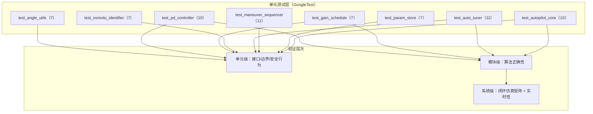

关键测试点（节选）：

| 测试 | 验证内容 |
|------|----------|
| `CrossZeroError` | 359°→1° 跨零角差 |
| `DeadzoneOutputsZero` | 死区内输出 0 |
| `RateLimit` | 舵速限幅生效 |
| `InterpolationContinuityAtBoundary` | 增益插值连续性 |
| `ConvergesOnNomotoData` | RLS 收敛到真值 |
| `OscillationDetectorMeasuresAmplitude` | 振荡幅值实测 |
| `RingBufferNoHeap` | 无堆分配保证 |
| `CrcDetectsCorruption` | CRC 检错 |
| `SetModeResetsState` | 模式切换状态清理 |
| `HoldFreezesLastRudder` | HOLD 冻结舵角 |
| `HighSpeedDisablesTuner` | 高速去激活 |

### 7.5 实时性设计

- 控制周期 50 Hz（20 ms），算法单拍实测峰值耗时 < 5 ms，留有 4 倍余量
- 核心算法**零堆分配**：ESC 窗口缓冲用固定容量 `RingBuffer<3000>`，无运行时 `new/delete`
- 序列化/反序列化使用栈缓冲，无动态内存

---

## 8. 工具链与调试设计

### 8.1 仿真可视化工具链

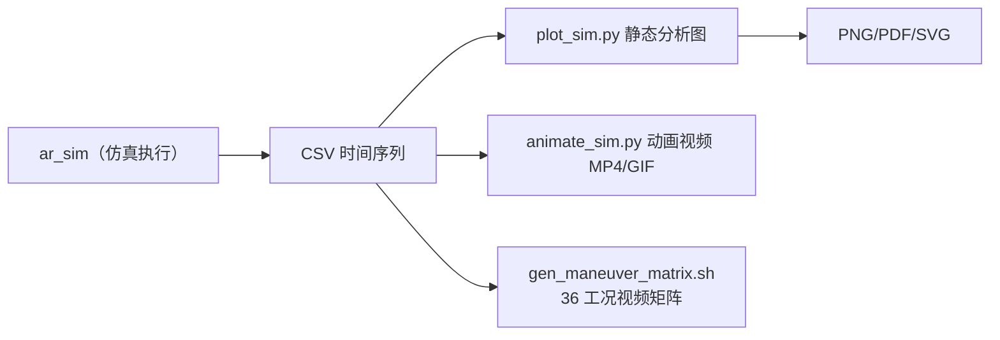

| 工具 | 功能 |
|------|------|
| `plot_sim.py` | 多子图分析（航向/舵角/转首率/误差/增益）、极坐标轨迹、多文件对比、指标表 |
| `animate_sim.py` | 时间演化动画（左多子图 + 右极坐标） |
| `gen_all_videos.sh` | 一键生成全部场景视频 |
| `gen_maneuver_matrix.sh` | 3 船参 × 6 机动 × 2 干扰 = 36 个工况视频 |

### 8.2 Web 调试界面

`debug_ui.html` 为单文件 Web 应用（HTML+CSS+JS，无第三方依赖）：

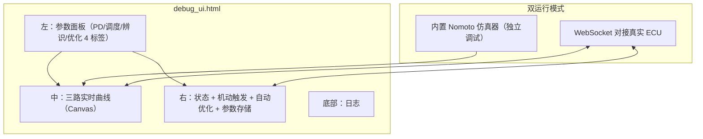

界面中的算法实现与 C++ 头文件一一对应（参数映射表见 `ui/README.md`），用于离线调试与参数整定，实船控制必须使用 C++ ECU。

---

## 9. 非功能设计

### 9.1 实时性

- 50 Hz 硬实时驱动，单拍预算 20 ms，算法实测峰值 < 5 ms
- 辨识/ESC 等重任务降频调度（1 s / 60 s），避免峰值冲击

### 9.2 可移植性

- **header-only**：无编译期依赖顺序问题，单文件即可嵌入任意工程
- **C++17**、无平台相关 API、无动态内存；浮点序列化显式小端，跨架构一致
- 算法层与 IO 完全解耦，通过注入函数（`std::function`）对接真实硬件

### 9.3 可靠性

| 机制 | 位置 |
|------|------|
| 输入范围校验（非法数据丢弃） | `NomotoIdentifier::update` |
| 物理合理性校验（K/T/Kp/Kd 范围） | `identifier.valid()`、`param_store.validateRange()` |
| 增益更新限幅（≤10%）与负 Kd clamp | `AutoTuner` |
| 稳定性监控 + 振荡实测 + 基线回退 | `AutoTuner::stabilityCheck` |
| 模式切换状态清理 | `AutopilotCore::setMode` |
| 参数 CRC32 完整性校验 | `ParamStore` |

### 9.4 可测试性

- 纯函数式算法核心，便于单元测试与性质验证
- 确定性仿真（固定 seed），CI 中可重复回归
- 全部模块通过 `ar_sim --validate` 与 `ar_tests` 双向验证

---

## 10. 构建与部署

### 10.1 构建结构

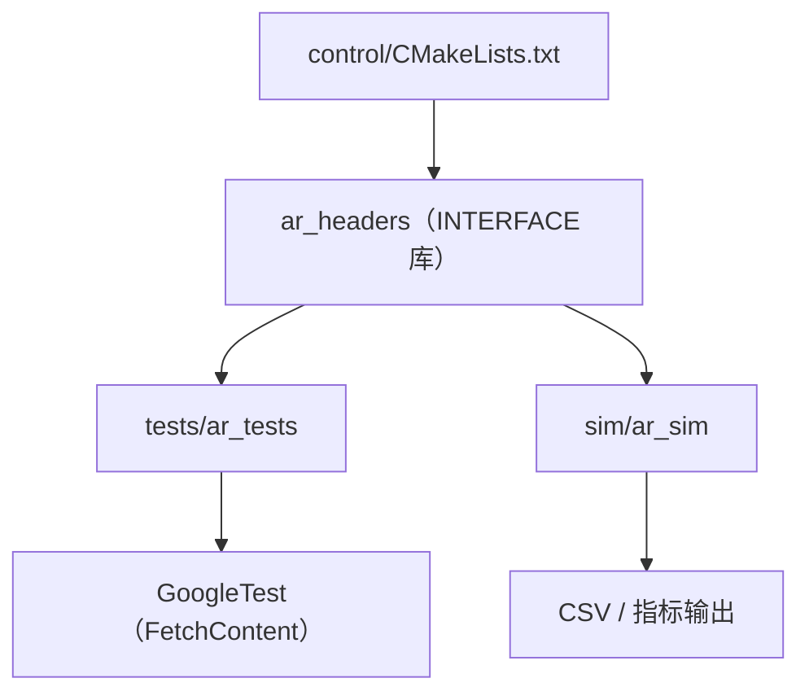

```bash
# 构建（Release 默认）
cmake -S control -B control/build
cmake --build control/build -j

# 运行单元测试
control/build/tests/ar_tests

# 运行仿真验证矩阵
control/build/sim/ar_sim --all
control/build/sim/ar_sim --validate
```

### 10.2 运行入口

| 入口 | 用途 |
|------|------|
| `ar_sim --scenario step_typical` | 阶跃验证 |
| `ar_sim --ident` | RLS 在线辨识 |
| `ar_sim --esc` | ESC 长期整定 |
| `ar_sim --maneuver williamson` | 机动形态仿真（6 选 1） |
| `ar_sim --validate` | 全验证矩阵 + 实时性 |
| `ar_tests` | 68 个单元测试 |
| `debug_ui.html` | Web 调试界面（浏览器打开） |

### 10.3 文档映射关系

| 本文档章节 | 对应设计文档 |
|------------|-------------|
| 需求与算法依据 | `自动舵定位与控制设计文档.md` |
| 系统可行性 | `自动舵设计技术可行性分析文档.md` |
| 模块级实现细节 | `control/控制算法开发文档.md`、`control/控制算法代码说明文档.md` |

---

— 文档结束 —
